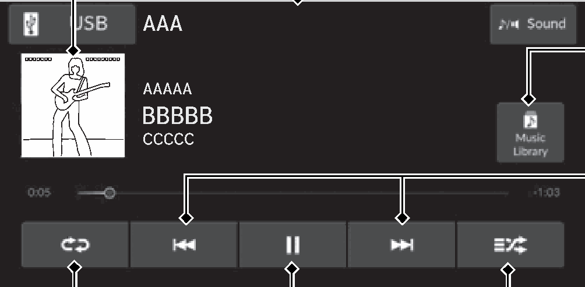
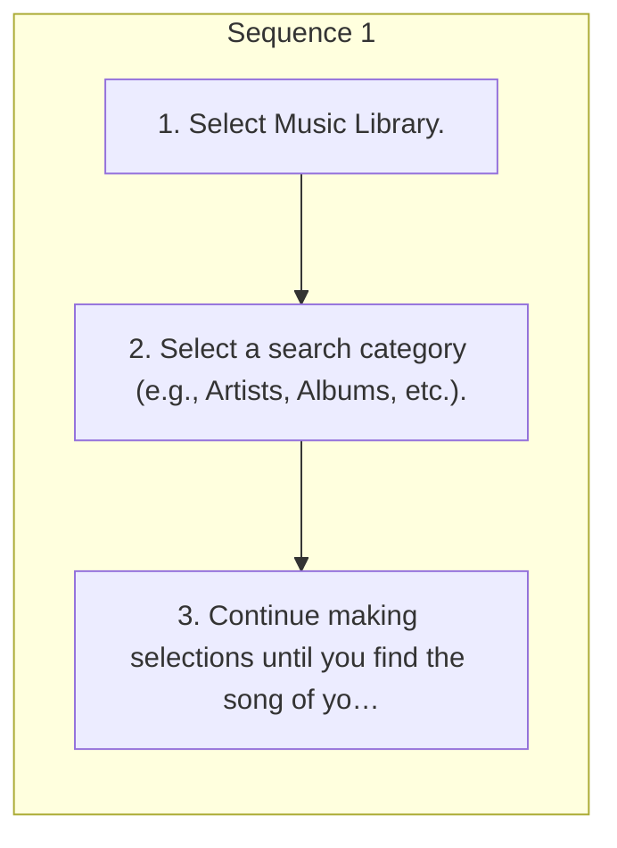

<!-- GENERATED:START function=f1324a2514fb (generated; edits inside this block are overwritten by the next publish — write your own notes outside it) -->
# 11. Music Playback via Wired Connection

<b>Function path:</b> Features / Music Playback via Wired Connection <b>Source:</b> printed page 269, 270 <b>Test-ready:</b> no — procedure missing or thresholds unfilled

Every "Presumed requirement" row below is machine-derived from the Owner's Manual text by rule-based extraction — not AI-written — and traceable to the printed page in its Source column.

## Figures (areas of the original PDF; the OM has no figure numbers or captions)

- Figure 11-1 source: p.269
- (Copied from OM) Audio/Information Screen

## Procedure

| Seq | Step | Operation (Copied from OM) | Source |
|---|---|---|---|
| 1 | 1 | Select Music Library. | p.270 / step |
| 1 | 2 | Select a search category (e.g., Artists, Albums, etc.). | p.270 / step |
| 1 | 3 | Continue making selections until you find the song of your choice. | p.270 / step |

## Numeric thresholds (filled in by a tester)
Filled: 0 / unfilled: 1

| Threshold | Matching text (Copied from OM) | Kind | Unit | Value | Status | Evidence | Filled by |
|---|---|---|---|---|---|---|---|
| 90baf1022985 | Repeatedly select the shuffle or repeat icon until | count | times | **unfilled** | unfilled | — | — |

## 11-2-1. Service overview

| # | Presumed requirement | Strength | Source |
|---|---|---|---|
| 1 | Music Playback via Wired ConnectionUsing your USB connector, connect the device to the USB port, then select Audio Source and USB icon. 2 USB Ports P.253. | capability | p.269 / text |
| 2 | Music Playback via Wired ConnectionCover Art. | capability | p.269 / text |
| 3 | Music Playback via Wired ConnectionRepeat Icon Select to repeat the current song. | capability | p.269 / text |
| 4 | Music Playback via Wired ConnectionAudio/Information Screen. | capability | p.269 / text |
| 5 | Music Playback via Wired ConnectionMusic Library Icon Select to display the music search screen. | capability | p.269 / text |
| 6 | Music Playback via Wired ConnectionTrack Icons to change Select or songs. Select and hold to move rapidly within a song. | capability | p.269 / text |
| 7 | Music Playback via Wired ConnectionShuffle Icon Select to play all songs in the current category in random order. Play/Pause Icon. | capability | p.269 / text |
| 8 | Music Playback via Wired ConnectionHow to Select a Song from the Device Music List. | capability | p.270 / text |
| 9 | Music Playback via Wired ConnectionHow to Select a Play Mode. | capability | p.270 / text |
| 10 | Music Playback via Wired ConnectionYou can select repeat and shuffle modes when playing a song. | constraint | p.270 / text |
| 11 | Music Playback via Wired ConnectionShuffle/Repeat. | capability | p.270 / text |
| 12 | Music Playback via Wired ConnectionRepeatedly select the shuffle or repeat icon until you find a play mode option of your preference. | capability | p.270 / text |
| 13 | Music Playback via Wired ConnectionPlay Mode Menu Items Shuffle Shuffle off: Shuffle mode to off. Shuffle All Songs: Plays all available songs in a selected list in random order. | capability | p.270 / text |
| 14 | Music Playback via Wired ConnectionRepeat Repeat off: Repeat mode to off. Repeat all: Repeats all songs. Repeat Song: Repeats the current song. | capability | p.270 / text |
| 15 | Music Playback via Wired Connection1Music Playback via Wired Connection Available operating functions vary on models or versions. Some functions may not be available on the vehicle’s audio system. | capability | p.270 / text |
| 16 | Music Playback via Wired ConnectionWhile an iPhone is connected via Apple CarPlay, audio files on the iPhone can only be played using Apple CarPlay. | capability | p.270 / text |
<!-- GENERATED:END function=f1324a2514fb -->

