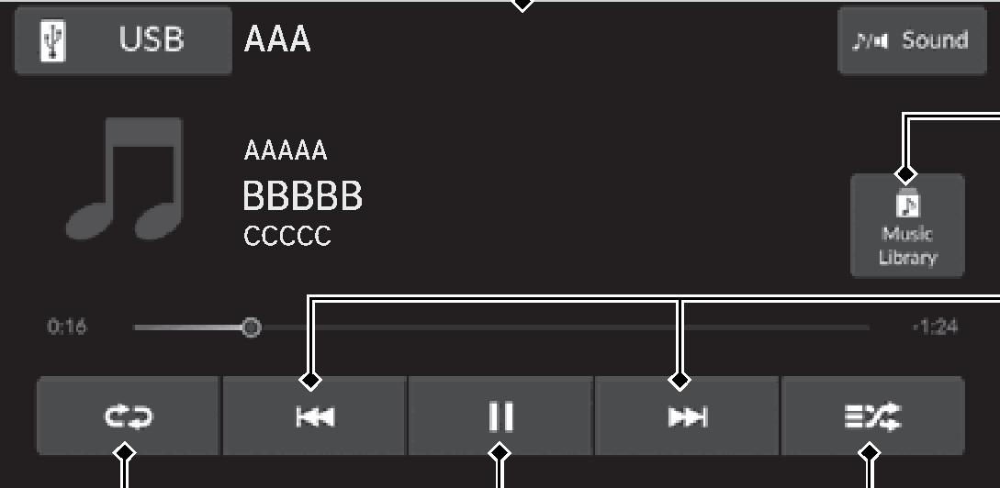
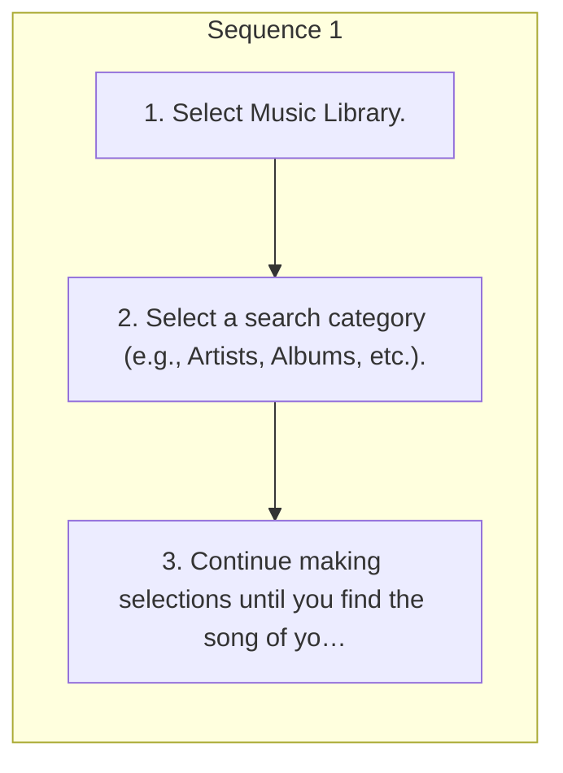

<!-- GENERATED:START function=fdc39666133d (generated; edits inside this block are overwritten by the next publish — write your own notes outside it) -->
# 12. Music Playback via USB Flash Drive

<b>Function path:</b> Features / Music Playback via USB Flash Drive <b>Source:</b> printed page 271, 272 <b>Test-ready:</b> yes — no unfilled thresholds and a procedure is present

Every "Presumed requirement" row below is machine-derived from the Owner's Manual text by rule-based extraction — not AI-written — and traceable to the printed page in its Source column.

## Figures (areas of the original PDF; the OM has no figure numbers or captions)

- Figure 12-1 source: p.271
- (Copied from OM) Music Library Icon

## Procedure

| Seq | Step | Operation (Copied from OM) | Source |
|---|---|---|---|
| 1 | 1 | Select Music Library. | p.272 / step |
| 1 | 2 | Select a search category (e.g., Artists, Albums, etc.). | p.272 / step |
| 1 | 3 | Continue making selections until you find the song of your choice. | p.272 / step |

## 12-2-1. Service overview

| # | Presumed requirement | Strength | Source |
|---|---|---|---|
| 1 | Music Playback via USB Flash DriveYour audio system reads and plays sound files on a USB flash drive in either MP3, WMA, AAC, FLAC, or WAV format. Connect your USB flash drive to the USB port, then select Audio Source and USB icon. 2 USB Ports P.253. | capability | p.271 / text |
| 2 | Music Playback via USB Flash DriveAudio/Information Screen. | capability | p.271 / text |
| 3 | Music Playback via USB Flash DriveMusic Library Icon Select to display the music search screen. | capability | p.271 / text |
| 4 | Music Playback via USB Flash DriveTrack Icons Select or to change files. Select and hold to move rapidly within a file. | capability | p.271 / text |
| 5 | Music Playback via USB Flash DriveRandom Icon Select to play all files in the current category in random order. | capability | p.271 / text |
| 6 | Music Playback via USB Flash DrivePlay/Pause Icon. | capability | p.271 / text |
| 7 | Music Playback via USB Flash DriveRepeat Icon Select to repeat the current file. | capability | p.271 / text |
| 8 | Music Playback via USB Flash DriveHow to Select a Song from the Music Search List. | capability | p.272 / text |
| 9 | Music Playback via USB Flash DriveHow to Select a Play Mode. | capability | p.272 / text |
| 10 | Music Playback via USB Flash DriveYou can select repeat and random modes when playing a song. | constraint | p.272 / text |
| 11 | Music Playback via USB Flash DriveRandom/Repeat. | capability | p.272 / text |
| 12 | Music Playback via USB Flash DriveSelect random or repeat icon. | capability | p.272 / text |
| 13 | Music Playback via USB Flash DrivePlay Mode Menu Items Random Random All Tracks: Plays all songs in random order. | capability | p.272 / text |
| 14 | Music Playback via USB Flash DriveRepeat Repeat track: Repeats the current song. | capability | p.272 / text |
| 15 | Music Playback via USB Flash Drive1Music Playback via USB Flash Drive Use the recommended USB flash drives. 2 General Information on the Audio System P.283. | capability | p.272 / text |
| 16 | Music Playback via USB Flash DriveWMA files protected by digital rights management (DRM) cannot be played. The audio system displays File Error, and then skips to the next song. | constraint | p.272 / text |
| 17 | Music Playback via USB Flash DriveIf there is a problem, you may see an error message on the audio/information screen. 2 iPod/USB Flash Drive P.282. | capability | p.272 / text |
<!-- GENERATED:END function=fdc39666133d -->

