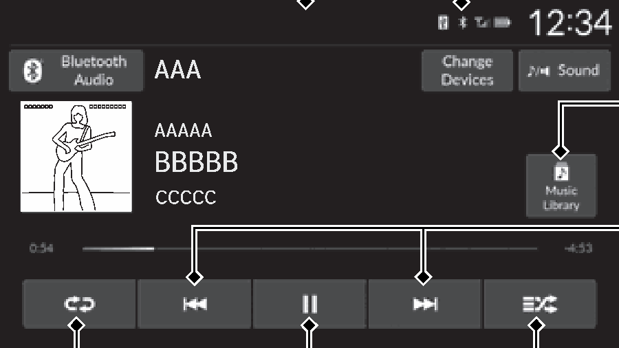
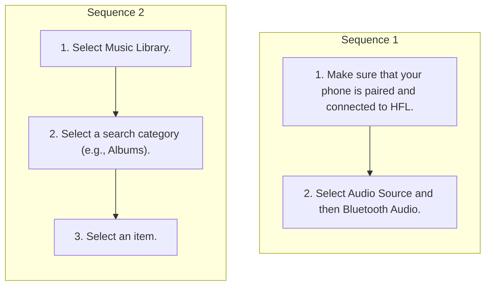

<!-- GENERATED:START function=bfae0f3ebe54 (generated; edits inside this block are overwritten by the next publish — write your own notes outside it) -->
# 13. Playing Bluetooth® Audio

<b>Function path:</b> Features / Playing Bluetooth® Audio <b>Source:</b> printed page 273, 274, 275 <b>Test-ready:</b> no — procedure missing or thresholds unfilled

Every "Presumed requirement" row below is machine-derived from the Owner's Manual text by rule-based extraction — not AI-written — and traceable to the printed page in its Source column.

## Figures (areas of the original PDF; the OM has no figure numbers or captions)

- Figure 13-1 source: p.273
- (Copied from OM) Shuffle Icon

## Procedure (2 sequences; the manual restarts the numbering)

| Seq | Step | Operation (Copied from OM) | Source |
|---|---|---|---|
| 1 | 1 | Make sure that your phone is paired and connected to HFL. | p.274 / step |
| 1 | 2 | Select Audio Source and then Bluetooth Audio. | p.274 / step |
| 2 | 1 | Select Music Library. | p.274 / step |
| 2 | 2 | Select a search category (e.g., Albums). | p.274 / step |
| 2 | 3 | Select an item. | p.274 / step |

## Numeric thresholds (filled in by a tester)
Filled: 0 / unfilled: 2

| Threshold | Matching text (Copied from OM) | Kind | Unit | Value | Status | Evidence | Filled by |
|---|---|---|---|---|---|---|---|
| f552b01f7910 | repeatedly until | count | times | **unfilled** | unfilled | — | — |
| 6136d616e7c2 | Repeatedly select shuffle or repeat icon until | count | times | **unfilled** | unfilled | — | — |

## 13-2-1. Service overview

| # | Presumed requirement | Strength | Source |
|---|---|---|---|
| 1 | Playing Bluetooth® AudioYour audio system allows you to listen to music from your Bluetooth-compatible phone. This function is available when the phone is paired and connected to the vehicle’s Bluetooth® HandsFreeLink® (HFL) system. 2 Phone Setup P.315. | constraint | p.273 / text |
| 2 | Playing Bluetooth® AudioRepeat Icon Select to repeat the current track. | capability | p.273 / text |
| 3 | Playing Bluetooth® Audio1Playing Bluetooth® Audio Not all Bluetooth-enabled phones with streaming audio capabilities are compatible with the system. For a list of compatible phones:. | capability | p.273 / text |

## 13-2-2. Service requirements

| # | Presumed requirement | Strength | Source |
|---|---|---|---|
| 1 | Step -U.S.: Visit https://mygarage.honda.com/s/hondahandsfreelink-compatibility-check, or call 1-888- 528-7876. | capability | p.273 / bullet |
| 2 | Step -Canada: Call 1-855-490-7351. Audio/Information Screen. | capability | p.273 / bullet |
| 3 | Playing Bluetooth® AudioIn some states, it may be illegal to perform some data Bluetooth Indicator device functions while driving. Appears when your phone is connected to HFL. Only one phone can be used with HFL at a time. When there is more than one paired phone in the vehicle, the system automatically connects to the prioritized phone. You can assign priority to a phone Music Library Icon in the Priority Device menu. Select to display the 2 HFL Menus P.313 music search screen. | constraint | p.273 / text |
| 4 | Playing Bluetooth® AudioPlay/Pause Icon. | capability | p.273 / text |
| 5 | Playing Bluetooth® AudioTo Play Bluetooth® Audio Files. | capability | p.274 / text |
| 6 | Playing Bluetooth® AudioIf the phone is not recognized, another HFL-compatible phone, which is not compatible for Bluetooth® Audio, may already be connected. | capability | p.274 / text |
| 7 | Playing Bluetooth® AudioTo pause or resume a file. | capability | p.274 / text |
| 8 | Playing Bluetooth® AudioSelect the play/pause icon. | capability | p.274 / text |
| 9 | Playing Bluetooth® AudioHow to Select a Song from the Music Search List. | capability | p.274 / text |
| 10 | Step -Select an item repeatedly until a desired item you want to listen to is displayed. | capability | p.274 / bullet |
| 11 | Playing Bluetooth® Audio1To Play Bluetooth® Audio Files To play the audio files, you may need to operate your phone. If so, follow the phone manufacturer's operating instructions. | constraint | p.274 / text |
| 12 | Playing Bluetooth® AudioSwitching to another mode pauses the music playing from your phone. | capability | p.274 / text |
| 13 | Playing Bluetooth® AudioIf any audio device is connected to the USB port, you may need to select Audio Source to select Bluetooth Audio. | capability | p.274 / text |
| 14 | Playing Bluetooth® AudioYou can change the connected phone by selecting Change Devices. 2 Phone Setup P.315. | capability | p.274 / text |
| 15 | Playing Bluetooth® AudioHow to Select a Play Mode. | capability | p.275 / text |
| 16 | Playing Bluetooth® AudioYou can select repeat and shuffle modes when playing a song. | constraint | p.275 / text |
| 17 | Playing Bluetooth® AudioShuffle/Repeat. | capability | p.275 / text |
| 18 | Playing Bluetooth® AudioPlay Mode Menu Items Shuffle Shuffle off: Shuffle mode to off. Shuffle All Songs: Plays all available songs in a selected list in random order. | capability | p.275 / text |
| 19 | Playing Bluetooth® AudioRepeat Repeat off: Repeat mode to off. Repeat all: Repeats all songs. Repeat Song: Repeats the current song. | capability | p.275 / text |

## 13-4. User settings

| # | Presumed requirement | Strength | Source |
|---|---|---|---|
| 1 | Playing Bluetooth® AudioRepeatedly select shuffle or repeat icon until you find a play mode option of your preference. | capability | p.275 / text |

## 13-5. Exception operation

| # | Presumed requirement | Strength | Source |
|---|---|---|---|
| 1 | Playing Bluetooth® AudioTrack Icons If a phone is currently connected via Apple CarPlay or or to Select Android Auto, Bluetooth® Audio from that phone is change track. unavailable. 2 Phone Setup P.315 Shuffle Icon Select to play all tracks in the current category in random order. | constraint | p.273 / text |
| 2 | Playing Bluetooth® Audio1How to Select a Song from the Music Search List Depending on the Bluetooth® device you connect, some or all of the categories may not be displayed. | capability | p.274 / text |
| 3 | Playing Bluetooth® Audio1How to Select a Play Mode Depending on the Bluetooth® device you connect, some or all of the functions may not be displayed. | capability | p.275 / text |
<!-- GENERATED:END function=bfae0f3ebe54 -->

