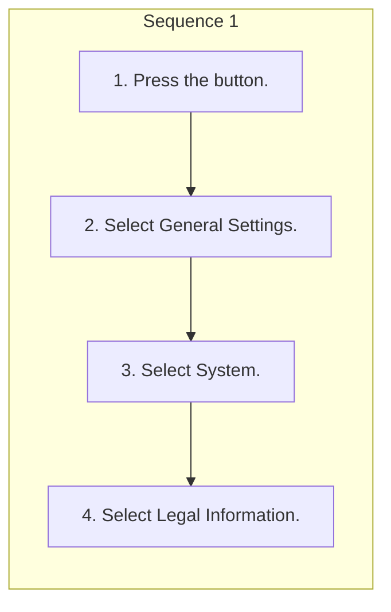

<!-- GENERATED:START function=28f20d8b617d (generated; edits inside this block are overwritten by the next publish — write your own notes outside it) -->
# 19. About Open Source Licenses

<b>Function path:</b> Features / About Open Source Licenses <b>Source:</b> printed page 300 <b>Test-ready:</b> yes — no unfilled thresholds and a procedure is present

Every "Presumed requirement" row below is machine-derived from the Owner's Manual text by rule-based extraction — not AI-written — and traceable to the printed page in its Source column.

## Procedure

| Seq | Step | Operation (Copied from OM) | Source |
|---|---|---|---|
| 1 | 1 | Press the button. | p.300 / step |
| 1 | 2 | Select General Settings. | p.300 / step |
| 1 | 3 | Select System. | p.300 / step |
| 1 | 4 | Select Legal Information. | p.300 / step |

## 19-2-1. Service overview

| # | Presumed requirement | Strength | Source |
|---|---|---|---|
| 1 | About Open Source LicensesTo see the open source license information, follow these steps. | capability | p.300 / text |
<!-- GENERATED:END function=28f20d8b617d -->

