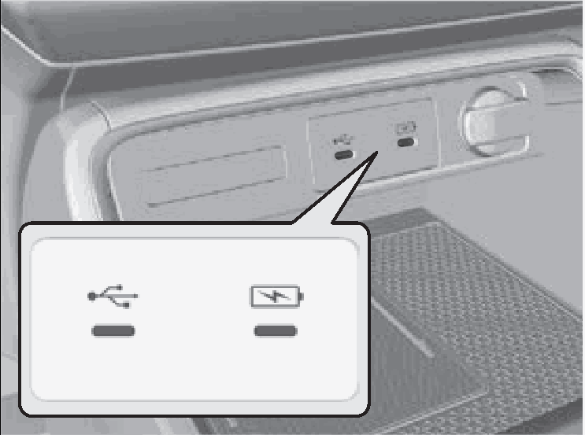
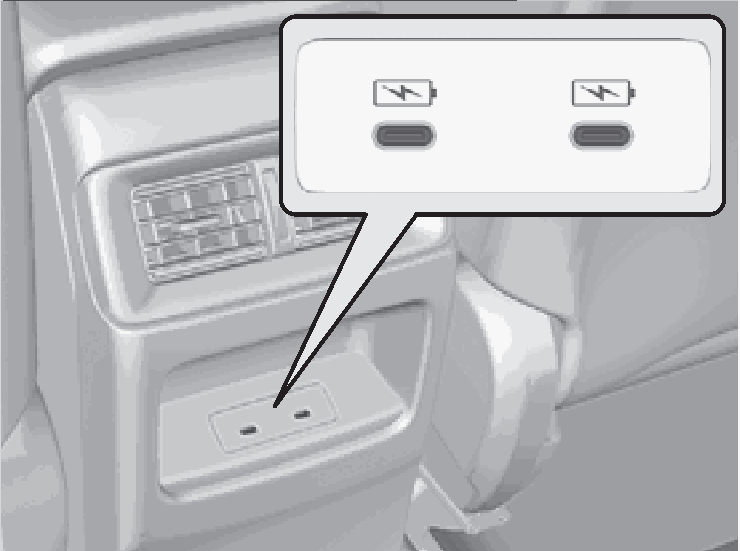

<!-- GENERATED:START function=bc498a74ee35 (generated; edits inside this block are overwritten by the next publish — write your own notes outside it) -->
# 2. USB Ports

<b>Function path:</b> Features / USB Ports <b>Source:</b> printed page 255 <b>Test-ready:</b> no — procedure missing or thresholds unfilled

Every "Presumed requirement" row below is machine-derived from the Owner's Manual text by rule-based extraction — not AI-written — and traceable to the printed page in its Source column.

## Figures (areas of the original PDF; the OM has no figure numbers or captions)

- Figure 2-1 source: p.255
- (Copied from OM) USB charging port on the front panel

- Figure 2-2 source: p.255
- (Copied from OM) USB charging port on the back of the console compartment (

## 2-2-1. Service overview

| # | Presumed requirement | Strength | Source |
|---|---|---|---|
| 1 | USB PortsUSB charging/connector port (. | capability | p.255 / text |
| 2 | USB Ports) 1USB Ports On the front panel The USB port is for charging devices, playing. | capability | p.255 / text |

## 2-2-2. Service requirements

| # | Presumed requirement | Strength | Source |
|---|---|---|---|
| 1 | Step -Do not leave the iPod or USB flash drive in the vehicle. Direct sunlight and high temperatures may audio files, and connecting compatible damage it. phones with Apple CarPlay or Android Auto. | capability | p.255 / bullet |
| 2 | Step -We recommend that you use a USB cable if you are. | constraint | p.255 / bullet |
| 3 | Step -To prevent any potential issues, be sure attaching a USB flash drive to the USB port. to use an Apple MFi Certified Lightning. | capability | p.255 / bullet |
| 4 | Step -Do not connect the iPod or USB flash drive using a hub. Connector for Apple CarPlay. USB cables. | capability | p.255 / bullet |
| 5 | Step -Do not use a device such as a card reader or hard should be certified by USB-IF to be disk drive, as the device or your files may be compliant with USB 2.0 Standard. damaged. | capability | p.255 / bullet |
| 6 | Step -We recommend backing up your data before using the device in your vehicle. | capability | p.255 / bullet |
| 7 | USB PortsUSB charging port on the front panel. | capability | p.255 / text |
| 8 | Step -Displayed messages may vary depending on the ( ) device model and software version. The USB port is only for charging devices. | capability | p.255 / bullet |
| 9 | USB PortsUSB charging port on the back of the. | capability | p.255 / text |
| 10 | Step -The USB ports on the front panel support USB On the back of the console compartment* console compartment ( )* Power Delivery. | capability | p.255 / bullet |
| 11 | Step -USB standard output The USB ports (3.0A) are only for charging When using 1 port: 5V/3A(15W), 9V/3A(27W), devices. 15V/3A(45W), 20V/3A(60W). | constraint | p.255 / bullet |
| 12 | Step -The USB port can supply up to 3.0A of When using both ports: 5V/3A(15W), 9V/3A(27W), power. It does not output 3.0A unless 20V/2.25A(45W), Max 60W in total requested by the device. For amperage details, read the operating manual of. | constraint | p.255 / bullet |
| 13 | Step -The USB port also supports PPS (Programmable connected music players to it. Power Supply). PPS 5.0V-21V (Max 60W). | capability | p.255 / bullet |

## 2-5. Exception operation

| # | Presumed requirement | Strength | Source |
|---|---|---|---|
| 1 | Step -Some devices may not work even if they are connected to the USB ports. | constraint | p.255 / bullet |
| 2 | Step -You cannot play music even if you have connected music players to it. Supplementary information about USB Charging:. | constraint | p.255 / bullet |
| 3 | Step -You cannot play music even if you have the device that needs to be charged. | constraint | p.255 / bullet |
| 4 | Step -Charging may not start or may operate slowly depending on the connected devices and cables. Using only one port while not connecting anything (including cables) to the other port may solve the issue. * Not available on all models 253. | capability | p.255 / bullet |
<!-- GENERATED:END function=bc498a74ee35 -->

