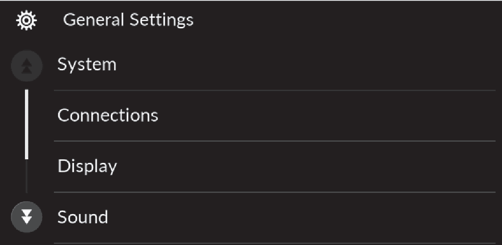

<!-- GENERATED:START function=2db19dc8b16a (generated; edits inside this block are overwritten by the next publish — write your own notes outside it) -->
# 20. License Information

<b>Function path:</b> Features / License Information <b>Source:</b> printed page 301, 302, 303, 304, 305, 306, 307, 308, 309, 310 <b>Test-ready:</b> no — procedure missing or thresholds unfilled

Every "Presumed requirement" row below is machine-derived from the Owner's Manual text by rule-based extraction — not AI-written — and traceable to the printed page in its Source column.

## Figures (areas of the original PDF; the OM has no figure numbers or captions)

- Figure 20-1 source: p.304
- (Copied from OM) button, select General Settings, and

## 20-2-1. Service overview

| # | Presumed requirement | Strength | Source |
|---|---|---|---|
| 1 | License InformationBluetooth. | capability | p.301 / text |
| 2 | License InformationThe Bluetooth® word mark and logos are registered trademarks owned by Bluetooth SIG, Inc. and any use of such marks by Faurecia Clarion Electronics Co., Ltd. is under license. Other trademarks and trade names are those of their respective owners. | capability | p.301 / text |
| 3 | License Informationhttps://www.bluetooth.com/develop-with-bluetooth/marketing-branding/. | capability | p.301 / text |
| 4 | License InformationWindows Media. | capability | p.301 / text |
| 5 | License InformationThis product is protected by certain intellectual property rights of Microsoft. Use or distribution of such technology outside of this product is prohibited without a license from Microsoft. | capability | p.301 / text |
| 6 | License Information“Made for iPod,” and “Made for iPhone,” mean that an electronic accessory has been designed to connect specifically to iPod, or iPhone, respectively, and has been certified by the developer to meet Apple performance standards. Apple is not responsible for the operation of this device or its compliance with safety and regulatory standards. Please note that the use of this accessory with iPod, or iPhone, may affect wireless performance. Apple, the Apple Logo, iPhone, iPod touch are trademarks of Apple Inc., registered in the U.S. and other countries. Apple CarPlay, iPod, iPhone, iTunes, Siri and Lightning are trademarks of Apple Inc. App Store is a service mark of Apple Inc. | capability | p.302 / text |
| 7 | License InformationMpeg4 Visual THIS PRODUCT IS LICENSED UNDER THE MPEG-4 VISUAL PATENT PORTFOLIO LICENSE FOR THE PERSONAL AND NON-COMMERCIAL USE OF A CONSUMER FOR (i) ENCODING VIDEO IN COMPLIANCE WITH THE MPEG-4 VISUALA STANDARD (“MPEG-4 VIDEO”) AND/OR (ii) DECODING MPEG-4 VIDEO THAT WAS ENCODED BY A CONSUMER ENGAGED IN A PERSONAL AND NONCOMMERCIAL ACTIVITY AND/OR WAS OBTAINED FROM A VIDEO PROVIDER LICENSED BY MPEG LA TO PROVIDE MPEG-4 VIDEO. NO LICENSE IS GRANTED OR SHALL BE IMPLIED FOR ANY OTHER USE. ADDITIONAL INFORMATION INCLUDING THAT RELATING TO PROMOTIONAL, INTERNAL AND COMMERCIAL USES AND LICENSING MAY BE OBTAINED FROM MPEG LA, LLC. SEE HTTP://WWW.MPEGLA.COM. | capability | p.303 / text |
| 8 | License InformationAVC/H.264 THIS PRODUCT IS LICENSED UNDER THE AVC PATENT PORTFOLIO LICENSE FOR THE PERSONAL AND NONCOMMERCIAL USE OF A CONSUMER TO (i) ENCODE VIDEO IN COMPLIANCE WITH THE AVC STANDARD (“AVC VIDEO”) AND/OR (ii) DECODE AVC VIDEO THAT WAS ENCODED BY A CONSUMER ENGAGED IN A PERSONAL AND NON-COMMERCIAL ACTIVITY AND/OR WAS OBTAINED FROM A VIDEO PROVIDER LICENSED TO PROVIDE AVC VIDEO. NO LICENSE IS GRANTED OR SHALL BE IMPLIED FOR ANY OTHER USE. ADDITIONAL INFORMATION MAY BE OBTAINED FROM MPEG LA, L.L.C. SEE HTTP://WWW.MPEGLA.COM. | capability | p.303 / text |
| 9 | License InformationUse the audio/information screen to customize certain features. | capability | p.304 / text |
| 10 | License InformationHow to Customize the Settings. | capability | p.304 / text |
| 11 | License InformationWith the power mode in ON, press the button, select General Settings, and select a setting item. | capability | p.304 / text |
| 12 | License Information1Customized Features When you customize settings:. | constraint | p.304 / text |

## 20-2-2. Service requirements

| # | Presumed requirement | Strength | Source |
|---|---|---|---|
| 1 | Step -Make sure that the vehicle is at a complete stop. | capability | p.304 / bullet |
| 2 | Step -Shift to (P. | capability | p.304 / bullet |
| 3 | License InformationChanges the digital clock display from 12H to Time Format 24H. | capability | p.305 / text |
| 4 | License InformationAutomatic Select ON to have the GPS automatically adjust Date &amp; the clock. Select OFF to cancel this function. Time. | capability | p.305 / text |
| 5 | License InformationAuto Select ON to have the GPS automatically adjust Daylight the clock to daylight savings time. Select OFF to Set Date &amp; Saving cancel this function. Time Time Date &amp; Time Adjusts date. Set Date 2 Adjusting the Clock P.164. | capability | p.305 / text |
| 6 | License InformationAdjusts clock. Set Time 2 Adjusting the Clock P.164. | capability | p.305 / text |
| 7 | License Information(Select time Changes the time zone manually. Time Zone zone). | capability | p.305 / text |
| 8 | License InformationSets the date format. Date Format. | capability | p.305 / text |
| 9 | License Information*1:Default Setting. | capability | p.305 / text |
| 10 | License Information12H*1/24H. | capability | p.305 / text |
| 11 | License InformationOn*1/Off. | capability | p.305 / text |
| 12 | License InformationOn*1/Off. | capability | p.305 / text |
| 13 | License InformationMM/DD/YYYY*1/YYYY/MM/ DD. | capability | p.305 / text |
| 14 | License InformationCustomizable Features. | capability | p.306 / text |
| 15 | License InformationLanguage. | capability | p.306 / text |
| 16 | License InformationFactory Data Reset. | capability | p.306 / text |
| 17 | License InformationTouch Panel Sensitivity. | capability | p.306 / text |
| 18 | License InformationLegal Information. | capability | p.306 / text |
| 19 | License Information*1:Default Setting. | capability | p.306 / text |
| 20 | License InformationDescription Selectable Settings. | capability | p.306 / text |
| 21 | License InformationChanges the display language. English*1/Español/Français. | capability | p.306 / text |
| 22 | License InformationResets all the settings to their factory default. Cancel/Continue 2 Defaulting All the Settings P.309. | capability | p.306 / text |
| 23 | License InformationSets the sensitivity of the touch panel screen. Low*1/High. | capability | p.306 / text |
| 24 | License InformationDisplays the legal information. —. | capability | p.306 / text |
| 25 | License InformationConnections. | capability | p.307 / text |
| 26 | License InformationSets a device as the priority device. Priority Device. | capability | p.307 / text |
| 27 | License InformationChanges vehicle name for Bluetooth® connection Name setting. Options Displays the MAC address. MAC Address. | capability | p.307 / text |
| 28 | License InformationDisplays the password for Wi-Fi connection. You Wi-Fi Settings can also change this at random. | capability | p.307 / text |
| 29 | License InformationPairs a new phone to HFL. + Connect New Device 2 Phone Setup P.315. | capability | p.307 / text |
| 30 | License InformationConnects, disconnects, or deletes a paired (Saved Devices) phone. 2 Phone Setup P.315. | capability | p.307 / text |
| 31 | License Information*1:Default Setting. | capability | p.307 / text |
| 32 | License InformationCustomizable Features Description. | capability | p.308 / text |
| 33 | License InformationChanges the brightness of the audio/information Brightness screen. | capability | p.308 / text |
| 34 | License InformationChanges the contrast of the audio/information Contrast screen. | capability | p.308 / text |
| 35 | License InformationChanges the black level of the audio/information Black Level screen. | capability | p.308 / text |
| 36 | License InformationDay Mode*1 Changes between the daytime mode and night mode. Night Mode*1. | capability | p.308 / text |
| 37 | License InformationTurns the audio/information screen brightness Display Off off. | capability | p.308 / text |
| 38 | License Information*1:When the AID sensor is disabled. | capability | p.308 / text |
| 39 | License InformationSelectable Settings. | capability | p.308 / text |
| 40 | License InformationTreble Bass/Mid/ Midrange Treble Adjusts the settings of the audio speakers’ Bass sound. 2 Adjusting the Sound P.262 Balance / Fader. | capability | p.309 / text |
| 41 | License InformationSpeed Volume Compensation. | capability | p.309 / text |
| 42 | License InformationSound Volume. | capability | p.309 / text |
| 43 | License InformationCustomizable Features Description. | capability | p.309 / text |
| 44 | License InformationSystem Sounds. | capability | p.309 / text |
| 45 | License InformationVoice Recognition. | capability | p.309 / text |
| 46 | License InformationAdjusts the sounds' volume settings. Navigation Guidance. | capability | p.309 / text |
| 47 | License InformationRingtone. | capability | p.309 / text |
| 48 | License InformationPhone Calls. | capability | p.309 / text |
| 49 | License Information*1:Default Setting. | capability | p.309 / text |
| 50 | License InformationSelectable Settings. | capability | p.309 / text |
| 51 | License Information0~6*1~11. | capability | p.309 / text |
| 52 | License Information0~6*1~11. | capability | p.309 / text |
| 53 | License Information0~20*1~40. | capability | p.309 / text |
| 54 | License Information0~20*1~40. | capability | p.309 / text |
| 55 | License InformationRear Camera. | capability | p.310 / text |
| 56 | License InformationCustomizable Features. | capability | p.310 / text |
| 57 | License InformationFixed Guideline. | capability | p.310 / text |
| 58 | License InformationDynamic Guideline. | capability | p.310 / text |
| 59 | License InformationCross Traffic Monitor*. | capability | p.310 / text |
| 60 | License Information*1:Default Setting. | capability | p.310 / text |
| 61 | License InformationDescription Selectable Settings. | capability | p.310 / text |
| 62 | License InformationShows the guideline that does not move with the On*1/Off steering wheel. 2 Multi-View Rear Camera P.479. | capability | p.310 / text |
| 63 | License InformationShows the guideline that moves with the steering On*1/Off wheel. 2 Multi-View Rear Camera P.479. | capability | p.310 / text |
| 64 | License InformationShows arrows on the rear camera image to On*1/Off indicate vehicles approaching from the sides. 2 Cross Traffic Monitor* P.475. | capability | p.310 / text |
<!-- GENERATED:END function=2db19dc8b16a -->

