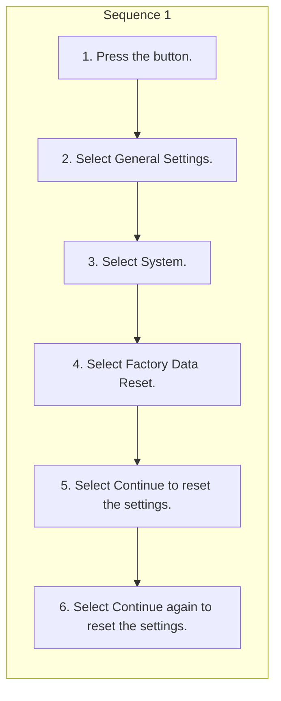

<!-- GENERATED:START function=6d2565926cdf (generated; edits inside this block are overwritten by the next publish — write your own notes outside it) -->
# 21. Defaulting All the Settings

<b>Function path:</b> Features / Defaulting All the Settings <b>Source:</b> printed page 311, 312 <b>Test-ready:</b> yes — no unfilled thresholds and a procedure is present

Every "Presumed requirement" row below is machine-derived from the Owner's Manual text by rule-based extraction — not AI-written — and traceable to the printed page in its Source column.

## Procedure

| Seq | Step | Operation (Copied from OM) | Source |
|---|---|---|---|
| 1 | 1 | Press the button. | p.311 / step |
| 1 | 2 | Select General Settings. | p.311 / step |
| 1 | 3 | Select System. | p.311 / step |
| 1 | 4 | Select Factory Data Reset. | p.311 / step |
| 1 | 5 | Select Continue to reset the settings. | p.311 / step |
| 1 | 6 | Select Continue again to reset the settings. | p.311 / step |

## 21-2-1. Service overview

| # | Presumed requirement | Strength | Source |
|---|---|---|---|
| 1 | Defaulting All the SettingsReset all the menu and customized settings as the factory defaults. | capability | p.311 / text |

## 21-2-2. Service requirements

| # | Presumed requirement | Strength | Source |
|---|---|---|---|
| 1 | Step -A confirmation message appears on the screen. | capability | p.311 / bullet |
| 2 | Step -The system will reboot. | capability | p.311 / bullet |
| 3 | Defaulting All the Settings1Defaulting All the Settings When you transfer the vehicle to a third party, reset all settings to default and delete all personal data. | constraint | p.311 / text |
| 4 | Defaulting All the SettingsIf you perform Factory Data Reset, it will reset the preinstalled apps to their factory default. | capability | p.311 / text |
| 5 | Defaulting All the SettingsBluetooth® HandsFreeLink® (HFL) allows you to place and receive phone calls using 1Bluetooth® HandsFreeLink® your vehicle’s audio system, without handling your cell phone. Select the phone zone when your phone is connected to the system wirelessly. | constraint | p.312 / text |
<!-- GENERATED:END function=6d2565926cdf -->

