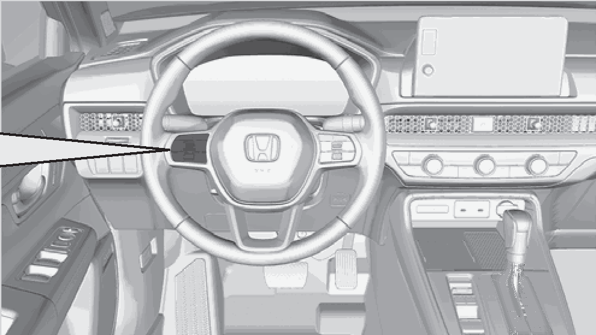
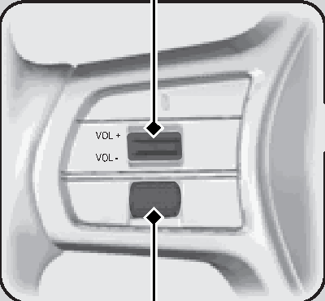
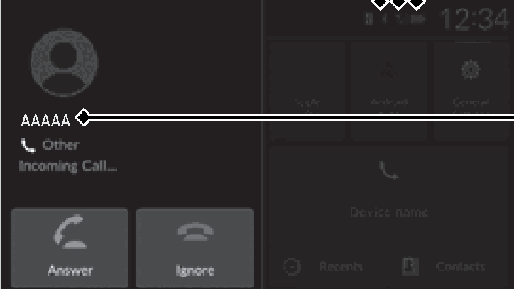
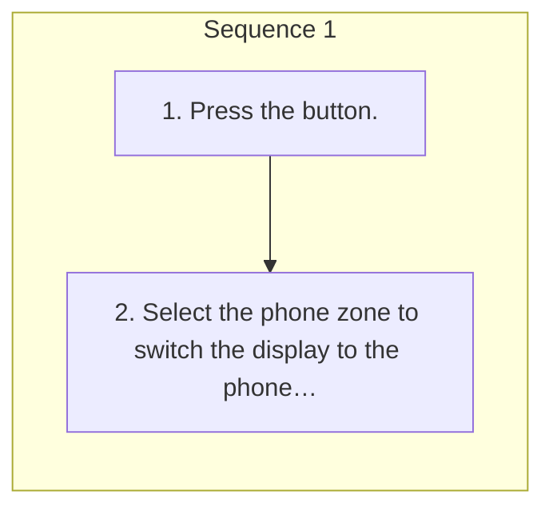

<!-- GENERATED:START function=18d2ef322cee (generated; edits inside this block are overwritten by the next publish — write your own notes outside it) -->
# 22. Using HFL

<b>Function path:</b> Features / Using HFL <b>Source:</b> printed page 312, 313, 314 <b>Test-ready:</b> yes — no unfilled thresholds and a procedure is present

Every "Presumed requirement" row below is machine-derived from the Owner's Manual text by rule-based extraction — not AI-written — and traceable to the printed page in its Source column.

## Figures (areas of the original PDF; the OM has no figure numbers or captions)

- Figure 22-1 source: p.312
- (Copied from OM) HFL Buttons

- Figure 22-2 source: p.312
- (Copied from OM) (Volume) Switch

- Figure 22-3 source: p.314
- (Copied from OM) Caller’s Name (If

## Procedure

| Seq | Step | Operation (Copied from OM) | Source |
|---|---|---|---|
| 1 | 1 | Press the button. | p.313 / step |
| 1 | 2 | Select the phone zone to switch the display to the phone screen. | p.313 / step |

## 22-2-1. Service overview

| # | Presumed requirement | Strength | Source |
|---|---|---|---|
| 1 | Using HFLHFL Buttons. | capability | p.312 / text |
| 2 | Using HFLVOL (+/VOL (- (Volume) Switch. | capability | p.312 / text |
| 3 | Using HFLLeft Selector Wheel. | capability | p.312 / text |
| 4 | Using HFLPlace your phone where you can get good reception. | capability | p.312 / text |
| 5 | Using HFLTo use HFL, you need a Bluetooth-compatible cell phone. For a list of compatible phones, pairing procedures, and special feature capabilities:. | capability | p.312 / text |

## 22-2-2. Service requirements

| # | Presumed requirement | Strength | Source |
|---|---|---|---|
| 1 | Step -U.S.: Visit https://mygarage.honda.com/s/hondahandsfreelink-compatibility-check, or call 1-888- 528-7876. | capability | p.312 / bullet |
| 2 | Step -Canada: Call 1-855-490-7351. | capability | p.312 / bullet |
| 3 | Using HFLVoice control tips. | capability | p.312 / text |
| 4 | Step -Aim the vents away from the ceiling and close the windows, as noise coming from them may interfere with the microphone. | capability | p.312 / bullet |
| 5 | Step -If the microphone picks up voices other than yours, the command may be misinterpreted. | capability | p.312 / bullet |
| 6 | Using HFLState or local laws may prohibit the operation of handheld electronic devices while operating a vehicle. | capability | p.312 / text |
| 7 | Using HFLUp to 16 favorite contacts can be stored. If there is no entry in the system, the pop-up notification appears on the screen. 2 Favorite Contacts P.318. | constraint | p.312 / text |
| 8 | Using HFLUp to 100 call histories can be stored. If there is no call history, Call History is disabled. | constraint | p.312 / text |
| 9 | Using HFL(Home) button*1: Press to go back to the home screen of the driver information 1Bluetooth® HandsFreeLink® interface. Left Selector Wheel: Press the (Home) button*1. Roll up or down to select Phone on the driver information interface, and then press the left selector wheel. | capability | p.313 / text |
| 10 | Step -You can select Favorite Contacts or Recent Calls by rolling up or down the left selector wheel. While receiving a call, the incoming call screen is displayed on the driver information interface. You can pick up the call using the left selector wheel. 2 Receiving a Call P.321. | capability | p.313 / bullet |
| 11 | Using HFLTo go to the phone screen:. | capability | p.313 / text |
| 12 | Using HFL*1:Models with A-type meter. | capability | p.313 / text |
| 13 | Using HFLWireless Technology Bluetooth® The Bluetooth® word mark and logos are registered trademarks owned by Bluetooth SIG, Inc., and any use of such marks by Honda Motor Co., Ltd., is under license. Other trademarks and trade names are those of their respective owners. | capability | p.313 / text |
| 14 | Using HFLHFL Limitations An incoming call on HFL will interrupt the audio system when it is playing. It will resume when the call is ended. | constraint | p.313 / text |
| 15 | Using HFLContinued. | capability | p.313 / text |
| 16 | Using HFLHFL Status Display. | capability | p.314 / text |
| 17 | Using HFLThe audio/information screen notifies you when there is an incoming call. | constraint | p.314 / text |
| 18 | Using HFLBluetooth Indicator Appears when your phone is connected to HFL. | constraint | p.314 / text |
| 19 | Using HFLLimitations for Manual Operation. | capability | p.314 / text |
| 20 | Using HFL1HFL Status Display The information that appears on the audio/ information screen varies between phone models. | capability | p.314 / text |
| 21 | Using HFLSignal Strength. | capability | p.314 / text |
| 22 | Using HFLBattery Level Status. | capability | p.314 / text |
| 23 | Using HFLCaller’s Name (If registered)/ Caller’s Number (If not registered). | capability | p.314 / text |

## 22-5. Exception operation

| # | Presumed requirement | Strength | Source |
|---|---|---|---|
| 1 | Using HFLIf there is an active connection to Apple CarPlay or Android Auto, HFL is unavailable. | capability | p.312 / text |
| 2 | Using HFLCertain manual functions are disabled or inoperable while the vehicle is in motion. You cannot select a grayed-out option until the vehicle is stopped. | constraint | p.314 / text |
<!-- GENERATED:END function=18d2ef322cee -->

