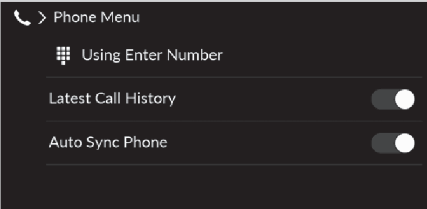
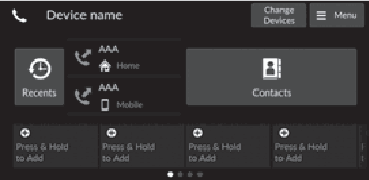
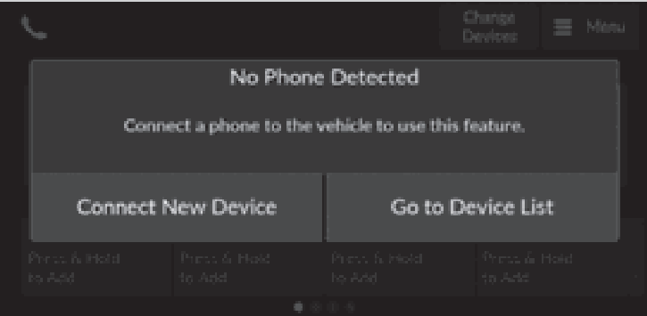
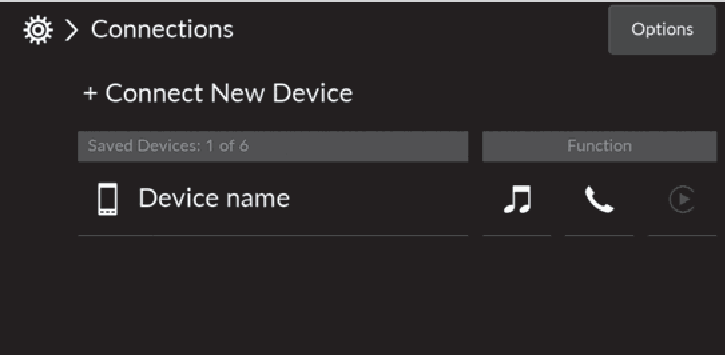
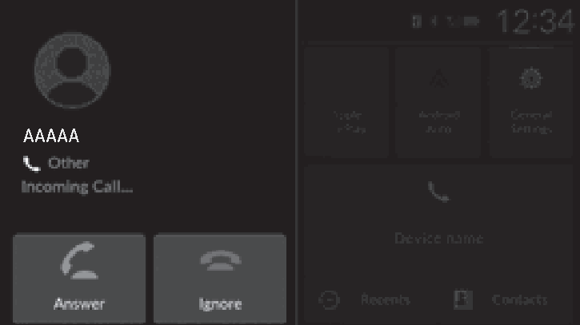
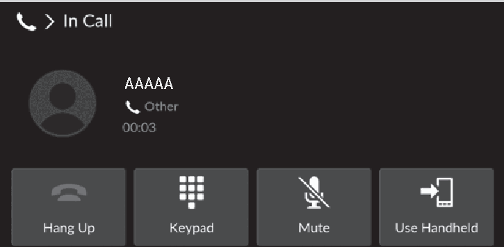

<!-- GENERATED:START function=1e3c0dcd8040 (generated; edits inside this block are overwritten by the next publish — write your own notes outside it) -->
# 23. HFL Menus

<b>Function path:</b> Features / HFL Menus <b>Source:</b> printed page 315, 316, 317, 318, 319, 320, 321, 322, 323, 324 <b>Test-ready:</b> yes — no unfilled thresholds and a procedure is present

Every "Presumed requirement" row below is machine-derived from the Owner's Manual text by rule-based extraction — not AI-written — and traceable to the printed page in its Source column.

## Figures (areas of the original PDF; the OM has no figure numbers or captions)

- Figure 23-1 source: p.315
- (Copied from OM) Phone menu screen

- Figure 23-2 source: p.316
- (Copied from OM) Phone screen

- Figure 23-3 source: p.317
- (Copied from OM) To pair a cell phone (when there is no phone paired to the system)

- Figure 23-4 source: p.318
- (Copied from OM) To change the currently paired phone

- Figure 23-5 source: p.321
- (Copied from OM) To make a call using the imported phonebook

- Figure 23-6 source: p.323
- (Copied from OM) Receiving a Call

- Figure 23-7 source: p.324
- (Copied from OM) Options During a Call

## Procedure (14 sequences; the manual restarts the numbering)

```mermaid
flowchart TD
    subgraph SEQ1["Sequence 1"]
    direction TB
    S1_1["1. Press the button."]
    S1_2["2. Select the phone zone."]
    S1_3["3. Select Menu."]
    S1_1 --> S1_2
    S1_2 --> S1_3
    end
    subgraph SEQ2["Sequence 2"]
    direction TB
    S2_1["1. Press the button."]
    S2_2["2. Select the phone zone."]
    S2_1 --> S2_2
    end
    subgraph SEQ3["Sequence 3"]
    direction TB
    S3_1["1. Press the button. moving."]
    S3_2["2. Select the phone zone."]
    S3_3["3. Select Connect New Device."]
    S3_4["4. Make sure your phone is in search or paired to the syste…"]
    S3_5["5. Select your phone when it appears on the : The phone is …"]
    S3_6["6. Select Yes."]
    S3_1 --> S3_2
    S3_2 --> S3_3
    S3_3 --> S3_4
    S3_4 --> S3_5
    S3_5 --> S3_6
    end
    subgraph SEQ4["Sequence 4"]
    direction TB
    S4_1["1. Go to the phone screen. 2 Phone Setup P.315"]
    S4_2["2. Select Change Devices."]
    S4_3["3. Select the function icon for the phone you want to conne…"]
    S4_1 --> S4_2
    S4_2 --> S4_3
    end
    subgraph SEQ5["Sequence 5"]
    direction TB
    S5_1["1. Go to the phone screen. 2 Phone Setup P.315"]
    S5_2["2. Select Change Devices."]
    S5_3["3. Select a phone you want to delete."]
    S5_4["4. Select Delete."]
    S5_5["5. A confirmation message appears on the screen. Select Del…"]
    S5_1 --> S5_2
    S5_2 --> S5_3
    S5_3 --> S5_4
    S5_4 --> S5_5
    end
    subgraph SEQ6["Sequence 6"]
    direction TB
    S6_1["1. Go to the phone menu screen. 2 Phone menu screen P.313"]
    S6_2["2. Select Auto Sync Phone."]
    S6_3["3. Select On or Off."]
    S6_1 --> S6_2
    S6_2 --> S6_3
    end
    subgraph SEQ7["Sequence 7"]
    direction TB
    S7_1["1. Press the"]
    S7_2["2. Select the phone zone."]
    S7_3["3. Select and hold Press & Hold to Add."]
    S7_4["4. Select From Recents, From Contacts, or Using Enter Numbe…"]
    S7_5["5. Select the phone number."]
    S7_1 --> S7_2
    S7_2 --> S7_3
    S7_3 --> S7_4
    S7_4 --> S7_5
    end
    subgraph SEQ8["Sequence 8"]
    direction TB
    S8_5["5. Input number, and select OK."]
    end
    subgraph SEQ9["Sequence 9"]
    direction TB
    S9_1["1. Press the"]
    S9_2["2. Select the phone zone."]
    S9_3["3. Select and hold a favorite contact."]
    S9_4["4. Select Edit Favorites."]
    S9_5["5. Select a setting you want."]
    S9_6["6. Select Enter or select type."]
    S9_1 --> S9_2
    S9_2 --> S9_3
    S9_3 --> S9_4
    S9_4 --> S9_5
    S9_5 --> S9_6
    end
    subgraph SEQ10["Sequence 10"]
    direction TB
    S10_1["1. Press the"]
    S10_2["2. Select the phone zone."]
    S10_3["3. Select and hold a favorite contact."]
    S10_4["4. Select Remove Favorite."]
    S10_1 --> S10_2
    S10_2 --> S10_3
    S10_3 --> S10_4
    end
    subgraph SEQ11["Sequence 11"]
    direction TB
    S11_1["1. Press the button."]
    S11_2["2. Select Contacts."]
    S11_3["3. Select a name. If more than one number is registered, se…"]
    S11_1 --> S11_2
    S11_2 --> S11_3
    end
    subgraph SEQ12["Sequence 12"]
    direction TB
    S12_1["1. Press the button."]
    S12_2["2. Select the phone zone."]
    S12_3["3. Select Menu."]
    S12_4["4. Select Using Enter Number."]
    S12_5["5. Select a number."]
    S12_6["6. Select Call."]
    S12_1 --> S12_2
    S12_2 --> S12_3
    S12_3 --> S12_4
    S12_4 --> S12_5
    S12_5 --> S12_6
    end
    subgraph SEQ13["Sequence 13"]
    direction TB
    S13_1["1. Press the button."]
    S13_2["2. Select Recents."]
    S13_3["3. Select a number."]
    S13_1 --> S13_2
    S13_2 --> S13_3
    end
    subgraph SEQ14["Sequence 14"]
    direction TB
    S14_1["1. Press the button."]
    S14_2["2. Select the phone zone."]
    S14_3["3. Select desired favorite contact."]
    S14_1 --> S14_2
    S14_2 --> S14_3
    end
```

| Seq | Step | Operation (Copied from OM) | Source |
|---|---|---|---|
| 1 | 1 | Press the button. | p.315 / step |
| 1 | 2 | Select the phone zone. | p.315 / step |
| 1 | 3 | Select Menu. | p.315 / step |
| 2 | 1 | Press the button. | p.316 / step |
| 2 | 2 | Select the phone zone. | p.316 / step |
| 3 | 1 | Press the button. moving. | p.317 / step |
| 3 | 2 | Select the phone zone. | p.317 / step |
| 3 | 3 | Select Connect New Device. | p.317 / step |
| 3 | 4 | Make sure your phone is in search or paired to the system. discoverable mode, then select Search for Once you have paired a phone, you can see it Devices. displayed on the screen with one or more icons on | p.317 / step |
| 3 | 5 | Select your phone when it appears on the : The phone is compatible with Bluetooth® Audio. list. : The phone is compatible with HFL. | p.317 / step |
| 3 | 6 | Select Yes. | p.317 / step |
| 4 | 1 | Go to the phone screen. 2 Phone Setup P.315 | p.318 / step |
| 4 | 2 | Select Change Devices. | p.318 / step |
| 4 | 3 | Select the function icon for the phone you want to connect. | p.318 / step |
| 5 | 1 | Go to the phone screen. 2 Phone Setup P.315 | p.318 / step |
| 5 | 2 | Select Change Devices. | p.318 / step |
| 5 | 3 | Select a phone you want to delete. | p.318 / step |
| 5 | 4 | Select Delete. | p.318 / step |
| 5 | 5 | A confirmation message appears on the screen. Select Delete. | p.318 / step |
| 6 | 1 | Go to the phone menu screen. 2 Phone menu screen P.313 | p.319 / step |
| 6 | 2 | Select Auto Sync Phone. | p.319 / step |
| 6 | 3 | Select On or Off. | p.319 / step |
| 7 | 1 | Press the | p.320 / step |
| 7 | 2 | Select the phone zone. | p.320 / step |
| 7 | 3 | Select and hold Press &amp; Hold to Add. | p.320 / step |
| 7 | 4 | Select From Recents, From Contacts, or Using Enter Number. | p.320 / step |
| 7 | 5 | Select the phone number. | p.320 / step |
| 8 | 5 | Input number, and select OK. | p.320 / step |
| 9 | 1 | Press the | p.320 / step |
| 9 | 2 | Select the phone zone. | p.320 / step |
| 9 | 3 | Select and hold a favorite contact. | p.320 / step |
| 9 | 4 | Select Edit Favorites. | p.320 / step |
| 9 | 5 | Select a setting you want. | p.320 / step |
| 9 | 6 | Select Enter or select type. | p.320 / step |
| 10 | 1 | Press the | p.320 / step |
| 10 | 2 | Select the phone zone. | p.320 / step |
| 10 | 3 | Select and hold a favorite contact. | p.320 / step |
| 10 | 4 | Select Remove Favorite. | p.320 / step |
| 11 | 1 | Press the button. | p.321 / step |
| 11 | 2 | Select Contacts. | p.321 / step |
| 11 | 3 | Select a name. If more than one number is registered, select a number. | p.321 / step |
| 12 | 1 | Press the button. | p.322 / step |
| 12 | 2 | Select the phone zone. | p.322 / step |
| 12 | 3 | Select Menu. | p.322 / step |
| 12 | 4 | Select Using Enter Number. | p.322 / step |
| 12 | 5 | Select a number. | p.322 / step |
| 12 | 6 | Select Call. | p.322 / step |
| 13 | 1 | Press the button. | p.322 / step |
| 13 | 2 | Select Recents. | p.322 / step |
| 13 | 3 | Select a number. | p.322 / step |
| 14 | 1 | Press the button. | p.322 / step |
| 14 | 2 | Select the phone zone. | p.322 / step |
| 14 | 3 | Select desired favorite contact. | p.322 / step |

## 23-2-1. Service overview

| # | Presumed requirement | Strength | Source |
|---|---|---|---|
| 1 | HFL MenusThe power mode must be in ACCESSORY or ON to use the system. | capability | p.315 / text |
| 2 | HFL MenusPhone menu screen. | capability | p.315 / text |
| 3 | HFL MenusEnter a phone number to dial. Using Enter Number. | capability | p.315 / text |
| 4 | HFL MenusSet whether the history shortcut is displayed in the phone screen. Latest Call History. | capability | p.315 / text |
| 5 | HFL MenusSet phonebook and call history data to be automatically imported when a phone is paired to HFL. Auto Sync Phone. | constraint | p.315 / text |
| 6 | HFL Menus1HFL Menus To use HFL, you must first pair your Bluetoothcompatible cell phone to the system while the vehicle is parked. | capability | p.315 / text |
| 7 | HFL MenusSome functions are limited while driving. A message appears on the screen when the vehicle is moving and the operation is canceled. | constraint | p.315 / text |
| 8 | HFL MenusPhone screen. | capability | p.316 / text |
| 9 | HFL MenusDisplay the last outgoing, incoming, and missed calls. Recents All. | capability | p.316 / text |
| 10 | HFL MenusDisplay the last outgoing calls. Dialed. | capability | p.316 / text |
| 11 | HFL MenusDisplay the last missed calls. Missed. | capability | p.316 / text |
| 12 | HFL MenusDisplay the last incoming calls. Received. | capability | p.316 / text |
| 13 | HFL Menus(Existing entry list) Dial the selected number in the favorite contacts list. | capability | p.316 / text |
| 14 | HFL MenusContacts Display the paired phone’s phonebook. Select a phone number from the call history to store as a Press &amp; Hold to From Recents favorite contact number. Add Select a phone number from the phonebook to store as a From Contacts favorite contact number. Using Enter Enter a phone number to store as a favorite contact number. Number Change Devices + Connect New Device Pair a new phone to the system. | capability | p.316 / text |
| 15 | HFL MenusConnect, disconnect, or delete a paired device. (Existing entry list) Menu Display the phone menu screen. | capability | p.316 / text |
| 16 | HFL MenusPhone Setup. | capability | p.317 / text |
| 17 | HFL MenusBluetooth® setup. | capability | p.317 / text |
| 18 | HFL MenusThe Bluetooth® function is always ON. | capability | p.317 / text |
| 19 | HFL Menus1Phone Setup Your Bluetooth-compatible phone must be paired to the system before you can make and receive handsfree calls. | capability | p.317 / text |
| 20 | HFL MenusTo pair a cell phone (when there is no. | capability | p.317 / text |
| 21 | HFL MenusPhone Pairing Tips: phone paired to the system). | capability | p.317 / text |

## 23-2-2. Service requirements

| # | Presumed requirement | Strength | Source |
|---|---|---|---|
| 1 | Step -Up to six phones can be paired. | capability | p.317 / bullet |
| 2 | Step -Your phone’s battery may drain faster when it is. | constraint | p.317 / bullet |
| 3 | Step -HFL automatically searches for a the right side. Bluetooth® device. These icons indicate the following:. | capability | p.317 / bullet |
| 4 | Step -If your phone still does not appear, : The phone is compatible with Apple CarPlay. search for Bluetooth® devices using your : The phone is compatible with Android Auto. phone. From your phone, search for Vehicle Name. | capability | p.317 / bullet |
| 5 | Step -Confirm if the pairing code on the audio/ information screen and your phone matches. This may vary by phone. | constraint | p.317 / bullet |
| 6 | HFL MenusTo change the currently paired phone. | capability | p.318 / text |
| 7 | HFL MenusTo delete a paired phone. | capability | p.318 / text |
| 8 | HFL Menus1To change the currently paired phone If no other phones are found or paired when trying to switch to another phone, the original phone is connected again. | constraint | p.318 / text |
| 9 | HFL MenusTo pair other phones, select + Connect New Device from the Connections screen. | capability | p.318 / text |
| 10 | HFL MenusAutomatic Import of Cellular Phonebook and Call History. | capability | p.319 / text |
| 11 | HFL MenusWhen Auto Sync Phone is set to On:. | capability | p.319 / text |
| 12 | HFL MenusWhen your phone is paired, the contents of its phonebook and call history are automatically imported to HFL. | capability | p.319 / text |
| 13 | HFL MenusChanging the Auto Sync Phone setting. | capability | p.319 / text |
| 14 | HFL Menus1Automatic Import of Cellular Phonebook and Call History When you select a person from the list in the cellular phonebook, you can see up to five category icons. The icons indicate what types of numbers are stored for that name. | constraint | p.319 / text |
| 15 | HFL MenusMobile Work. | capability | p.319 / text |
| 16 | HFL MenusHome Other. | capability | p.319 / text |
| 17 | HFL MenusThe phonebook is updated after every connection. Call history is updated after every connection or call. | capability | p.319 / text |
| 18 | HFL MenusFavorite Contacts. | capability | p.320 / text |
| 19 | HFL MenusTo store a number as a favorite contact:. | capability | p.320 / text |
| 20 | HFL MenusFrom Recents, From Contacts. | capability | p.320 / text |
| 21 | HFL MenusUsing Enter Number. | capability | p.320 / text |
| 22 | HFL MenusTo edit a favorite contact. | capability | p.320 / text |
| 23 | HFL MenusTo delete a favorite contact. | capability | p.320 / text |
| 24 | HFL MenusMaking a Call. | capability | p.321 / text |
| 25 | HFL MenusYou can make calls by inputting any phone number, or by using the imported phonebook, call history, or favorite contact entries. | capability | p.321 / text |
| 26 | HFL MenusTo make a call using the imported phonebook. | capability | p.321 / text |
| 27 | HFL MenusWhen your phone is paired, the contents of its phonebook are automatically imported to HFL. | capability | p.321 / text |
| 28 | Step -Dialing starts automatically. | capability | p.321 / bullet |
| 29 | Step -The phonebook is stored alphabetically. | capability | p.321 / bullet |
| 30 | Step -You can sort by First Name or Last Name. Select the icon on the upper right of the screen. | capability | p.321 / bullet |
| 31 | HFL Menus1Making a Call Once a call is connected, you can hear the voice of the person you are calling through the audio speakers. | capability | p.321 / text |
| 32 | HFL MenusTo make a call using a phone number. | capability | p.322 / text |
| 33 | Step -Dialing starts automatically. | capability | p.322 / bullet |
| 34 | HFL MenusTo make a call using the call history. | capability | p.322 / text |
| 35 | HFL MenusCall history is stored by All, Dialed, Missed, or Received. | capability | p.322 / text |
| 36 | Step -You can sort by All, Dialed, Missed, or Received. Select the icon on the upper right of the screen. | capability | p.322 / bullet |
| 37 | Step -Dialing starts automatically. | capability | p.322 / bullet |
| 38 | HFL MenusTo make a call using a favorite contact. | capability | p.322 / text |
| 39 | Step -Dialing starts automatically. | capability | p.322 / bullet |
| 40 | HFL Menus1To make a call using the call history The call history appears only when a phone is connected to HFL, and displays the last 100 dialed, received, or missed calls. | constraint | p.322 / text |
| 41 | HFL MenusReceiving a Call. | capability | p.323 / text |
| 42 | HFL MenusWhen there is an incoming call, an audible notification sounds and the Incoming Call... screen appears. | capability | p.323 / text |
| 43 | HFL MenusYou can answer the call using the left selector wheel. To pick up the call, roll up or down to select Answer on the driver information interface and then press the left selector wheel. | capability | p.323 / text |
| 44 | Step -If you want to decline or end the call, select Ignore on the driver information interface using the left selector wheel. | capability | p.323 / bullet |
| 45 | HFL Menus1Receiving a Call Call Waiting Select Answer using the left selector wheel to put the current call on hold to answer the incoming call. Select Swap calls using the left selector wheel to return to the current call. Select Ignore using the left selector wheel to ignore the incoming call if you do not want to answer it. Select Hang up using the left selector wheel if you want to hang up the current call. | constraint | p.323 / text |
| 46 | HFL MenusYou can select the icons on the audio/information screen instead of the icons on the driver information interface. | capability | p.323 / text |
| 47 | HFL Menus1Options During a Call. | capability | p.324 / text |
| 48 | HFL MenusOptions During a Call. | capability | p.324 / text |
| 49 | HFL MenusKeypad: Available on some phones. The following options are available during a call. Swap Calls: Put the current call on hold to answer the incoming call. Mute: Mute your voice. Use Handheld: Transfer a call from HFL to your phone. Keypad: Send numbers during a call. This is useful when you call a menu-driven phone system. The available options are shown on the lower half of the screen. | constraint | p.324 / text |
| 50 | HFL MenusSelect the option. | capability | p.324 / text |
| 51 | Step -Select Mute again to turn it off. | capability | p.324 / bullet |

## 23-5. Exception operation

| # | Presumed requirement | Strength | Source |
|---|---|---|---|
| 1 | Step -You cannot pair your phone while the vehicle is. | constraint | p.317 / bullet |
| 2 | HFL MenusYou can also switch the connection with the , icon, or icon in the device list. When or is selected, , cannot be selected. | constraint | p.318 / text |
| 3 | HFL MenusOn some phones, it may not be possible to import the category icons to HFL. | capability | p.319 / text |
<!-- GENERATED:END function=1e3c0dcd8040 -->

