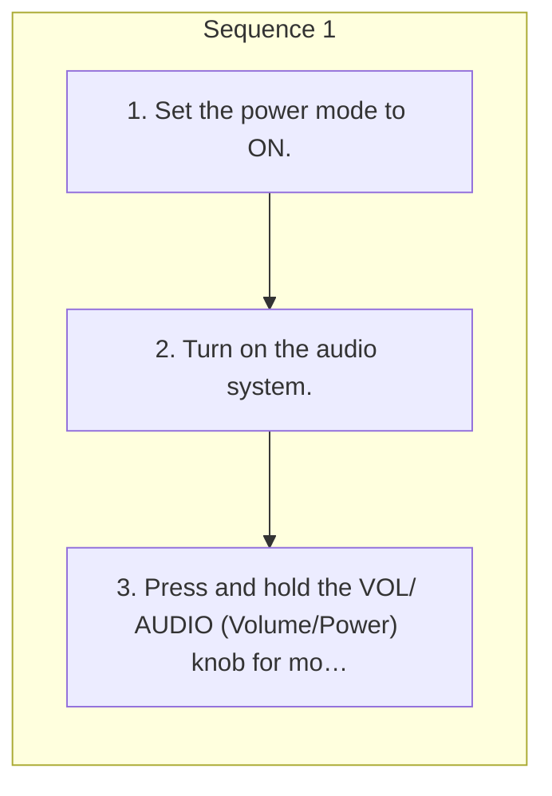

<!-- GENERATED:START function=82dc052947d0 (generated; edits inside this block are overwritten by the next publish — write your own notes outside it) -->
# 3. Audio System Theft Protection

<b>Function path:</b> Features / Audio System Theft Protection <b>Source:</b> printed page 256 <b>Test-ready:</b> yes — no unfilled thresholds and a procedure is present

Every "Presumed requirement" row below is machine-derived from the Owner's Manual text by rule-based extraction — not AI-written — and traceable to the printed page in its Source column.

## Procedure

| Seq | Step | Operation (Copied from OM) | Source |
|---|---|---|---|
| 1 | 1 | Set the power mode to ON. | p.256 / step |
| 1 | 2 | Turn on the audio system. | p.256 / step |
| 1 | 3 | Press and hold the VOL/ AUDIO (Volume/Power) knob for more than two seconds. | p.256 / step |

## 3-2-1. Service overview

| # | Presumed requirement | Strength | Source |
|---|---|---|---|
| 1 | Audio System Theft ProtectionThe audio system is disabled when it is disconnected from the power source, such as when the battery is disconnected or goes dead. In certain conditions, the system may display a code entry screen. If this occurs, reactivate the audio system. | constraint | p.256 / text |
| 2 | Audio System Theft ProtectionReactivating the audio system. | capability | p.256 / text |

## 3-2-2. Service requirements

| # | Presumed requirement | Strength | Source |
|---|---|---|---|
| 1 | Step -The audio system is reactivated when the audio control unit establishes a connection with the vehicle control unit. If the control unit fails to recognize the audio unit, you must go to a dealer and have the audio unit checked. | constraint | p.256 / bullet |
<!-- GENERATED:END function=82dc052947d0 -->

