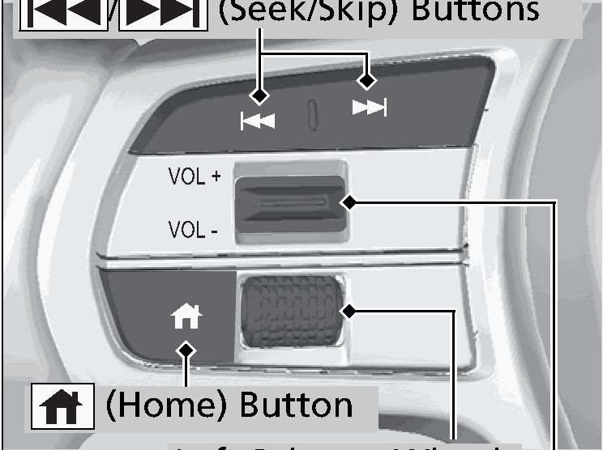
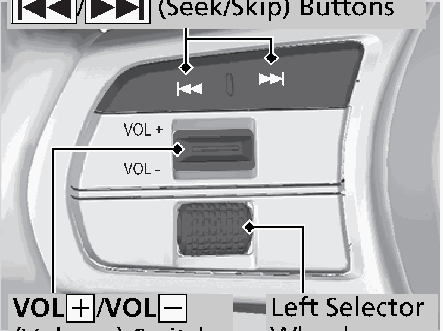

<!-- GENERATED:START function=3eefe40e4d15 (generated; edits inside this block are overwritten by the next publish — write your own notes outside it) -->
# 4. Audio Remote Controls

<b>Function path:</b> Features / Audio Remote Controls <b>Source:</b> printed page 257, 258, 259, 260 <b>Test-ready:</b> no — procedure missing or thresholds unfilled

Every "Presumed requirement" row below is machine-derived from the Owner's Manual text by rule-based extraction — not AI-written — and traceable to the printed page in its Source column.

## Figures (areas of the original PDF; the OM has no figure numbers or captions)

- Figure 4-1 source: p.257
- (Copied from OM) (Home) Button

- Figure 4-2 source: p.257
- (Copied from OM) VOL(+/VOL(-

## 4-2-1. Service overview

| # | Presumed requirement | Strength | Source |
|---|---|---|---|
| 1 | Audio Remote ControlsAllow you to operate the audio system while driving. The information is shown on the driver information interface. VOL(+/VOL(- (Volume) Switch Models with A-type meter Press Up: To increase the volume. / (Seek/Skip) Buttons Press Down: To decrease the volume. | capability | p.257 / text |
| 2 | Audio Remote Controls(Home) Button Left Selector Wheel VOL(+/VOL(- (Volume) Switch. | capability | p.257 / text |
| 3 | Audio Remote ControlsModels with B-type meter / (Seek/Skip) Buttons. | capability | p.257 / text |
| 4 | Audio Remote ControlsLeft Selector VOL(+/VOL(- Wheel (Volume) Switch. | capability | p.257 / text |
| 5 | Audio Remote Controls1Audio Remote Controls Some modes appear only when an appropriate device or medium is used. | constraint | p.257 / text |
| 6 | Audio Remote ControlsDepending on the Bluetooth® device you connect, some functions may not be available. | capability | p.257 / text |
| 7 | Audio Remote ControlsModels with A-type meter Press the (Home) button to go back to the home screen of the driver information interface. | capability | p.257 / text |
| 8 | Audio Remote Controls/ (Seek/Skip) Buttons. | capability | p.258 / text |

## 4-2-2. Service requirements

| # | Presumed requirement | Strength | Source |
|---|---|---|---|
| 1 | Step -When listening to the radio : To select the next preset radio station. Press : To select the previous preset radio station. Press : To select the next strong station. Press and hold : To select the previous strong station. Press and hold. | capability | p.258 / bullet |
| 2 | Step -When listening to a wired connection, USB flash drive, Bluetooth® Audio, or Smartphone Connection. | capability | p.258 / bullet |
| 3 | Step -Depending on a connected device, operations may be changed. : To skip to the next song. Press : To go back to the beginning of the current or previous song. Press. | capability | p.258 / bullet |
| 4 | Step -When listening to a USB flash drive : To skip to the next folder. Press and hold : To go back to the previous folder. Press and hold. | capability | p.258 / bullet |
| 5 | Audio Remote ControlsModels with A-type meter Left Selector Wheel. | capability | p.259 / text |
| 6 | Step -When selecting the audio mode Press the (home) button, then roll up or down to select Audio on the driver information interface, and then press the left selector wheel. | capability | p.259 / bullet |
| 7 | Audio Remote ControlsRoll up or down: To cycle through the audio modes, roll up or down and then press the left selector wheel: FM/AM/iPod/USB/Bluetooth/Apple CarPlay/Android Auto. | capability | p.259 / text |
| 8 | Step -Depending on a connected device, the displayed modes may be changed. | capability | p.259 / bullet |
| 9 | Step -Depending on a connected device, the displayed modes may be changed. | capability | p.259 / bullet |
| 10 | Audio Remote ControlsTo use the audio system, the power mode must be in ACCESSORY or ON. (Connect) Button (Home) Button. | capability | p.260 / text |
| 11 | Audio Remote ControlsVOL/ AUDIO (Volume/Power) Knob. | capability | p.260 / text |
| 12 | Audio Remote Controls(Home) button: Press to go to the home screen. 2 Using the audio/information screen P.260 (Connect) button: Press to operate Apple CarPlay or Android Auto. VOL/ AUDIO (Volume/Power) knob: Press to turn the audio system on and off. Turn to adjust the volume. | capability | p.260 / text |

## 4-4. User settings

| # | Presumed requirement | Strength | Source |
|---|---|---|---|
| 1 | Audio Remote ControlsModels with B-type meter Left Selector Wheel Roll up or down: To cycle through the audio modes, roll up or down and then press the left selector wheel: Back/Phone/FM/AM/USB/Bluetooth/Apple CarPlay/Android Auto/Customize display. | capability | p.259 / text |
<!-- GENERATED:END function=3eefe40e4d15 -->

