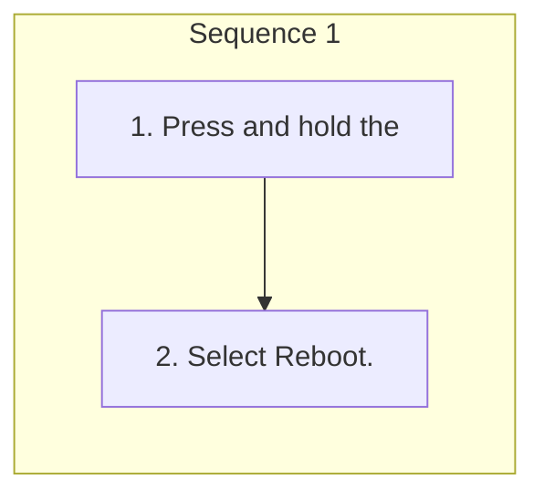

<!-- GENERATED:START function=49d9dccc5820 (generated; edits inside this block are overwritten by the next publish — write your own notes outside it) -->
# 6. Reboot Audio

<b>Function path:</b> Features / Reboot Audio <b>Source:</b> printed page 261 <b>Test-ready:</b> no — procedure missing or thresholds unfilled

Every "Presumed requirement" row below is machine-derived from the Owner's Manual text by rule-based extraction — not AI-written — and traceable to the printed page in its Source column.

## Procedure

| Seq | Step | Operation (Copied from OM) | Source |
|---|---|---|---|
| 1 | 1 | Press and hold the | p.261 / step |
| 1 | 2 | Select Reboot. | p.261 / step |

## Numeric thresholds (filled in by a tester)
Filled: 0 / unfilled: 1

| Threshold | Matching text (Copied from OM) | Kind | Unit | Value | Status | Evidence | Filled by |
|---|---|---|---|---|---|---|---|
| 86fd4e74c18f | a certain period of time | duration | time | **unfilled** | unfilled | — | — |

## 6-2-1. Service overview

| # | Presumed requirement | Strength | Source |
|---|---|---|---|
| 1 | Reboot AudioYou can reboot the audio system. | capability | p.261 / text |
| 2 | Reboot AudioSelect OK. | capability | p.261 / text |

## 6-2-2. Service requirements

| # | Presumed requirement | Strength | Source |
|---|---|---|---|
| 1 | Step -If you do not select OK within 5 seconds, the home screen will be displayed. | capability | p.261 / bullet |
| 2 | Reboot Audiobutton for a certain period of time. | capability | p.261 / text |
<!-- GENERATED:END function=49d9dccc5820 -->

