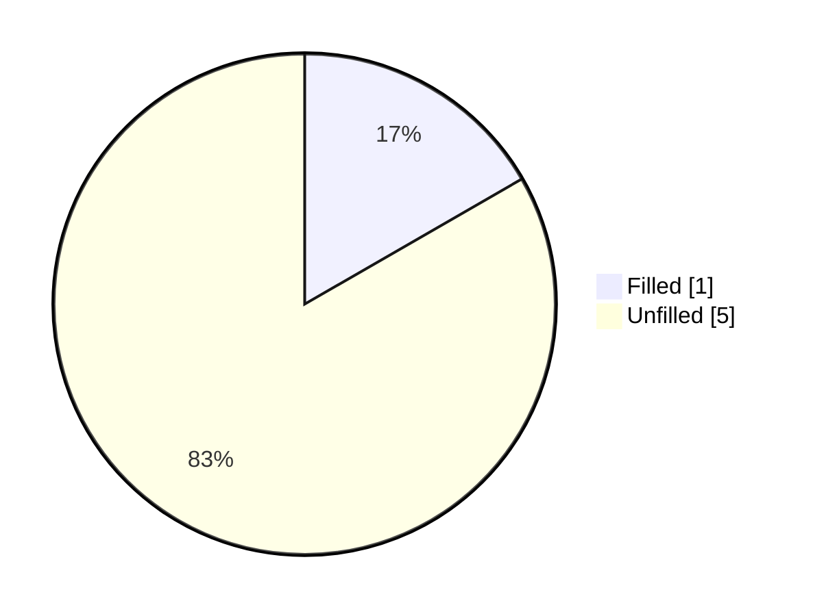
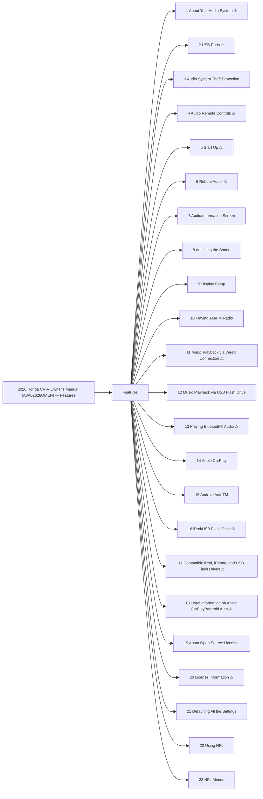

<!-- GENERATED:START index (generated; edits inside this block are overwritten by the next publish — write your own notes outside it) -->
# 2026 Honda CR-V Owner's Manual (A3A02626OMEN) — Features — Presumed specification

> This is a machine-derived estimate, not an official requirements document. Numeric thresholds left blank could not be found in the manual and must be filled in by a tester with evidence.

| Field | Value |
|---|---|
| Maker / Model | Honda / CR-V 2026 |
| Scope | Features |
| Markets | US, CA |
| Profile | honda_v2 |
| Manual ID | honda/cr-v-2026/ivi |

## Numeric thresholds

- Thresholds detected: **6**
- Filled: **1** / unfilled: **5**
- Test-ready functions: **12 / 23**

The manual states almost no numbers, so a tester fills the thresholds in. A function that still has an unfilled threshold cannot become a test specification (`is_test_ready=false`). Fill them in `overlay/thresholds.yaml` or on the screen.

## Figures in the manual

- Figures: **28** / images rendered: **28**

Each image is a rendering of the corresponding area of the original PDF. **Images are not kept in the repository** (they are copies of another company's manual); `publish` creates them under `../figures/` on the machine that runs it.

## Glossary (registered by a reviewer)

How wording in the manual maps to the in-house term. **The original text is not rewritten** — the mapping is only annotated here. Register terms on the Glossary screen. Evidence (why the mapping holds) is required.

| In-house term | Category | Wording in the manual | Hits | Evidence |
|---|---|---|---:|---|
| AA | abbreviation | `Android Auto` | 60 | Counted by string match over workspace/subaru/**/published/*.md (2026-09-01): outback-2026 31 / outback-2025 24 / ascent-2026 1. Always printed in full ("Android Auto") — no abbreviated form appears in the manual text; "AA" is an in-house-only abbreviation. |

## Functions

| No. | Function | Area | Requirements | Figures | Unfilled thresholds | Test-ready |
|---|---|---|---|---|---|---|
| 1 | [About Your Audio System](/specifications/honda/cr-v-2026/ivi/file/1-about-your-audio-system.md?chapter=features) | Features | 6 | 1 | 0 | - |
| 2 | [USB Ports](/specifications/honda/cr-v-2026/ivi/file/2-usb-ports.md?chapter=features) | Features | 19 | 2 | 0 | - |
| 3 | [Audio System Theft Protection](/specifications/honda/cr-v-2026/ivi/file/3-audio-system-theft-protection.md?chapter=features) | Features | 3 | 0 | 0 | o |
| 4 | [Audio Remote Controls](/specifications/honda/cr-v-2026/ivi/file/4-audio-remote-controls.md?chapter=features) | Features | 21 | 2 | 0 | - |
| 5 | [Start Up](/specifications/honda/cr-v-2026/ivi/file/5-start-up.md?chapter=features) | Features | 1 | 1 | 0 | - |
| 6 | [Reboot Audio](/specifications/honda/cr-v-2026/ivi/file/6-reboot-audio.md?chapter=features) | Features | 4 | 0 | 1 | - |
| 7 | [Audio/Information Screen](/specifications/honda/cr-v-2026/ivi/file/7-audio-information-screen.md?chapter=features) | Features | 23 | 3 | 0 | o |
| 8 | [Adjusting the Sound](/specifications/honda/cr-v-2026/ivi/file/8-adjusting-the-sound.md?chapter=features) | Features | 7 | 0 | 0 | o |
| 9 | [Display Setup](/specifications/honda/cr-v-2026/ivi/file/9-display-setup.md?chapter=features) | Features | 9 | 2 | 0 | o |
| 10 | [Playing AM/FM Radio](/specifications/honda/cr-v-2026/ivi/file/10-playing-am-fm-radio.md?chapter=features) | Features | 28 | 1 | 0 | o |
| 11 | [Music Playback via Wired Connection](/specifications/honda/cr-v-2026/ivi/file/11-music-playback-via-wired-connection.md?chapter=features) | Features | 16 | 1 | 1 | - |
| 12 | [Music Playback via USB Flash Drive](/specifications/honda/cr-v-2026/ivi/file/12-music-playback-via-usb-flash-drive.md?chapter=features) | Features | 17 | 1 | 0 | o |
| 13 | [Playing Bluetooth® Audio](/specifications/honda/cr-v-2026/ivi/file/13-playing-bluetooth-audio.md?chapter=features) | Features | 26 | 1 | 2 | - |
| 14 | [Apple CarPlay](/specifications/honda/cr-v-2026/ivi/file/14-apple-carplay.md?chapter=features) | Features | 33 | 1 | 0 | o |
| 15 | [Android AutoTM](/specifications/honda/cr-v-2026/ivi/file/15-android-autotm.md?chapter=features) | Features | 35 | 1 | 0 | o |
| 16 | [iPod/USB Flash Drive](/specifications/honda/cr-v-2026/ivi/file/16-ipod-usb-flash-drive.md?chapter=features) | Features | 8 | 0 | 1 | - |
| 17 | [Compatible iPod, iPhone, and USB Flash Drives](/specifications/honda/cr-v-2026/ivi/file/17-compatible-ipod-iphone-and-usb-flash-drives.md?chapter=features) | Features | 12 | 0 | 0 | - |
| 18 | [Legal Information on Apple CarPlay/Android Auto](/specifications/honda/cr-v-2026/ivi/file/18-legal-information-on-apple-carplay-android-auto.md?chapter=features) | Features | 6 | 0 | 0 | - |
| 19 | [About Open Source Licenses](/specifications/honda/cr-v-2026/ivi/file/19-about-open-source-licenses.md?chapter=features) | Features | 1 | 0 | 0 | o |
| 20 | [License Information](/specifications/honda/cr-v-2026/ivi/file/20-license-information.md?chapter=features) | Features | 76 | 1 | 0 | - |
| 21 | [Defaulting All the Settings](/specifications/honda/cr-v-2026/ivi/file/21-defaulting-all-the-settings.md?chapter=features) | Features | 6 | 0 | 0 | o |
| 22 | [Using HFL](/specifications/honda/cr-v-2026/ivi/file/22-using-hfl.md?chapter=features) | Features | 30 | 3 | 0 | o |
| 23 | [HFL Menus](/specifications/honda/cr-v-2026/ivi/file/23-hfl-menus.md?chapter=features) | Features | 75 | 7 | 0 | o |
<!-- GENERATED:END index -->

