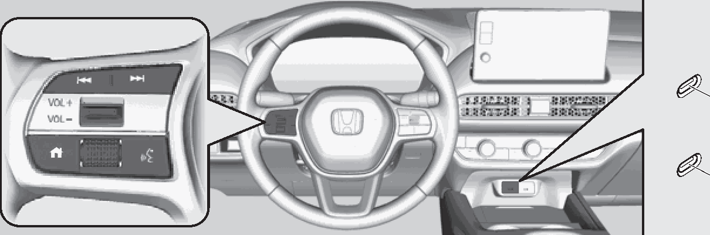

<!-- GENERATED:START function=b6be79f7490f (generated; edits inside this block are overwritten by the next publish — write your own notes outside it) -->
# 1. About Your Audio System

<b>Function path:</b> Features / About Your Audio System <b>Source:</b> printed page 211 <b>Test-ready:</b> no — procedure missing or thresholds unfilled

Every "Presumed requirement" row below is machine-derived from the Owner's Manual text by rule-based extraction — not AI-written — and traceable to the printed page in its Source column.

## Figures (areas of the original PDF; the OM has no figure numbers or captions)

- Figure 1-1 source: p.211
- (Copied from OM) Remote Controls

## 1-2-1. Service overview

| # | Presumed requirement | Strength | Source |
|---|---|---|---|
| 1 | About Your Audio SystemThe audio system features AM/FM radio. It can also play USB flash drives, iPod, iPhone and Bluetooth® devices. | capability | p.211 / text |
| 2 | About Your Audio SystemYou can operate the audio system from the buttons and knob on the panel, the remote controls on the steering wheel, or the icons on the touchscreen interface. | capability | p.211 / text |
| 3 | About Your Audio SystemRemote Controls. | capability | p.211 / text |
| 4 | About Your Audio System1About Your Audio System State or local laws may prohibit the operation of handheld electronic devices while operating a vehicle. | capability | p.211 / text |
| 5 | About Your Audio SystemUSB Flash Drive. | capability | p.211 / text |
<!-- GENERATED:END function=b6be79f7490f -->

