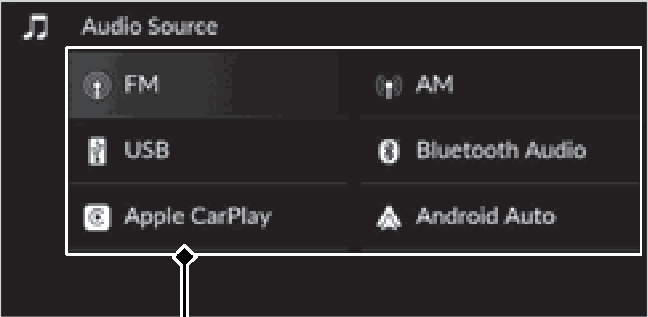
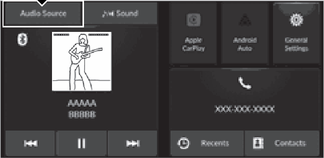
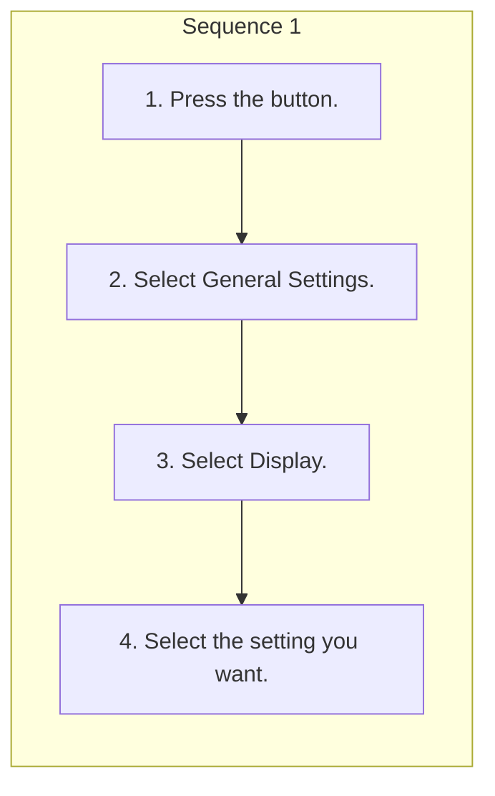

<!-- GENERATED:START function=b8ef03ccd8a1 (generated; edits inside this block are overwritten by the next publish — write your own notes outside it) -->
# 10. Display Setup

<b>Function path:</b> Features / Display Setup <b>Source:</b> printed page 223 <b>Test-ready:</b> yes — no unfilled thresholds and a procedure is present

Every "Presumed requirement" row below is machine-derived from the Owner's Manual text by rule-based extraction — not AI-written — and traceable to the printed page in its Source column.

## Figures (areas of the original PDF; the OM has no figure numbers or captions)

- Figure 10-1 source: p.223
- (Copied from OM) Source Select Screen

- Figure 10-2 source: p.223
- (Copied from OM) Select Audio Source

## Procedure

| Seq | Step | Operation (Copied from OM) | Source |
|---|---|---|---|
| 1 | 1 | Press the button. | p.223 / step |
| 1 | 2 | Select General Settings. | p.223 / step |
| 1 | 3 | Select Display. | p.223 / step |
| 1 | 4 | Select the setting you want. | p.223 / step |

## 10-2-1. Service overview

| # | Presumed requirement | Strength | Source |
|---|---|---|---|
| 1 | Display SetupYou can change the brightness of the audio/information screen. | capability | p.223 / text |
| 2 | Display SetupChanging the Screen Brightness. | capability | p.223 / text |

## 10-2-2. Service requirements

| # | Presumed requirement | Strength | Source |
|---|---|---|---|
| 1 | Step -Select Display Off to turn off the screen. To turn on the screen, press the or button. | capability | p.223 / bullet |
| 2 | Display SetupSelecting an Audio Source. | capability | p.223 / text |
| 3 | Display SetupSelect Audio Source. | capability | p.223 / text |
| 4 | Display SetupSelect Audio Source on the home screen, then select an icon on the source list to switch the audio source. | capability | p.223 / text |
| 5 | Display Setup1Display Setup You can adjust the screen brightness by sliding or tapping on the brightness bar. | capability | p.223 / text |
| 6 | Display SetupYou can change the Contrast and Black Level settings in the same manner. | capability | p.223 / text |
| 7 | Display SetupTo reset the settings, select Reset to Default. | capability | p.223 / text |
| 8 | Display SetupSource Select Screen. | capability | p.223 / text |
| 9 | Display SetupSource List Icons. | capability | p.223 / text |
<!-- GENERATED:END function=b8ef03ccd8a1 -->

