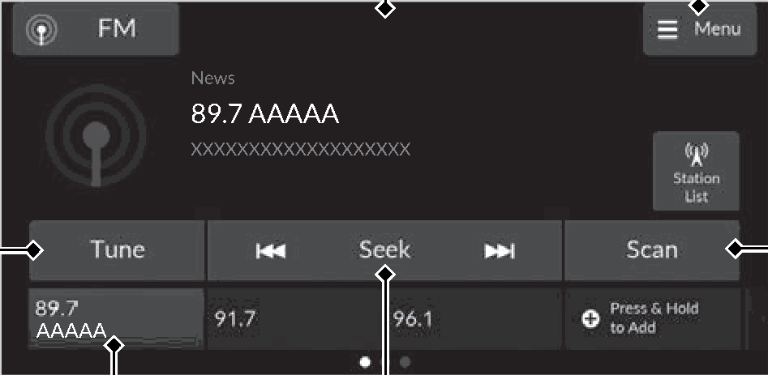
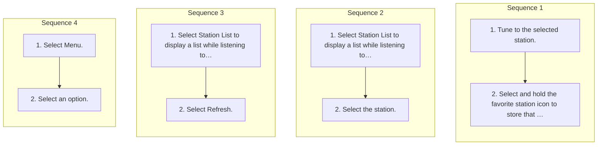

<!-- GENERATED:START function=234d9ea7dcf8 (generated; edits inside this block are overwritten by the next publish — write your own notes outside it) -->
# 11. Playing AM/FM Radio

<b>Function path:</b> Features / Playing AM/FM Radio <b>Source:</b> printed page 224, 225, 226 <b>Test-ready:</b> yes — no unfilled thresholds and a procedure is present

Every "Presumed requirement" row below is machine-derived from the Owner's Manual text by rule-based extraction — not AI-written — and traceable to the printed page in its Source column.

## Figures (areas of the original PDF; the OM has no figure numbers or captions)

- Figure 11-1 source: p.224
- (Copied from OM) Seek Icons Select

## Procedure (4 sequences; the manual restarts the numbering)

| Seq | Step | Operation (Copied from OM) | Source |
|---|---|---|---|
| 1 | 1 | Tune to the selected station. | p.225 / step |
| 1 | 2 | Select and hold the favorite station icon to store that station. | p.225 / step |
| 2 | 1 | Select Station List to display a list while listening to an FM station. | p.226 / step |
| 2 | 2 | Select the station. | p.226 / step |
| 3 | 1 | Select Station List to display a list while listening to an FM station. | p.226 / step |
| 3 | 2 | Select Refresh. | p.226 / step |
| 4 | 1 | Select Menu. | p.226 / step |
| 4 | 2 | Select an option. | p.226 / step |

## Numeric thresholds (filled in by a tester)
Filled: 1 / unfilled: 0

| Threshold | Matching text (Copied from OM) | Kind | Unit | Value | Status | Evidence | Filled by |
|---|---|---|---|---|---|---|---|
| 256c5f0592b3 | for 10 seconds | duration | seconds | 10 | from_manual | Stated in the OM: "10" | — |

## 11-2-1. Service overview

| # | Presumed requirement | Strength | Source |
|---|---|---|---|
| 1 | Playing AM/FM RadioTune Icon Select to use the on-screen keyboard for entering the radio frequency directly. | capability | p.224 / text |
| 2 | Playing AM/FM RadioFavorite Station Icons Tune the radio frequency for a favorite station. Select and hold the icon to store the station. Swipe left or right on the screen to move to the next or previous favorite station list. | capability | p.224 / text |
| 3 | Playing AM/FM RadioAudio/Information Screen. | capability | p.224 / text |
| 4 | Playing AM/FM RadioMenu Icon (Playing FM radio) Select to display the menu screen. | capability | p.224 / text |
| 5 | Playing AM/FM RadioScan Icon Select to scan each station with a strong signal. | capability | p.224 / text |
| 6 | Playing AM/FM RadioSeek Icons Select or to search the selected band up or down for a station with a strong signal. | capability | p.224 / text |
| 7 | Playing AM/FM RadioFavorite Station. | capability | p.225 / text |
| 8 | Playing AM/FM RadioTo store a station:. | capability | p.225 / text |

## 11-2-2. Service requirements

| # | Presumed requirement | Strength | Source |
|---|---|---|---|
| 1 | Step -Selecting Press &amp; Hold to Add can set a new preset station. | capability | p.225 / bullet |
| 2 | Playing AM/FM RadioEditing a favorite station Select and hold the desired favorite station icon. The following items are available:. | capability | p.225 / text |
| 3 | Step -Remove Favorite: Delete the favorite station icon from the favorite station list. | capability | p.225 / bullet |
| 4 | Step -Replace with (number): Replace the stored favorite station icon. | capability | p.225 / bullet |
| 5 | Playing AM/FM RadioSamples each of the strongest stations on the selected band for 10 seconds. To turn off scan, select Stop. | capability | p.225 / text |
| 6 | Playing AM/FM Radio1Playing AM/FM Radio Stereo reproduction in AM is not available. | capability | p.225 / text |
| 7 | Playing AM/FM RadioSwitching the Audio Mode Roll the left selector wheel or select Audio Source on the screen. 2 Audio Remote Controls P.213. | capability | p.225 / text |
| 8 | Playing AM/FM RadioYou can store 12 AM/FM stations to Favorites. | capability | p.225 / text |
| 9 | Playing AM/FM RadioRadio Data System (RDS). | capability | p.226 / text |
| 10 | Playing AM/FM RadioProvides text data information related to your selected RDS-capable FM station. | capability | p.226 / text |
| 11 | Playing AM/FM RadioTo find an RDS station from Station List. | capability | p.226 / text |
| 12 | Playing AM/FM RadioUpdate list Updates your available station list at any time. | capability | p.226 / text |
| 13 | Playing AM/FM RadioFM Settings. | capability | p.226 / text |
| 14 | Playing AM/FM RadioChanges the FM settings. | capability | p.226 / text |
| 15 | Step -Sound Settings: Adjust the sound. 2 Adjusting the Sound P.221. | capability | p.226 / bullet |
| 16 | Step -Program Service Name: Sets whether to display the program service name. | capability | p.226 / bullet |
| 17 | Playing AM/FM Radio1Radio Data System (RDS) When you select an RDS-capable FM station, the RDS automatically turns on, and the frequency display changes to the station name. When the signal of that station becomes weak, the display continues to show the last displayed station name. | constraint | p.226 / text |
<!-- GENERATED:END function=234d9ea7dcf8 -->

