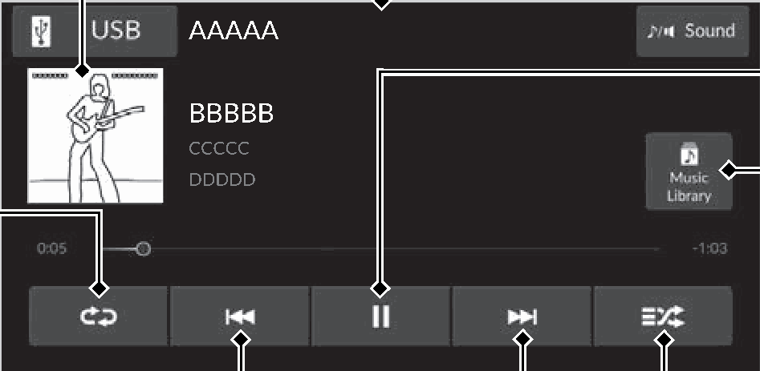
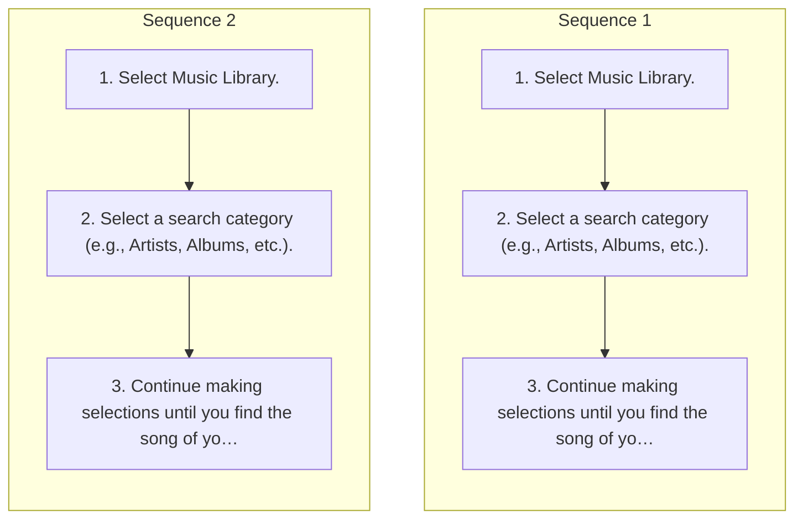

<!-- GENERATED:START function=3990a70d3787 (generated; edits inside this block are overwritten by the next publish — write your own notes outside it) -->
# 12. Music Playback via Wired Connection

<b>Function path:</b> Features / Music Playback via Wired Connection <b>Source:</b> printed page 227, 228, 229, 230 <b>Test-ready:</b> no — procedure missing or thresholds unfilled

Every "Presumed requirement" row below is machine-derived from the Owner's Manual text by rule-based extraction — not AI-written — and traceable to the printed page in its Source column.

## Figures (areas of the original PDF; the OM has no figure numbers or captions)

- Figure 12-1 source: p.227
- (Copied from OM) Audio/Information Screen

- Figure 12-2 source: p.229
- (Copied from OM) Audio/Information Screen

## Procedure (2 sequences; the manual restarts the numbering)

| Seq | Step | Operation (Copied from OM) | Source |
|---|---|---|---|
| 1 | 1 | Select Music Library. | p.228 / step |
| 1 | 2 | Select a search category (e.g., Artists, Albums, etc.). | p.228 / step |
| 1 | 3 | Continue making selections until you find the song of your choice. | p.228 / step |
| 2 | 1 | Select Music Library. | p.230 / step |
| 2 | 2 | Select a search category (e.g., Artists, Albums, etc.). | p.230 / step |
| 2 | 3 | Continue making selections until you find the song of your choice. | p.230 / step |

## Numeric thresholds (filled in by a tester)
Filled: 0 / unfilled: 2

| Threshold | Matching text (Copied from OM) | Kind | Unit | Value | Status | Evidence | Filled by |
|---|---|---|---|---|---|---|---|
| ea58d27e8570 | Repeatedly select the shuffle or repeat icon until | count | times | **unfilled** | unfilled | — | — |
| 12ec85b1ab71 | Repeatedly select the random or repeat icon until | count | times | **unfilled** | unfilled | — | — |

## 12-2-1. Service overview

| # | Presumed requirement | Strength | Source |
|---|---|---|---|
| 1 | Music Playback via Wired ConnectionUsing your USB connector, connect the device to the USB port, then select the Audio Source icon. Then select USB. 2 USB Ports P.211. | capability | p.227 / text |
| 2 | Music Playback via Wired ConnectionCover Art. | capability | p.227 / text |
| 3 | Music Playback via Wired ConnectionRepeat Icon Select to repeat the current song. | capability | p.227 / text |
| 4 | Music Playback via Wired ConnectionTrack Icons Select or to change songs. Select and hold to move rapidly within a song. | capability | p.227 / text |
| 5 | Music Playback via Wired ConnectionAudio/Information Screen. | capability | p.227 / text |
| 6 | Music Playback via Wired ConnectionPlay/Pause Icon. | capability | p.227 / text |
| 7 | Music Playback via Wired ConnectionMusic Library Icon Select to display the music search screen. | capability | p.227 / text |
| 8 | Music Playback via Wired ConnectionShuffle Icon Select to play all songs in the current category in random order. | capability | p.227 / text |
| 9 | Music Playback via Wired ConnectionHow to Select a Song from the Music Search List. | capability | p.228 / text |
| 10 | Music Playback via Wired ConnectionHow to Select a Play Mode. | capability | p.228 / text |
| 11 | Music Playback via Wired ConnectionYou can select shuffle and repeat modes when playing a song. | constraint | p.228 / text |
| 12 | Music Playback via Wired ConnectionShuffle/Repeat Repeatedly select the shuffle or repeat icon until you find a play mode option of your preference. Shuffle off: Shuffle mode to off. Shuffle All Songs: Plays all available songs in a selected list in random order. Repeat off: Repeat mode to off. Repeat Song: Repeats the current song. Repeat all: Repeats all songs. | capability | p.228 / text |
| 13 | Music Playback via Wired Connection1Music Playback via Wired Connection Available operating functions vary on models or versions. Some functions may not be available on the vehicle’s audio system. | capability | p.228 / text |
| 14 | Music Playback via Wired ConnectionWhile an iPhone is connected via Apple CarPlay, audio files on the iPhone can only be played using Apple CarPlay. | capability | p.228 / text |
| 15 | Music Playback via Wired ConnectionMusic Playback via USB Flash Drive. | capability | p.229 / text |
| 16 | Music Playback via Wired ConnectionYour audio system reads and plays sound files on a USB flash drive in either MP3, WMA, AAC*1, FLAC, or WAV format. Connect your USB device to the USB port, then select the Audio Source icon. Then select USB. 2 USB Ports P.211. | capability | p.229 / text |
| 17 | Music Playback via Wired ConnectionCover Art. | capability | p.229 / text |
| 18 | Music Playback via Wired ConnectionRepeat Icon Select to repeat the current song. | capability | p.229 / text |
| 19 | Music Playback via Wired ConnectionTrack Icons Select or to change songs. Select and hold to move rapidly within a song. | capability | p.229 / text |
| 20 | Music Playback via Wired Connection*1:Only AAC format files recorded with iTunes are playable on this unit. | capability | p.229 / text |
| 21 | Music Playback via Wired ConnectionAudio/Information Screen. | capability | p.229 / text |
| 22 | Music Playback via Wired ConnectionPlay/Pause Icon. | capability | p.229 / text |
| 23 | Music Playback via Wired ConnectionMusic Library Icon Select to display the music search screen. | capability | p.229 / text |
| 24 | Music Playback via Wired ConnectionRandom Icon Select to play all songs in the current category in random order. | capability | p.229 / text |
| 25 | Music Playback via Wired ConnectionHow to Select a Song from the Music Search List. | capability | p.230 / text |
| 26 | Music Playback via Wired ConnectionHow to Select a Play Mode. | capability | p.230 / text |
| 27 | Music Playback via Wired ConnectionYou can select the repeat and random modes when playing a song. | constraint | p.230 / text |
| 28 | Music Playback via Wired ConnectionRandom/Repeat Repeatedly select the random or repeat icon until you find a play mode option of your preference. Random off: Random mode to off. Random All Songs: Plays all songs in random order. Repeat off: Repeat mode to off. Repeat Song: Repeats the current song. | capability | p.230 / text |
| 29 | Music Playback via Wired Connection1Music Playback via USB Flash Drive Use the recommended USB flash drives. 2 General Information on the Audio System P.242. | capability | p.230 / text |
| 30 | Music Playback via Wired ConnectionWMA files protected by digital rights management (DRM) cannot be played. The audio system displays File Error, then skips to the next song. | constraint | p.230 / text |
| 31 | Music Playback via Wired ConnectionIf there is a problem, you may see an error message on the audio/information screen. 2 iPod/USB Flash Drive P.241. | capability | p.230 / text |
<!-- GENERATED:END function=3990a70d3787 -->

