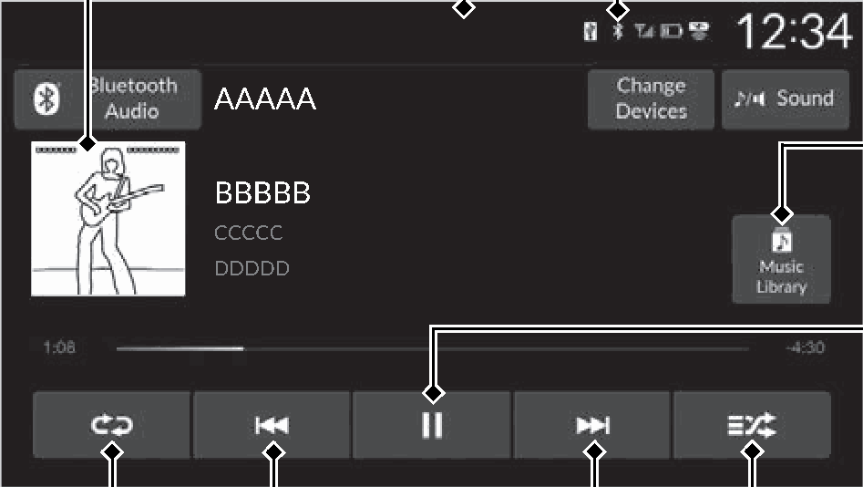
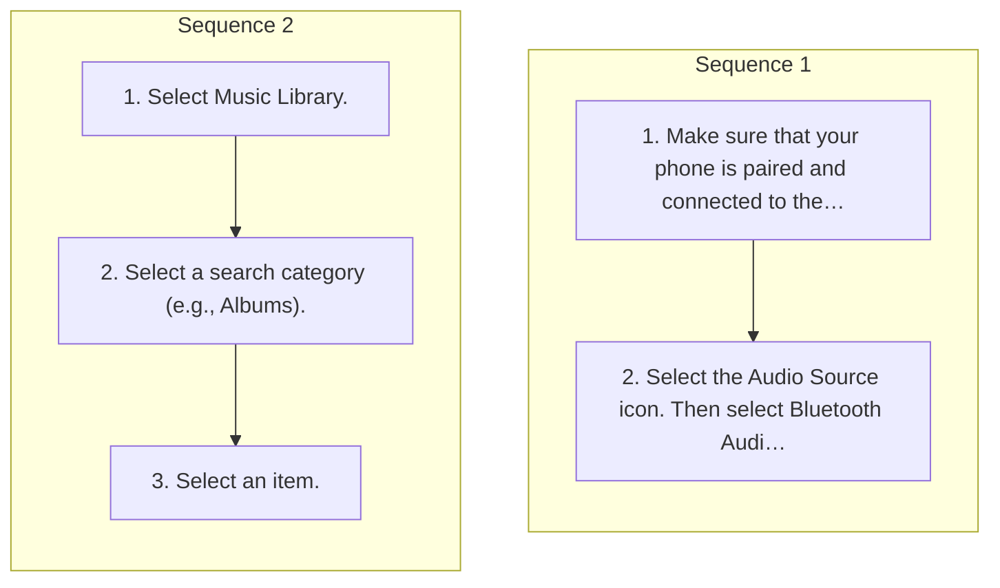

<!-- GENERATED:START function=b75a5a2fac0a (generated; edits inside this block are overwritten by the next publish — write your own notes outside it) -->
# 13. Playing Bluetooth® Audio

<b>Function path:</b> Features / Playing Bluetooth® Audio <b>Source:</b> printed page 231, 232, 233 <b>Test-ready:</b> no — procedure missing or thresholds unfilled

Every "Presumed requirement" row below is machine-derived from the Owner's Manual text by rule-based extraction — not AI-written — and traceable to the printed page in its Source column.

## Figures (areas of the original PDF; the OM has no figure numbers or captions)

- Figure 13-1 source: p.231
- (Copied from OM) Play/Pause Icon Music Library Icon Select to display the music search screen.

## Procedure (2 sequences; the manual restarts the numbering)

| Seq | Step | Operation (Copied from OM) | Source |
|---|---|---|---|
| 1 | 1 | Make sure that your phone is paired and connected to the system. 2 Phone Setup P.272 | p.232 / step |
| 1 | 2 | Select the Audio Source icon. Then select Bluetooth Audio. | p.232 / step |
| 2 | 1 | Select Music Library. | p.232 / step |
| 2 | 2 | Select a search category (e.g., Albums). | p.232 / step |
| 2 | 3 | Select an item. | p.232 / step |

## Numeric thresholds (filled in by a tester)
Filled: 0 / unfilled: 2

| Threshold | Matching text (Copied from OM) | Kind | Unit | Value | Status | Evidence | Filled by |
|---|---|---|---|---|---|---|---|
| 26ddae2b9e93 | repeatedly until | count | times | **unfilled** | unfilled | — | — |
| d9184b3ff9e3 | Repeatedly select the shuffle or repeat icon until | count | times | **unfilled** | unfilled | — | — |

## 13-2-1. Service overview

| # | Presumed requirement | Strength | Source |
|---|---|---|---|
| 1 | Playing Bluetooth® AudioYour audio system allows you to listen to music from your Bluetooth®-compatible phone. This function is available when the phone is paired and connected to the vehicle’s Bluetooth® HandsFreeLink® (HFL) system. 2 Phone Setup P.272. | constraint | p.231 / text |
| 2 | Playing Bluetooth® AudioCover Art. | capability | p.231 / text |
| 3 | Playing Bluetooth® AudioRepeat Icon Select to repeat the current song. | capability | p.231 / text |
| 4 | Playing Bluetooth® Audio1Playing Bluetooth® Audio Not all Bluetooth®-enabled phones with streaming audio capabilities are compatible with the system. For a list of compatible phones:. | capability | p.231 / text |

## 13-2-2. Service requirements

| # | Presumed requirement | Strength | Source |
|---|---|---|---|
| 1 | Step -U.S.: Visit https://mygarage.honda.com/s/hondahandsfreelink-compatibility-check, or call 1-888-528-7876. | capability | p.231 / bullet |
| 2 | Playing Bluetooth® AudioShuffle Icon Select to play all songs in the current category in random order. | capability | p.231 / text |
| 3 | Playing Bluetooth® AudioTrack Icons Select or to change songs. | capability | p.231 / text |
| 4 | Playing Bluetooth® AudioTo Play Bluetooth® Audio Files. | capability | p.232 / text |
| 5 | Playing Bluetooth® AudioIf the phone is not recognized, another HFL-compatible phone, which is not compatible for Bluetooth® Audio, may already be connected. | capability | p.232 / text |
| 6 | Playing Bluetooth® AudioTo play or pause a song Select the play/pause icon. | capability | p.232 / text |
| 7 | Playing Bluetooth® AudioSearching for Music. | capability | p.232 / text |
| 8 | Step -Select an item repeatedly until a desired item you want to listen to is displayed. | capability | p.232 / bullet |
| 9 | Playing Bluetooth® Audio1To Play Bluetooth® Audio Files To play the audio files, you may need to operate your phone. If so, follow the phone manufacturer’s operating instructions. | constraint | p.232 / text |
| 10 | Playing Bluetooth® AudioSwitching to another mode pauses the music playing from your phone. | capability | p.232 / text |
| 11 | Playing Bluetooth® AudioIf any audio device is connected to the USB port, you may need to select Audio Source to select Bluetooth Audio. | capability | p.232 / text |
| 12 | Playing Bluetooth® AudioYou can change the connected phone by selecting Change Devices. 2 Phone Setup P.272. | capability | p.232 / text |
| 13 | Playing Bluetooth® AudioHow to Select a Play Mode. | capability | p.233 / text |
| 14 | Playing Bluetooth® AudioYou can select shuffle and repeat modes when playing a song. | constraint | p.233 / text |

## 13-4. User settings

| # | Presumed requirement | Strength | Source |
|---|---|---|---|
| 1 | Playing Bluetooth® AudioShuffle/Repeat Repeatedly select the shuffle or repeat icon until you find a play mode option of your preference. Shuffle off: Shuffle mode to off. Shuffle All Songs: Plays all available songs in a selected list in random order. Repeat off: Repeat mode to off. Repeat Song: Repeats the current song. Repeat all: Repeats all songs. | capability | p.233 / text |

## 13-5. Exception operation

| # | Presumed requirement | Strength | Source |
|---|---|---|---|
| 1 | Step -Canada: Call 1-855-490-7351. Audio/Information Screen It may be illegal to perform some data device Bluetooth® Indicator functions while driving. Appears when your phone is connected to HFL. Only one phone can be used with HFL at a time. When there is more than one paired phone in the vehicle, the system automatically connects to the prioritized phone. You can assign priority to a phone in the Priority Device menu. Music Library Icon 2 HFL Menus P.270 Select to display the music search screen. If a phone is currently connected via Apple CarPlay or Android Auto, Bluetooth® Audio from that phone is Play/Pause Icon unavailable. 2 Phone Setup P.272. | constraint | p.231 / bullet |
| 2 | Playing Bluetooth® Audio1Searching for Music Depending on the Bluetooth® device you connect, some or all of the lists may not be displayed. | capability | p.232 / text |
| 3 | Playing Bluetooth® Audio1How to Select a Play Mode Depending on the Bluetooth® device you connect, some or all of the functions may not be displayed. | capability | p.233 / text |
<!-- GENERATED:END function=b75a5a2fac0a -->

