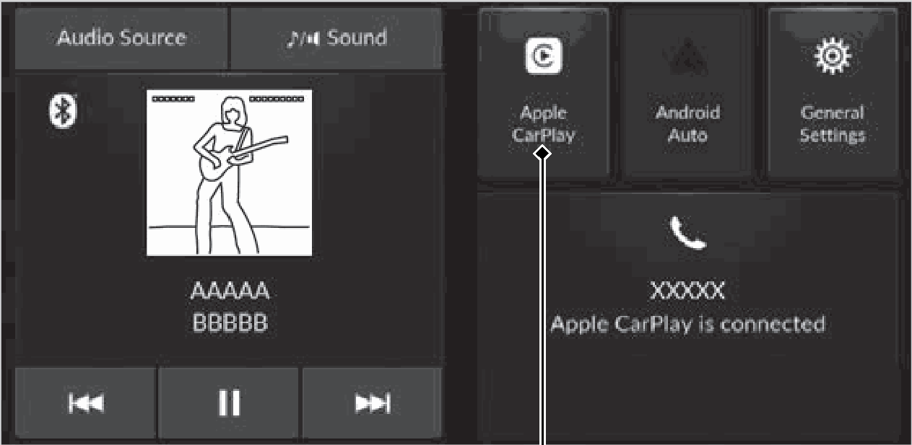
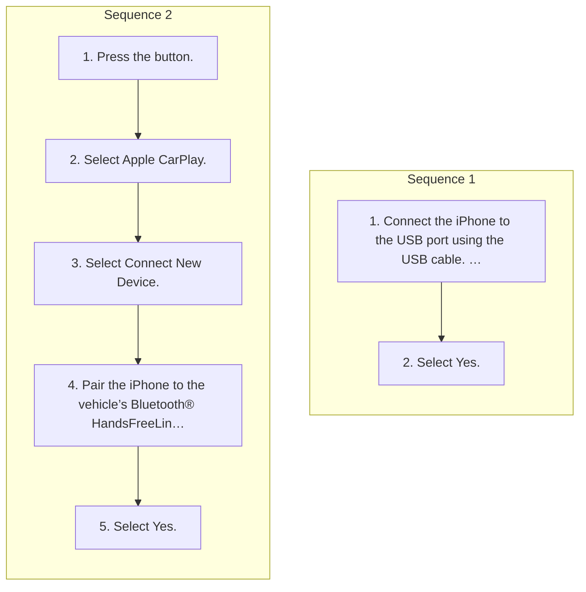

<!-- GENERATED:START function=890e3cb9a837 (generated; edits inside this block are overwritten by the next publish — write your own notes outside it) -->
# 14. Apple CarPlay

<b>Function path:</b> Features / Apple CarPlay <b>Source:</b> printed page 234, 235, 236, 237 <b>Test-ready:</b> yes — no unfilled thresholds and a procedure is present

Every "Presumed requirement" row below is machine-derived from the Owner's Manual text by rule-based extraction — not AI-written — and traceable to the printed page in its Source column.

## Figures (areas of the original PDF; the OM has no figure numbers or captions)

- Figure 14-1 source: p.234
- (Copied from OM) Apple CarPlay Icon

## Procedure (2 sequences; the manual restarts the numbering)

| Seq | Step | Operation (Copied from OM) | Source |
|---|---|---|---|
| 1 | 1 | Connect the iPhone to the USB port using the USB cable. 2 USB Ports P.211 | p.236 / step |
| 1 | 2 | Select Yes. | p.236 / step |
| 2 | 1 | Press the button. | p.236 / step |
| 2 | 2 | Select Apple CarPlay. | p.236 / step |
| 2 | 3 | Select Connect New Device. | p.236 / step |
| 2 | 4 | Pair the iPhone to the vehicle’s Bluetooth® HandsFreeLink® (HFL) system. 2 Phone Setup P.272 | p.236 / step |
| 2 | 5 | Select Yes. | p.236 / step |

## 14-2-1. Service overview

| # | Presumed requirement | Strength | Source |
|---|---|---|---|
| 1 | Apple CarPlayIf you connect an Apple CarPlay-compatible iPhone to the system via the USB port or wirelessly, and the (Connect) button is pressed or the Apple CarPlay icon is selected, you can operate Apple CarPlay on the audio/information screen. 2 USB Ports P.211. | capability | p.234 / text |
| 2 | Apple CarPlayApple CarPlay Icon. | capability | p.234 / text |
| 3 | Apple CarPlay1Apple CarPlay Only iPhone 6s or newer versions with iOS 10.0.2 or later are compatible with Apple CarPlay. | capability | p.234 / text |
| 4 | Apple CarPlayWe recommend using the latest OS. | capability | p.234 / text |
| 5 | Apple CarPlayPark in a safe place before connecting your iPhone to Apple CarPlay and when launching any compatible apps. | constraint | p.234 / text |
| 6 | Apple CarPlayWhen your iPhone is connected to Apple CarPlay, it is not possible to use the Bluetooth® Audio or Bluetooth® HandsFreeLink®. Music playback or calls are only made through Apple CarPlay. If you want to make a call with Bluetooth® HandsFreeLink®, turn Apple CarPlay OFF or detach the USB cable from your iPhone. Other previously paired phones can also use the Bluetooth® Audio. 2 Phone Setup P.272. | constraint | p.234 / text |
| 7 | Apple CarPlayApple CarPlay and Android Auto cannot run at the same time. | constraint | p.234 / text |
| 8 | Apple CarPlayFor details on countries and regions where Apple CarPlay is available, as well as information pertaining to function, refer to the Apple homepage. | capability | p.234 / text |
| 9 | Apple CarPlayUse of Apple CarPlay will result in the collection of certain user and vehicle information (such as vehicle location, speed, and status) from your iPhone to enhance the Apple CarPlay experience. You will need to consent to the sharing of this information on the audio/information screen. | capability | p.234 / text |
| 10 | Apple CarPlayApple CarPlay Menu. | capability | p.235 / text |
| 11 | Apple CarPlayFor details on available applications, please refer to the Apple CarPlay homepage. Apps displayed on your screen can be changed with your iPhone. Select the Honda icon on the Apple CarPlay menu screen to go back to the home screen. | capability | p.235 / text |
| 12 | Apple CarPlay1Apple CarPlay Apple CarPlay Operating Requirements &amp; Limitations Apple CarPlay requires a compatible iPhone with an active cellular connection and data plan. Your carrier’s rate plans will apply. | capability | p.235 / text |
| 13 | Apple CarPlayChanges in operating systems, hardware, software, and other technology integral to providing Apple CarPlay functionality, as well as new or revised governmental regulations, may result in a decrease or cessation of Apple CarPlay functionality and services. Honda cannot and does not provide any warranty or guarantee of future Apple CarPlay performance or functionality. | constraint | p.235 / text |
| 14 | Apple CarPlayIt is possible to use 3rd party apps if they are compatible with Apple CarPlay. Refer to the Apple homepage for information on compatible apps. | constraint | p.235 / text |
| 15 | Apple CarPlayConnect Apple CarPlay Using the USB Cable. | capability | p.236 / text |

## 14-2-2. Service requirements

| # | Presumed requirement | Strength | Source |
|---|---|---|---|
| 1 | Step -The confirmation screen will be displayed. | capability | p.236 / bullet |
| 2 | Step -If you do not want to connect Apple CarPlay, select No. | capability | p.236 / bullet |
| 3 | Apple CarPlayYou may change the consent settings under the Connections menu. | capability | p.236 / text |
| 4 | Apple CarPlayConnect Apple CarPlay Wirelessly. | capability | p.236 / text |
| 5 | Step -If your iPhone asks for permission to accept an Apple CarPlay connection, accept to connect. | capability | p.236 / bullet |
| 6 | Apple CarPlay1Apple CarPlay Only initialize Apple CarPlay when you are safely parked. When Apple CarPlay first detects your iPhone, you will need to set up your iPhone. Refer to the instruction manual that came with your iPhone. | constraint | p.236 / text |
| 7 | Apple CarPlayYou can also use the method below to set up Apple CarPlay: buttonSelect General Settings Press the Connections icon. | capability | p.236 / text |
| 8 | Apple CarPlayUse of user and vehicle information The use and handling of user and vehicle information transmitted to/from your iPhone by Apple CarPlay is governed by the Apple iOS terms and conditions and Apple’s Privacy Policy. | capability | p.236 / text |
| 9 | Apple CarPlayOperating Apple CarPlay with Siri. | capability | p.237 / text |
| 10 | Apple CarPlayPress the (Talk) button to activate Siri. Press again to deactivate Siri. | capability | p.237 / text |
| 11 | Apple CarPlay1Operating Apple CarPlay with Siri Below are examples of questions and commands for Siri. | capability | p.237 / text |
| 12 | Step -What movies are playing today? | capability | p.237 / bullet |
| 13 | Step -Call dad at work. | capability | p.237 / bullet |
| 14 | Step -What song is this? | capability | p.237 / bullet |
| 15 | Step -How’s the weather tomorrow? | capability | p.237 / bullet |
| 16 | Step -Read my latest email. | capability | p.237 / bullet |
| 17 | Apple CarPlayFor more information, please visit www.apple.com/ios/siri. | capability | p.237 / text |
<!-- GENERATED:END function=890e3cb9a837 -->

