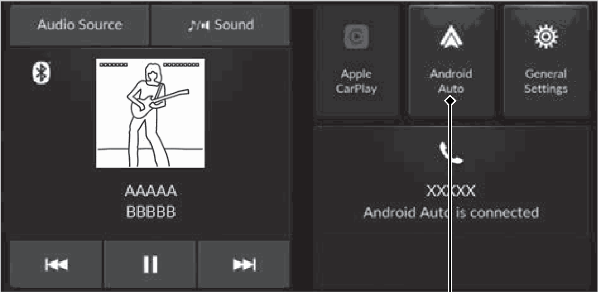
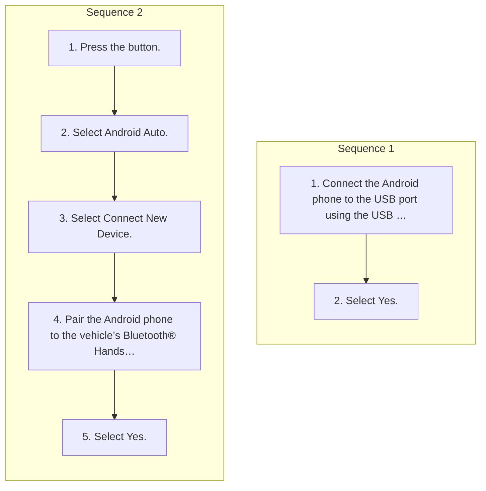

<!-- GENERATED:START function=5524460684e2 (generated; edits inside this block are overwritten by the next publish — write your own notes outside it) -->
# 15. Android AutoTM

<b>Function path:</b> Features / Android AutoTM <b>Source:</b> printed page 238, 239, 240 <b>Test-ready:</b> yes — no unfilled thresholds and a procedure is present

Every "Presumed requirement" row below is machine-derived from the Owner's Manual text by rule-based extraction — not AI-written — and traceable to the printed page in its Source column.

## Figures (areas of the original PDF; the OM has no figure numbers or captions)

- Figure 15-1 source: p.238
- (Copied from OM) (Connect) button is pressed or the Android Auto icon is selected, you can

## Procedure (2 sequences; the manual restarts the numbering)

| Seq | Step | Operation (Copied from OM) | Source |
|---|---|---|---|
| 1 | 1 | Connect the Android phone to the USB port using the USB cable. 2 USB Ports P.211 | p.240 / step |
| 1 | 2 | Select Yes. | p.240 / step |
| 2 | 1 | Press the button. | p.240 / step |
| 2 | 2 | Select Android Auto. | p.240 / step |
| 2 | 3 | Select Connect New Device. | p.240 / step |
| 2 | 4 | Pair the Android phone to the vehicle’s Bluetooth® HandsFreeLink® (HFL) system. 2 Phone Setup P.272 | p.240 / step |
| 2 | 5 | Select Yes. | p.240 / step |

## 15-2-1. Service overview

| # | Presumed requirement | Strength | Source |
|---|---|---|---|
| 1 | Android AutoTMIf you connect an AndroidTM phone to the system, via USB port or wirelessly, and the 1Android AutoTM (Connect) button is pressed or the Android Auto icon is selected, you can operate Android Auto on the audio/information screen. We recommend that you complete this tutorial while safely parked before using Android Auto. 2 USB Ports P.211. | capability | p.238 / text |
| 2 | Android AutoTMWe recommend that you update Android OS to the latest version when using Android Auto. Bluetooth® A2DP cannot be used while your phone is connected to Android Auto. | constraint | p.238 / text |
| 3 | Android AutoTMTo use Android Auto on a smartphone with Android 9.0 or earlier, you need to download the Android Auto app from Google Play to your smartphone. | capability | p.238 / text |
| 4 | Android AutoTMPark in a safe place before connecting your Android phone to Android Auto and when launching any compatible apps. | constraint | p.238 / text |
| 5 | Android AutoTMWhen your Android phone is connected to Android Auto, it is not possible to use the Bluetooth® Audio or Bluetooth® HandsFreeLink®. However, other previously paired phones can stream audio via Bluetooth® while Android Auto is connected. 2 Phone Setup P.272 Android Auto Icon Apple CarPlay and Android Auto cannot run at the same time. | constraint | p.238 / text |
| 6 | Android AutoTMAndroid and Android Auto are trademarks of Google LLC. | capability | p.238 / text |
| 7 | Android AutoTMAndroid Auto Menu. | capability | p.239 / text |
| 8 | Android AutoTMFor details on available applications, please refer to the Android Auto homepage. Apps displayed on your screen can be changed with your smartphone. Select the Honda icon on the Android Auto menu screen to go back to the home screen. | capability | p.239 / text |
| 9 | Android AutoTM1Android AutoTM For details on countries and regions where Android Auto is available, as well as information pertaining to function, refer to the Android Auto homepage. | capability | p.239 / text |
| 10 | Android AutoTMScreens may differ depending on the version of the Android Auto app you are using. | capability | p.239 / text |
| 11 | Android AutoTMAndroid Auto Operating Requirements &amp; Limitations Android Auto requires a compatible Android phone with an active cellular connection and data plan. Your carrier’s rate plans will apply. | capability | p.239 / text |
| 12 | Android AutoTMChanges in operating systems, hardware, software, and other technology integral to providing Android Auto functionality, as well as new or revised governmental regulations, may result in a decrease or cessation of Android Auto functionality and services. Honda cannot and does not provide any warranty or guarantee of future Android Auto performance or functionality. | constraint | p.239 / text |
| 13 | Android AutoTMIt is possible to use 3rd party apps if they are compatible with Android Auto. Refer to the Android Auto homepage for information on compatible apps. | constraint | p.239 / text |
| 14 | Android AutoTMConnect Android Auto Using the USB Cable. | capability | p.240 / text |

## 15-2-2. Service requirements

| # | Presumed requirement | Strength | Source |
|---|---|---|---|
| 1 | Step -The confirmation screen will be displayed. | capability | p.240 / bullet |
| 2 | Step -If you do not want to connect Android Auto, select No. | capability | p.240 / bullet |
| 3 | Android AutoTMYou may change the consent settings under the Connections menu. | capability | p.240 / text |
| 4 | Android AutoTMConnect Android Auto Wirelessly. | capability | p.240 / text |
| 5 | Step -If your Android phone asks for permission to accept an Android Auto connection, accept to connect. | capability | p.240 / bullet |
| 6 | Android AutoTM1Android AutoTM Only initialize Android Auto when you are safely parked. When Android Auto first detects your phone, you will need to set up your phone so that auto pairing is possible. Refer to the instruction manual that came with your phone. | constraint | p.240 / text |
| 7 | Android AutoTMYou can also use the method below to set up Android Auto: Press the button Select General Settings Connections icon. | capability | p.240 / text |
| 8 | Android AutoTMUse of user and vehicle information The use and handling of user and vehicle information transmitted to/from your phone by Android Auto is governed by Google’s Privacy Policy. | capability | p.240 / text |
<!-- GENERATED:END function=5524460684e2 -->

