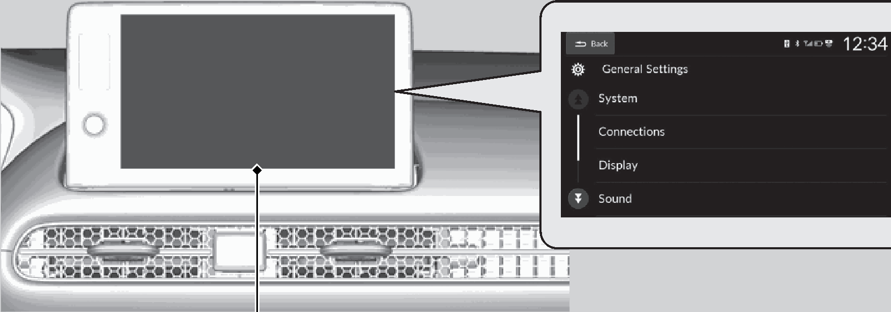

<!-- GENERATED:START function=4c2b9b42f553 (generated; edits inside this block are overwritten by the next publish — write your own notes outside it) -->
# 18. Customized Features

<b>Function path:</b> Features / Customized Features <b>Source:</b> printed page 261, 262, 263, 264, 265, 266 <b>Test-ready:</b> no — procedure missing or thresholds unfilled

Every "Presumed requirement" row below is machine-derived from the Owner's Manual text by rule-based extraction — not AI-written — and traceable to the printed page in its Source column.

## Figures (areas of the original PDF; the OM has no figure numbers or captions)

- Figure 18-1 source: p.262
- (Copied from OM) select a setting item.

## 18-2-1. Service overview

| # | Presumed requirement | Strength | Source |
|---|---|---|---|
| 1 | Customized FeaturesMpeg4 Visual THIS PRODUCT IS LICENSED UNDER THE MPEG-4 VISUAL PATENT PORTFOLIO LICENSE FOR THE PERSONAL AND NON-COMMERCIAL USE OF A CONSUMER FOR (i) ENCODING VIDEO IN COMPLIANCE WITH THE MPEG-4 VISUALA STANDARD (“MPEG-4 VIDEO”) AND/OR (ii) DECODING MPEG-4 VIDEO THAT WAS ENCODED BY A CONSUMER ENGAGED IN A PERSONAL AND NONCOMMERCIAL ACTIVITY AND/OR WAS OBTAINED FROM A VIDEO PROVIDER LICENSED BY MPEG LA TO PROVIDE MPEG-4 VIDEO. NO LICENSE IS GRANTED OR SHALL BE IMPLIED FOR ANY OTHER USE. ADDITIONAL INFORMATION INCLUDING THAT RELATING TO PROMOTIONAL, INTERNAL AND COMMERCIAL USES AND LICENSING MAY BE OBTAINED FROM MPEG LA, LLC. SEE HTTPS://WWW.VIA-LA.COM/VIA-LICENSING-AND-MPEG-LA/. | capability | p.261 / text |
| 2 | Customized FeaturesAVC/H.264 THIS PRODUCT IS LICENSED UNDER THE AVC PATENT PORTFOLIO LICENSE FOR THE PERSONAL AND NONCOMMERCIAL USE OF A CONSUMER TO (i) ENCODE VIDEO IN COMPLIANCE WITH THE AVC STANDARD (“AVC VIDEO”) AND/OR (ii) DECODE AVC VIDEO THAT WAS ENCODED BY A CONSUMER ENGAGED IN A PERSONAL AND NON-COMMERCIAL ACTIVITY AND/OR WAS OBTAINED FROM A VIDEO PROVIDER LICENSED TO PROVIDE AVC VIDEO. NO LICENSE IS GRANTED OR SHALL BE IMPLIED FOR ANY OTHER USE. ADDITIONAL INFORMATION MAY BE OBTAINED FROM MPEG LA, L.L.C. SEE HTTPS://WWW.VIA-LA.COM/VIA-LICENSING-AND-MPEG-LA/. | capability | p.261 / text |
| 3 | Customized FeaturesUse the audio/information screen to customize certain features. | capability | p.262 / text |
| 4 | Customized FeaturesHow to Customize the General Settings. | capability | p.262 / text |
| 5 | Customized FeaturesWith the power mode in ON, press the button, select General Settings, and select a setting item. | capability | p.262 / text |
| 6 | Customized FeaturesAudio/Information Screen. | capability | p.262 / text |
| 7 | Customized Features1Customized Features When you customize settings:. | constraint | p.262 / text |

## 18-2-2. Service requirements

| # | Presumed requirement | Strength | Source |
|---|---|---|---|
| 1 | Step -Make sure that the vehicle is at a complete stop. | capability | p.262 / bullet |
| 2 | Step -Shift to (P. | capability | p.262 / bullet |
| 3 | Customized FeaturesCustomizable Features Description. | capability | p.263 / text |
| 4 | Customized FeaturesSelect a time format. Time Format. | capability | p.263 / text |
| 5 | Customized FeaturesSelect On to have the GPS automatically adjust the clock. Automatic Select Off to cancel this function. Date &amp; Time. | capability | p.263 / text |
| 6 | Customized FeaturesAuto Daylight Sets the clock to update based on daylight savings time. On*1/Off Saving Time Set Date &amp; Time Adjusts date. Set Date Date &amp; Time 2 Adjusting the Clock P.134. | capability | p.263 / text |
| 7 | Customized FeaturesAdjusts time. Set Time 2 Adjusting the Clock P.134. | capability | p.263 / text |
| 8 | Customized Features(Select time Time Changes the time zone manually. zone) Zone. | capability | p.263 / text |
| 9 | Customized FeaturesSelect a date format. Date Format. | capability | p.263 / text |
| 10 | Customized FeaturesChanges the driver information interface and audio/ Language information screen language separately. | capability | p.263 / text |
| 11 | Customized FeaturesResets all the settings to their factory default. Factory Data Reset 2 Defaulting All the Settings P.266. | capability | p.263 / text |
| 12 | Customized FeaturesSets the sensitivity of the touch panel screen. Touch Panel Sensitivity. | capability | p.263 / text |
| 13 | Customized FeaturesDisplays the legal information. Legal Information. | capability | p.263 / text |
| 14 | Customized Features*1:Default Setting. | capability | p.263 / text |
| 15 | Customized FeaturesSelectable Settings. | capability | p.263 / text |
| 16 | Customized Features12H*1/24H. | capability | p.263 / text |
| 17 | Customized FeaturesOn*1/Off. | capability | p.263 / text |
| 18 | Customized FeaturesMonth/Day/Year. | capability | p.263 / text |
| 19 | Customized FeaturesHour/Minute AM/PM. | capability | p.263 / text |
| 20 | Customized FeaturesMM/DD/YYYY*1/ YYYY/MM/DD. | capability | p.263 / text |
| 21 | Customized FeaturesEnglish*1/Español/ Français. | capability | p.263 / text |
| 22 | Customized FeaturesCancel/Continue. | capability | p.263 / text |
| 23 | Customized FeaturesLow*1/High. | capability | p.263 / text |
| 24 | Customized FeaturesConnections. | capability | p.264 / text |
| 25 | Customized FeaturesCustomizable Features Description. | capability | p.264 / text |
| 26 | Customized FeaturesSets Bluetooth® connection priority. Priority Device. | capability | p.264 / text |
| 27 | Customized FeaturesChanges vehicle name for Bluetooth® connection setting. Name Options Displays the MAC address. MAC Address. | capability | p.264 / text |
| 28 | Customized FeaturesChanges password for the Wi-Fi connection. Wi-Fi Settings Password. | capability | p.264 / text |
| 29 | Customized FeaturesPairs a new device to HFL. + Connect New Device 2 Phone Setup P.272. | capability | p.264 / text |
| 30 | Customized FeaturesConnects, disconnects, or deletes a paired device. (Saved Devices) 2 Phone Setup P.272. | capability | p.264 / text |
| 31 | Customized FeaturesCustomizable Features Description. | capability | p.264 / text |
| 32 | Customized FeaturesChanges the brightness of the audio/information screen. Brightness. | capability | p.264 / text |
| 33 | Customized FeaturesChanges the contrast of the audio/information screen. Contrast. | capability | p.264 / text |
| 34 | Customized FeaturesChanges the black level of the audio/information screen. Black Level. | capability | p.264 / text |
| 35 | Customized FeaturesTurns the audio/information screen brightness off. Display Off. | capability | p.264 / text |
| 36 | Customized FeaturesSelectable Settings. | capability | p.264 / text |
| 37 | Customized FeaturesSelectable Settings. | capability | p.264 / text |
| 38 | Customized FeaturesCustomizable Features Description. | capability | p.265 / text |
| 39 | Customized FeaturesBass / Mid / Treble Midrange Adjusts the settings of the audio speakers’ sound. Bass 2 Adjusting the Sound P.221 Balance / Fader. | capability | p.265 / text |
| 40 | Customized FeaturesSpeed Volume Compensation. | capability | p.265 / text |
| 41 | Customized FeaturesSound Volume. | capability | p.265 / text |
| 42 | Customized FeaturesCustomizable Features Description. | capability | p.265 / text |
| 43 | Customized FeaturesSets the system sound volume level. System Sounds. | capability | p.265 / text |
| 44 | Customized FeaturesSets the voice recognition volume level. Voice Recognition. | capability | p.265 / text |
| 45 | Customized FeaturesNavigation Sets the navigation guidance volume level. Guidance. | capability | p.265 / text |
| 46 | Customized FeaturesSets the ringtone volume level. Ringtone. | capability | p.265 / text |
| 47 | Customized FeaturesSets the phone call volume level. Phone Calls. | capability | p.265 / text |
| 48 | Customized FeaturesResets all Sound Volume settings to default values. Reset to Default. | capability | p.265 / text |
| 49 | Customized FeaturesSelectable Settings. | capability | p.265 / text |
| 50 | Customized FeaturesSelectable Settings. | capability | p.265 / text |
| 51 | Customized FeaturesRear Camera. | capability | p.266 / text |
| 52 | Customized FeaturesCustomizable Features. | capability | p.266 / text |
| 53 | Customized FeaturesFixed Guideline. | capability | p.266 / text |
| 54 | Customized FeaturesDynamic Guideline. | capability | p.266 / text |
| 55 | Customized FeaturesCross Traffic Monitor*. | capability | p.266 / text |
| 56 | Customized Features*1:Default Setting. | capability | p.266 / text |
| 57 | Customized FeaturesDescription Selectable Settings. | capability | p.266 / text |
| 58 | Customized FeaturesShows the guideline that does not move with the steering On*1/Off wheel. 2 Multi-View Rear Camera P.415. | capability | p.266 / text |
| 59 | Customized FeaturesShows the guideline that moves with the steering wheel. On*1/Off 2 Multi-View Rear Camera P.415. | capability | p.266 / text |
| 60 | Customized FeaturesShows arrows on the rear camera image to indicate On*1/Off vehicles approaching from the sides. 2 Cross Traffic Monitor* P.412. | capability | p.266 / text |

## 18-4. User settings

| # | Presumed requirement | Strength | Source |
|---|---|---|---|
| 1 | Customized FeaturesTo customize features detail, refer to the following. 2 System P.262 2 Connections P.263 2 Display P.263 2 Sound P.264 2 Sound Volume P.264 2 Rear Camera P.265. | capability | p.262 / text |
| 2 | Customized FeaturesResets all customized settings for the brightness, contrast, Reset to Default and black level. | capability | p.264 / text |
<!-- GENERATED:END function=4c2b9b42f553 -->

