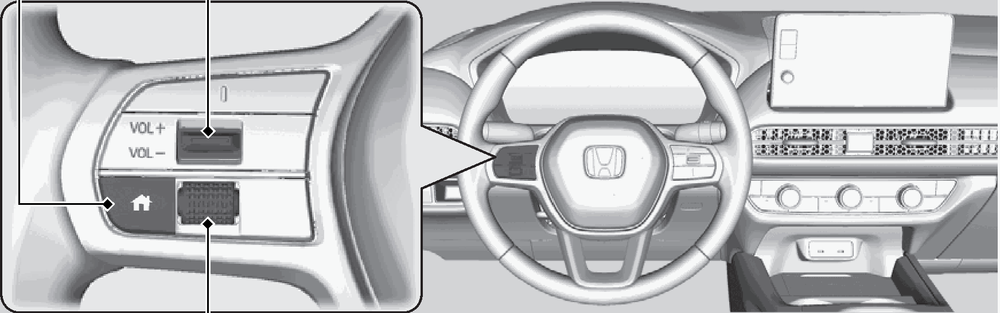
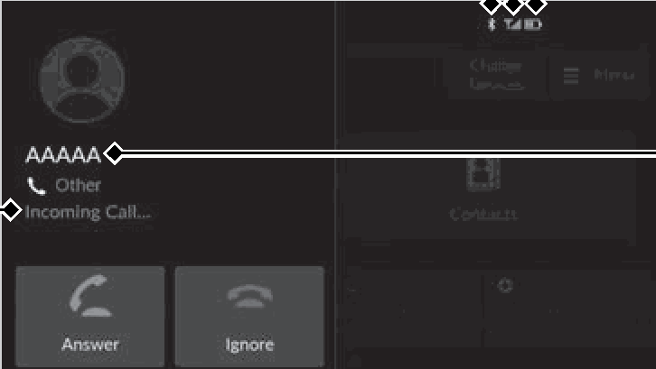
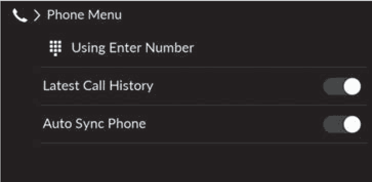
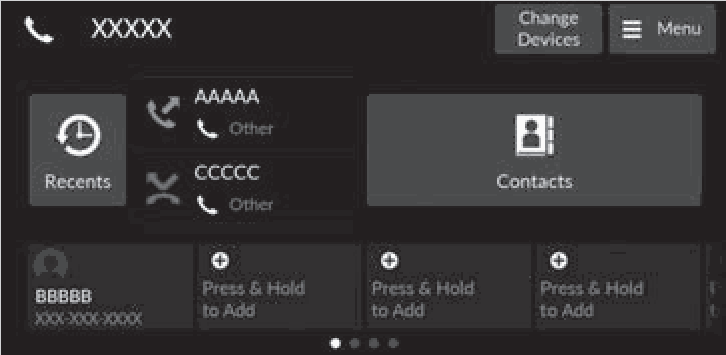
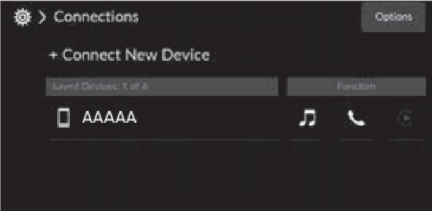
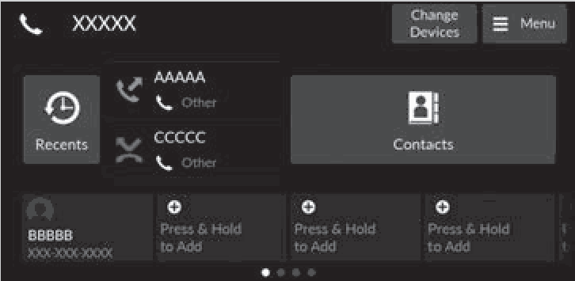
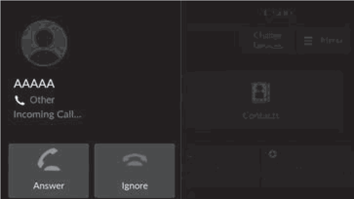
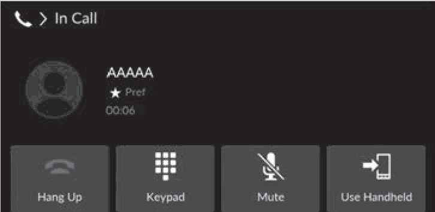

<!-- GENERATED:START function=09ed228b7c67 (generated; edits inside this block are overwritten by the next publish — write your own notes outside it) -->
# 19. Bluetooth® HandsFreeLink

<b>Function path:</b> Features / Bluetooth® HandsFreeLink <b>Source:</b> printed page 267, 268, 269, 270, 271, 272, 273, 274, 275, 276, 277, 278, 279, 280, 281 <b>Test-ready:</b> yes — no unfilled thresholds and a procedure is present

Every "Presumed requirement" row below is machine-derived from the Owner's Manual text by rule-based extraction — not AI-written — and traceable to the printed page in its Source column.

## Figures (areas of the original PDF; the OM has no figure numbers or captions)

- Figure 19-1 source: p.268
- (Copied from OM) VOL(+/VOL(- (Volume) Switch

- Figure 19-2 source: p.270
- (Copied from OM) Caller’s Name (If registered)/Caller’s Number (If not registered)

- Figure 19-3 source: p.271
- (Copied from OM) Phone menu screen

- Figure 19-4 source: p.272
- (Copied from OM) Phone screen

- Figure 19-5 source: p.274
- (Copied from OM) To delete a paired phone

- Figure 19-6 source: p.277
- (Copied from OM) phonebook, call history, or favorite contact entries.

- Figure 19-7 source: p.279
- (Copied from OM) Receiving a Call

- Figure 19-8 source: p.280
- (Copied from OM) phone system.

## Procedure (16 sequences; the manual restarts the numbering)

```mermaid
flowchart TD
    subgraph SEQ1["Sequence 1"]
    direction TB
    S1_1["1. Press the button."]
    S1_2["2. Select General Settings."]
    S1_3["3. Select System."]
    S1_4["4. Select Factory Data Reset."]
    S1_5["5. Select Continue to reset the settings."]
    S1_6["6. Select Continue again to reset the settings."]
    S1_1 --> S1_2
    S1_2 --> S1_3
    S1_3 --> S1_4
    S1_4 --> S1_5
    S1_5 --> S1_6
    end
    subgraph SEQ2["Sequence 2"]
    direction TB
    S2_1["1. Press the button."]
    S2_2["2. Select the phone zone to switch the display to the phone…"]
    S2_1 --> S2_2
    end
    subgraph SEQ3["Sequence 3"]
    direction TB
    S3_1["1. Press the button."]
    S3_2["2. Select the phone zone."]
    S3_3["3. Select Menu."]
    S3_1 --> S3_2
    S3_2 --> S3_3
    end
    subgraph SEQ4["Sequence 4"]
    direction TB
    S4_1["1. Press the button."]
    S4_2["2. Select the phone zone."]
    S4_1 --> S4_2
    end
    subgraph SEQ5["Sequence 5"]
    direction TB
    S5_1["1. Press the button. moving."]
    S5_2["2. Select the phone zone."]
    S5_3["3. Select Connect New Device."]
    S5_4["4. Make sure your phone is in search or paired to the syste…"]
    S5_5["5. Select your phone when it appears on the : The phone is …"]
    S5_6["6. Select Yes."]
    S5_1 --> S5_2
    S5_2 --> S5_3
    S5_3 --> S5_4
    S5_4 --> S5_5
    S5_5 --> S5_6
    end
    subgraph SEQ6["Sequence 6"]
    direction TB
    S6_1["1. Go to the phone screen. 2 Phone screen P.271"]
    S6_2["2. Select Change Devices."]
    S6_3["3. Select the function icon for the phone you want to conne…"]
    S6_1 --> S6_2
    S6_2 --> S6_3
    end
    subgraph SEQ7["Sequence 7"]
    direction TB
    S7_1["1. Go to the phone screen. 2 Phone screen P.271"]
    S7_2["2. Select Change Devices."]
    S7_3["3. Select a phone you want to delete."]
    S7_4["4. Select Delete."]
    S7_5["5. A confirmation message appears on the screen. Select Del…"]
    S7_1 --> S7_2
    S7_2 --> S7_3
    S7_3 --> S7_4
    S7_4 --> S7_5
    end
    subgraph SEQ8["Sequence 8"]
    direction TB
    S8_1["1. Go to the phone menu screen. 2 Phone menu screen P.270"]
    S8_2["2. Select Auto Sync Phone."]
    S8_3["3. Select On or Off."]
    S8_1 --> S8_2
    S8_2 --> S8_3
    end
    subgraph SEQ9["Sequence 9"]
    direction TB
    S9_1["1. Press the"]
    S9_2["2. Select the phone zone."]
    S9_3["3. Select and hold Press & Hold to Add."]
    S9_4["4. Select the From Recents, From Contacts, or Using Enter N…"]
    S9_5["5. Select the phone number or contact name."]
    S9_1 --> S9_2
    S9_2 --> S9_3
    S9_3 --> S9_4
    S9_4 --> S9_5
    end
    subgraph SEQ10["Sequence 10"]
    direction TB
    S10_5["5. Input number, and select OK."]
    end
    subgraph SEQ11["Sequence 11"]
    direction TB
    S11_1["1. Press the"]
    S11_2["2. Select the phone zone."]
    S11_3["3. Select and hold a favorite contact."]
    S11_4["4. Select Edit Favorites."]
    S11_5["5. Select a setting you want."]
    S11_6["6. Select Enter, OK, or select type."]
    S11_7["7. Select Save."]
    S11_1 --> S11_2
    S11_2 --> S11_3
    S11_3 --> S11_4
    S11_4 --> S11_5
    S11_5 --> S11_6
    S11_6 --> S11_7
    end
    subgraph SEQ12["Sequence 12"]
    direction TB
    S12_1["1. Press the"]
    S12_2["2. Select the phone zone."]
    S12_3["3. Select and hold a favorite contact."]
    S12_4["4. Select Remove Favorite."]
    S12_1 --> S12_2
    S12_2 --> S12_3
    S12_3 --> S12_4
    end
    subgraph SEQ13["Sequence 13"]
    direction TB
    S13_1["1. Press the button."]
    S13_2["2. Select Contacts."]
    S13_3["3. Select a name. If more than one number is registered, se…"]
    S13_1 --> S13_2
    S13_2 --> S13_3
    end
    subgraph SEQ14["Sequence 14"]
    direction TB
    S14_1["1. Press the button."]
    S14_2["2. Select the phone zone."]
    S14_3["3. Select Menu."]
    S14_4["4. Select Using Enter Number."]
    S14_5["5. Select a number."]
    S14_6["6. Select Call."]
    S14_1 --> S14_2
    S14_2 --> S14_3
    S14_3 --> S14_4
    S14_4 --> S14_5
    S14_5 --> S14_6
    end
    subgraph SEQ15["Sequence 15"]
    direction TB
    S15_1["1. Press the button."]
    S15_2["2. Select Recents."]
    S15_3["3. Select a number or contact name."]
    S15_1 --> S15_2
    S15_2 --> S15_3
    end
    subgraph SEQ16["Sequence 16"]
    direction TB
    S16_1["1. Press the button."]
    S16_2["2. Select the phone zone."]
    S16_3["3. Select a favorite contact."]
    S16_1 --> S16_2
    S16_2 --> S16_3
    end
```

| Seq | Step | Operation (Copied from OM) | Source |
|---|---|---|---|
| 1 | 1 | Press the button. | p.267 / step |
| 1 | 2 | Select General Settings. | p.267 / step |
| 1 | 3 | Select System. | p.267 / step |
| 1 | 4 | Select Factory Data Reset. | p.267 / step |
| 1 | 5 | Select Continue to reset the settings. | p.267 / step |
| 1 | 6 | Select Continue again to reset the settings. | p.267 / step |
| 2 | 1 | Press the button. | p.269 / step |
| 2 | 2 | Select the phone zone to switch the display to the phone screen. | p.269 / step |
| 3 | 1 | Press the button. | p.271 / step |
| 3 | 2 | Select the phone zone. | p.271 / step |
| 3 | 3 | Select Menu. | p.271 / step |
| 4 | 1 | Press the button. | p.272 / step |
| 4 | 2 | Select the phone zone. | p.272 / step |
| 5 | 1 | Press the button. moving. | p.273 / step |
| 5 | 2 | Select the phone zone. | p.273 / step |
| 5 | 3 | Select Connect New Device. | p.273 / step |
| 5 | 4 | Make sure your phone is in search or paired to the system. discoverable mode, then select Search for Once you have paired a phone, you can see it Devices. displayed on the screen with one or more icons on | p.273 / step |
| 5 | 5 | Select your phone when it appears on the : The phone is compatible with Bluetooth® Audio. list. : The phone can be used with HFL. | p.273 / step |
| 5 | 6 | Select Yes. | p.273 / step |
| 6 | 1 | Go to the phone screen. 2 Phone screen P.271 | p.274 / step |
| 6 | 2 | Select Change Devices. | p.274 / step |
| 6 | 3 | Select the function icon for the phone you want to connect. | p.274 / step |
| 7 | 1 | Go to the phone screen. 2 Phone screen P.271 | p.274 / step |
| 7 | 2 | Select Change Devices. | p.274 / step |
| 7 | 3 | Select a phone you want to delete. | p.274 / step |
| 7 | 4 | Select Delete. | p.274 / step |
| 7 | 5 | A confirmation message appears on the screen. Select Delete. | p.274 / step |
| 8 | 1 | Go to the phone menu screen. 2 Phone menu screen P.270 | p.275 / step |
| 8 | 2 | Select Auto Sync Phone. | p.275 / step |
| 8 | 3 | Select On or Off. | p.275 / step |
| 9 | 1 | Press the | p.276 / step |
| 9 | 2 | Select the phone zone. | p.276 / step |
| 9 | 3 | Select and hold Press &amp; Hold to Add. | p.276 / step |
| 9 | 4 | Select the From Recents, From Contacts, or Using Enter Number. | p.276 / step |
| 9 | 5 | Select the phone number or contact name. | p.276 / step |
| 10 | 5 | Input number, and select OK. | p.276 / step |
| 11 | 1 | Press the | p.276 / step |
| 11 | 2 | Select the phone zone. | p.276 / step |
| 11 | 3 | Select and hold a favorite contact. | p.276 / step |
| 11 | 4 | Select Edit Favorites. | p.276 / step |
| 11 | 5 | Select a setting you want. | p.276 / step |
| 11 | 6 | Select Enter, OK, or select type. | p.276 / step |
| 11 | 7 | Select Save. | p.276 / step |
| 12 | 1 | Press the | p.276 / step |
| 12 | 2 | Select the phone zone. | p.276 / step |
| 12 | 3 | Select and hold a favorite contact. | p.276 / step |
| 12 | 4 | Select Remove Favorite. | p.276 / step |
| 13 | 1 | Press the button. | p.277 / step |
| 13 | 2 | Select Contacts. | p.277 / step |
| 13 | 3 | Select a name. If more than one number is registered, select a number. | p.277 / step |
| 14 | 1 | Press the button. | p.277 / step |
| 14 | 2 | Select the phone zone. | p.277 / step |
| 14 | 3 | Select Menu. | p.277 / step |
| 14 | 4 | Select Using Enter Number. | p.277 / step |
| 14 | 5 | Select a number. | p.277 / step |
| 14 | 6 | Select Call. | p.277 / step |
| 15 | 1 | Press the button. | p.278 / step |
| 15 | 2 | Select Recents. | p.278 / step |
| 15 | 3 | Select a number or contact name. | p.278 / step |
| 16 | 1 | Press the button. | p.278 / step |
| 16 | 2 | Select the phone zone. | p.278 / step |
| 16 | 3 | Select a favorite contact. | p.278 / step |

## 19-2-1. Service overview

| # | Presumed requirement | Strength | Source |
|---|---|---|---|
| 1 | Bluetooth® HandsFreeLinkDefaulting All the Settings. | capability | p.267 / text |
| 2 | Bluetooth® HandsFreeLinkReset all the menu and customized settings as the factory defaults. | capability | p.267 / text |

## 19-2-2. Service requirements

| # | Presumed requirement | Strength | Source |
|---|---|---|---|
| 1 | Step -A confirmation message appears on the screen. | capability | p.267 / bullet |
| 2 | Bluetooth® HandsFreeLink1Defaulting All the Settings When you transfer the vehicle to a third party, reset all settings to default and delete all personal data. | constraint | p.267 / text |
| 3 | Bluetooth® HandsFreeLinkIf you perform Factory Data Reset, it will reset the preinstalled apps to their factory default. | capability | p.267 / text |
| 4 | Bluetooth® HandsFreeLinkBluetooth® HandsFreeLink® (HFL) allows you to place and receive phone calls using 1Bluetooth® HandsFreeLink® your vehicle’s audio system without handling your cell phone. Select the phone zone when your phone is connected to the system wirelessly. | constraint | p.268 / text |
| 5 | Bluetooth® HandsFreeLinkUsing HFL. | capability | p.268 / text |
| 6 | Bluetooth® HandsFreeLinkHFL Buttons. | capability | p.268 / text |
| 7 | Bluetooth® HandsFreeLink(Home) Button. | capability | p.268 / text |
| 8 | Bluetooth® HandsFreeLinkVOL(+/VOL(- (Volume) Switch. | capability | p.268 / text |
| 9 | Bluetooth® HandsFreeLinkLeft Selector Wheel. | capability | p.268 / text |
| 10 | Bluetooth® HandsFreeLinkPlace your phone where you can get good reception. | capability | p.268 / text |
| 11 | Bluetooth® HandsFreeLinkTo use HFL, you need a Bluetooth®-compatible cell phone. For a list of compatible phones, pairing procedures, and special feature capabilities:. | capability | p.268 / text |
| 12 | Step -U.S.: Visit https://mygarage.honda.com/s/hondahandsfreelink-compatibility-check, or call 1-888-528-7876. | capability | p.268 / bullet |
| 13 | Step -Canada: Call 1-855-490-7351. | capability | p.268 / bullet |
| 14 | Bluetooth® HandsFreeLinkVoice control tips. | capability | p.268 / text |
| 15 | Step -Aim the vents away from the ceiling and close the windows, as noise coming from them may interfere with the microphone. | capability | p.268 / bullet |
| 16 | Step -If the microphone picks up voices other than yours, the command may be misinterpreted. | capability | p.268 / bullet |
| 17 | Step -To change the volume level, the volume level is able to change by the audio system’s volume. | capability | p.268 / bullet |
| 18 | Bluetooth® HandsFreeLinkIf there is no Favorite Contact entry in the system, the pop-up notification appears on the screen. 2 Favorite Contacts P.275. | capability | p.268 / text |
| 19 | Bluetooth® HandsFreeLink(Home) button: Press to go back to the home screen of the driver information 1Bluetooth® HandsFreeLink® interface. Left Selector Wheel: Press the (Home) button. Roll up or down to select Phone on the driver information interface, and then press the left selector wheel. | capability | p.269 / text |
| 20 | Step -You can select the favorite contacts or recent calls screen by rolling up or down the left selector wheel. While receiving a call, the incoming call screen is displayed on the driver information interface. You can pick up the call using the left selector wheel. 2 Receiving a Call P.278. | capability | p.269 / bullet |
| 21 | Bluetooth® HandsFreeLinkTo go to the phone screen:. | capability | p.269 / text |
| 22 | Bluetooth® HandsFreeLinkWireless Technology Bluetooth® The Bluetooth® word mark and logos are registered trademarks owned by Bluetooth SIG, Inc., and any use of such marks by Honda Motor Co., Ltd., is under license. Other trademarks and trade names are those of their respective owners. | capability | p.269 / text |
| 23 | Bluetooth® HandsFreeLinkHFL Limitations An incoming call on HFL will interrupt the audio system when it is playing. It will resume when the call is ended. | constraint | p.269 / text |
| 24 | Bluetooth® HandsFreeLinkHFL Status Display. | capability | p.270 / text |
| 25 | Bluetooth® HandsFreeLinkThe audio/information screen notifies you when there is an incoming call. | constraint | p.270 / text |
| 26 | Bluetooth® HandsFreeLinkBluetooth® Indicator Appears when your phone is connected to HFL. | constraint | p.270 / text |
| 27 | Bluetooth® HandsFreeLinkHFL Mode. | capability | p.270 / text |
| 28 | Bluetooth® HandsFreeLinkLimitations for Manual Operation. | capability | p.270 / text |
| 29 | Bluetooth® HandsFreeLink1HFL Status Display The information that appears on the audio/ information screen varies between phone models. | capability | p.270 / text |
| 30 | Bluetooth® HandsFreeLinkSignal Strength. | capability | p.270 / text |
| 31 | Bluetooth® HandsFreeLinkBattery Level Status. | capability | p.270 / text |
| 32 | Bluetooth® HandsFreeLinkCaller’s Name (If registered)/Caller’s Number (If not registered). | capability | p.270 / text |
| 33 | Bluetooth® HandsFreeLinkHFL Menus. | capability | p.271 / text |
| 34 | Bluetooth® HandsFreeLinkThe power mode must be in ACCESSORY or ON to use the system. | capability | p.271 / text |
| 35 | Bluetooth® HandsFreeLinkPhone menu screen. | capability | p.271 / text |
| 36 | Bluetooth® HandsFreeLinkEnter a phone number to dial. Using Enter Number. | capability | p.271 / text |
| 37 | Bluetooth® HandsFreeLinkSet whether the history shortcut is displayed on the phone screen. Latest Call History. | capability | p.271 / text |
| 38 | Bluetooth® HandsFreeLinkSet phonebook and call history data to be automatically imported when a phone is paired to HFL. Auto Sync Phone. | constraint | p.271 / text |
| 39 | Bluetooth® HandsFreeLink1HFL Menus To use HFL, you must first pair your Bluetooth®- compatible cell phone to the system while the vehicle is parked. | capability | p.271 / text |
| 40 | Bluetooth® HandsFreeLinkSome functions are limited while driving. | capability | p.271 / text |
| 41 | Bluetooth® HandsFreeLinkPhone screen. | capability | p.272 / text |
| 42 | Bluetooth® HandsFreeLinkDisplay the last outgoing, incoming, and missed calls. Recents All. | capability | p.272 / text |
| 43 | Bluetooth® HandsFreeLinkDisplay the last outgoing calls. Dialed. | capability | p.272 / text |
| 44 | Bluetooth® HandsFreeLinkDisplay the last missed calls. Missed. | capability | p.272 / text |
| 45 | Bluetooth® HandsFreeLinkDisplay the last incoming calls. Received. | capability | p.272 / text |
| 46 | Bluetooth® HandsFreeLink(Existing entry list) Dial the selected number in the favorite contacts list. | capability | p.272 / text |
| 47 | Bluetooth® HandsFreeLinkContacts Display the paired phone’s phonebook. Select a phone number from the call history to store as a Press &amp; Hold to From Recents favorite contact number. Add Select a phone number from the phonebook to store as a From Contacts favorite contact number. Using Enter Enter a phone number to store as a favorite contact number. Number Change Devices + Connect New Device Pair a new phone to the system. | capability | p.272 / text |
| 48 | Bluetooth® HandsFreeLinkConnect, disconnect, or delete a paired device. (Saved devices) Menu Display the phone menu screen. | capability | p.272 / text |
| 49 | Bluetooth® HandsFreeLinkPhone Setup. | capability | p.273 / text |
| 50 | Bluetooth® HandsFreeLinkBluetooth® setup The Bluetooth® function is always ON. | capability | p.273 / text |
| 51 | Bluetooth® HandsFreeLink1Phone Setup Your Bluetooth®-compatible phone must be paired to the system before you can make and receive hands-free calls. | capability | p.273 / text |
| 52 | Step -To pair a cell phone (when there is no Phone Pairing Tips: phone paired to the system). | capability | p.273 / bullet |
| 53 | Step -Up to six phones can be paired. | capability | p.273 / bullet |
| 54 | Step -Your phone's battery may drain faster when it is. | constraint | p.273 / bullet |
| 55 | Step -HFL automatically searches for a the right side. Bluetooth® device. These icons indicate the following:. | capability | p.273 / bullet |
| 56 | Step -If your phone still does not appear, : The phone is compatible with Apple CarPlay. search for Bluetooth® devices using : The phone is compatible with Android Auto. your phone. From your phone, search for Vehicle Name. | capability | p.273 / bullet |
| 57 | Step -Confirm if the pairing code on the audio/information screen and your phone matches. This may vary by phone. | constraint | p.273 / bullet |
| 58 | Bluetooth® HandsFreeLinkTo change the currently paired phone. | capability | p.274 / text |
| 59 | Bluetooth® HandsFreeLinkTo delete a paired phone. | capability | p.274 / text |
| 60 | Bluetooth® HandsFreeLink1To change the currently paired phone If no other phones are found or paired when trying to switch to another phone, the original phone is connected again. | constraint | p.274 / text |
| 61 | Bluetooth® HandsFreeLinkTo pair other phones, select + Connect New Device from the Connections screen. | capability | p.274 / text |
| 62 | Bluetooth® HandsFreeLinkAutomatic Import of Cellular Phonebook and Call History. | capability | p.275 / text |
| 63 | Bluetooth® HandsFreeLinkWhen Auto Sync Phone is set to On: When your phone is paired, the contents of its phonebook and call history are automatically imported to the system. | constraint | p.275 / text |
| 64 | Bluetooth® HandsFreeLinkChanging the Auto Sync Phone setting. | capability | p.275 / text |
| 65 | Bluetooth® HandsFreeLink1Automatic Import of Cellular Phonebook and Call History When you select a name from the list in the cellular phonebook, you can see a category icon. The icons indicate what types of numbers are stored for that name. | constraint | p.275 / text |
| 66 | Bluetooth® HandsFreeLinkMobile Work. | capability | p.275 / text |
| 67 | Bluetooth® HandsFreeLinkHome Other. | capability | p.275 / text |
| 68 | Bluetooth® HandsFreeLinkThe phonebook is updated after every connection. Call history is updated after every connection or call. | capability | p.275 / text |
| 69 | Bluetooth® HandsFreeLinkFavorite Contacts. | capability | p.276 / text |
| 70 | Bluetooth® HandsFreeLinkTo store a number as a favorite contact:. | capability | p.276 / text |
| 71 | Bluetooth® HandsFreeLinkFrom Recents, From Contacts. | capability | p.276 / text |
| 72 | Bluetooth® HandsFreeLinkUsing Enter Number. | capability | p.276 / text |
| 73 | Bluetooth® HandsFreeLinkTo edit a favorite contact. | capability | p.276 / text |
| 74 | Bluetooth® HandsFreeLinkTo delete a favorite contact. | capability | p.276 / text |
| 75 | Bluetooth® HandsFreeLinkMaking a Call. | capability | p.277 / text |
| 76 | Bluetooth® HandsFreeLinkYou can make calls by inputting any phone number, or by using the imported phonebook, call history, or favorite contact entries. | capability | p.277 / text |
| 77 | Bluetooth® HandsFreeLinkTo make a call using the imported phonebook. | capability | p.277 / text |
| 78 | Step -Dialing starts automatically. | capability | p.277 / bullet |
| 79 | Step -The phonebook is stored alphabetically. | capability | p.277 / bullet |
| 80 | Step -You can sort by First Name or Last Name. Select the icon on the upper right of the screen. | capability | p.277 / bullet |
| 81 | Bluetooth® HandsFreeLinkTo make a call using a phone number. | capability | p.277 / text |
| 82 | Step -Dialing starts automatically. | capability | p.277 / bullet |
| 83 | Bluetooth® HandsFreeLink1Making a Call Once a call is connected, you can hear the voice of the person you are calling through the audio speakers. | capability | p.277 / text |
| 84 | Bluetooth® HandsFreeLinkTo make a call using the Call History Call history is stored by All, Dialed, Missed, and Received. | capability | p.278 / text |
| 85 | Step -You can sort by All, Dialed, Missed, or Received. Select the icon on the upper right of the screen. | capability | p.278 / bullet |
| 86 | Step -Dialing starts automatically. | capability | p.278 / bullet |
| 87 | Bluetooth® HandsFreeLinkTo make a call using a favorite contacts entry. | capability | p.278 / text |
| 88 | Step -Dialing starts automatically. | capability | p.278 / bullet |
| 89 | Bluetooth® HandsFreeLink1To make a call using the Call History The call history displays the last 100 all, dialed, missed, or received calls. (Appears only when a phone is connected to the system.). | constraint | p.278 / text |
| 90 | Bluetooth® HandsFreeLink1Receiving a Call. | capability | p.279 / text |
| 91 | Step -Receiving a Call Call Waiting When there is an incoming call, an audible Select Answer using the left selector wheel to put notification sounds (if activated) and the the current call on hold to answer the incoming call. Incoming Call... screen appears. Select Swap calls using the left selector wheel to return to the current call. Select Ignore using the left selector wheel to ignore You can answer the call using the left selector the incoming call if you do not want to answer it. wheel. Select Hang up using the left selector wheel if you To pick up the call, roll up or down to select want to hang up the current call. (answer) on the driver information interface and then press the left selector You can select the icons on the audio/information wheel. screen instead of the icons on the driver information interface. | constraint | p.279 / bullet |
| 92 | Step -If you want to decline or end the call, select (ignore) on the driver information interface using the left selector wheel. | capability | p.279 / bullet |
| 93 | Bluetooth® HandsFreeLinkOptions During a Call. | capability | p.280 / text |
| 94 | Bluetooth® HandsFreeLinkThe following options are available during a call. Swap Calls: Put the current call on hold to answer the incoming call. Mute: Mute your voice. Use Handheld: Transfer a call from the system to your phone. Keypad: Send numbers during a call. This is useful when you call a menu-driven phone system. The available options are shown on the lower half of the screen. | constraint | p.280 / text |
| 95 | Bluetooth® HandsFreeLinkSelect the option. | capability | p.280 / text |
| 96 | Step -Select Mute again to turn it off. | capability | p.280 / bullet |
| 97 | Bluetooth® HandsFreeLink1Options During a Call Keypad: Available on some phones. | capability | p.280 / text |
| 98 | Bluetooth® HandsFreeLinkYou can select the icons on the audio/information screen. | capability | p.280 / text |
| 99 | Bluetooth® HandsFreeLinkThis page intentionally left blank. | capability | p.281 / text |

## 19-5. Exception operation

| # | Presumed requirement | Strength | Source |
|---|---|---|---|
| 1 | Bluetooth® HandsFreeLinkIf there is an active connection to Apple CarPlay or Android Auto, HFL is unavailable. | capability | p.268 / text |
| 2 | Bluetooth® HandsFreeLinkCertain manual functions are disabled or inoperable while the vehicle is in motion. You cannot select a grayed-out option until the vehicle is stopped. | constraint | p.270 / text |
| 3 | Step -You cannot pair your phone while the vehicle is. | constraint | p.273 / bullet |
| 4 | Bluetooth® HandsFreeLinkYou can also switch the connection with the , , , or icons in the device list. When or is selected, you cannot select or . | constraint | p.274 / text |
| 5 | Bluetooth® HandsFreeLinkOn some phones, it may not be possible to import the category icons to the system. | capability | p.275 / text |
<!-- GENERATED:END function=09ed228b7c67 -->

