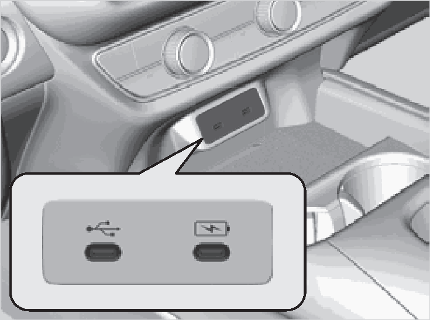
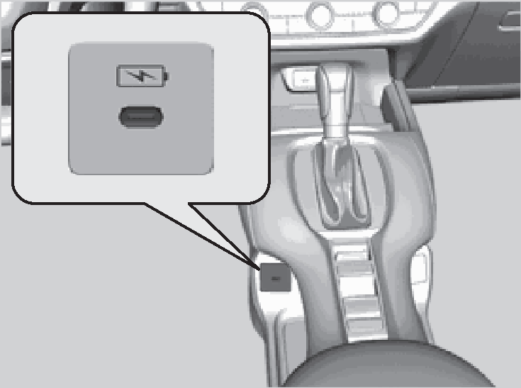

<!-- GENERATED:START function=5dacf71aa81a (generated; edits inside this block are overwritten by the next publish — write your own notes outside it) -->
# 2. USB Ports

<b>Function path:</b> Features / USB Ports <b>Source:</b> printed page 212 <b>Test-ready:</b> no — procedure missing or thresholds unfilled

Every "Presumed requirement" row below is machine-derived from the Owner's Manual text by rule-based extraction — not AI-written — and traceable to the printed page in its Source column.

## Figures (areas of the original PDF; the OM has no figure numbers or captions)

- Figure 2-1 source: p.212
- (Copied from OM) On the front panel

- Figure 2-2 source: p.212
- (Copied from OM) On the undertray

## 2-2-1. Service overview

| # | Presumed requirement | Strength | Source |
|---|---|---|---|
| 1 | USB PortsOn the front panel. | capability | p.212 / text |
| 2 | USB PortsOn the undertray. | capability | p.212 / text |
| 3 | USB PortsUSB charging/connector port ( ) 1USB Ports The USB port is for charging devices, playing. | capability | p.212 / text |

## 2-2-2. Service requirements

| # | Presumed requirement | Strength | Source |
|---|---|---|---|
| 1 | Step -Do not leave the iPod or USB flash drive in the audio files, and connecting compatible vehicle. Direct sunlight and high temperatures may damage it. phones with Apple CarPlay or Android Auto. | capability | p.212 / bullet |
| 2 | Step -We recommend that you use a USB cable if you are. | constraint | p.212 / bullet |
| 3 | Step -To prevent any potential issues, be sure attaching a USB flash drive to the USB port. to use an Apple MFi Certified Lightning. | capability | p.212 / bullet |
| 4 | Step -Do not connect the iPod or USB flash drive using a hub. Connector for Apple CarPlay. The USB. | capability | p.212 / bullet |
| 5 | Step -Do not use a device such as a card reader or hard disk cables should be certified by USB-IF to be drive, as the device or your files may be damaged. compliant with USB 2.0 Standard. | capability | p.212 / bullet |
| 6 | Step -We recommend backing up your data before using. | capability | p.212 / bullet |
| 7 | Step -USB charging port on the front panel the device in your vehicle. | capability | p.212 / bullet |
| 8 | Step -Displayed messages may vary depending on the ( ) device model and software version. The USB port is only for charging devices. | capability | p.212 / bullet |
| 9 | Step -USB charging port on the undertray Supplementary information about USB Charging:. | capability | p.212 / bullet |
| 10 | Step -The USB ports on the front panel support USB ( ) Power Delivery. The USB port (3.0A) is only for charging. | capability | p.212 / bullet |
| 11 | Step -USB standard output devices. When using 1 port: 5V/3A(15W), 9V/3A(27W),. | constraint | p.212 / bullet |
| 12 | Step -The USB port can supply up to 3.0A of 15V/3A(45W), 20V/3A(60W) power. It does not output 3.0A unless When using both ports: 5V/3A(15W), 9V/3A(27W), requested by the device. 20V/2.25A(45W), Max 60W in total. | constraint | p.212 / bullet |
| 13 | Step -The USB port also supports PPS (Programmable Power Supply). PPS 5.0V-21V (Max 60W). | capability | p.212 / bullet |

## 2-5. Exception operation

| # | Presumed requirement | Strength | Source |
|---|---|---|---|
| 1 | Step -Some devices may not work even if they are. | constraint | p.212 / bullet |
| 2 | Step -You cannot play music even if you have connected to the USB ports. connected music players to it. | constraint | p.212 / bullet |
| 3 | Step -You cannot play music even if you have For amperage details, read the operating manual of the device that needs to be charged. connected music players to it. | constraint | p.212 / bullet |
| 4 | Step -Charging may not start or may operate slowly depending on the connected devices and cables. Using only one port while not connecting anything (including cables) to the other port may solve the issue. | capability | p.212 / bullet |
<!-- GENERATED:END function=5dacf71aa81a -->

