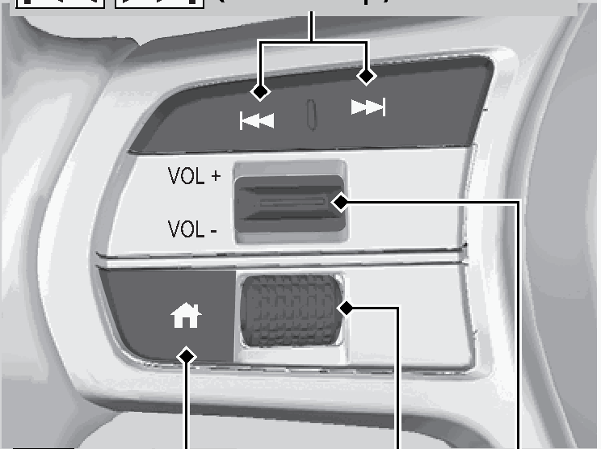

<!-- GENERATED:START function=cffc82fdf8d9 (generated; edits inside this block are overwritten by the next publish — write your own notes outside it) -->
# 4. Audio Remote Controls

<b>Function path:</b> Features / Audio Remote Controls <b>Source:</b> printed page 214, 215 <b>Test-ready:</b> no — procedure missing or thresholds unfilled

Every "Presumed requirement" row below is machine-derived from the Owner's Manual text by rule-based extraction — not AI-written — and traceable to the printed page in its Source column.

## Figures (areas of the original PDF; the OM has no figure numbers or captions)

- Figure 4-1 source: p.214
- (Copied from OM) (Home) Button Left Selector Wheel VOL(+/VOL(- (Volume) Switch

## 4-2-1. Service overview

| # | Presumed requirement | Strength | Source |
|---|---|---|---|
| 1 | Audio Remote ControlsAllow you to operate the audio system while driving. The information is shown on the driver information interface. VOL(+/VOL(- (Volume) Switch / (Seek/Skip) Buttons Press Up: To increase the volume. Press Down: To decrease the volume. | capability | p.214 / text |
| 2 | Audio Remote Controls(Home) Button Left Selector Wheel VOL(+/VOL(- (Volume) Switch. | capability | p.214 / text |
| 3 | Audio Remote Controls1Audio Remote Controls Some modes appear only when an appropriate device or medium is used. | constraint | p.214 / text |
| 4 | Audio Remote ControlsDepending on the Bluetooth® device you connect, some functions may not be available. | capability | p.214 / text |
| 5 | Audio Remote ControlsPress the (Home) button to go back to the home screen of the driver information interface. | capability | p.214 / text |
| 6 | Audio Remote Controls/ (Seek/Skip) Buttons. | capability | p.215 / text |

## 4-2-2. Service requirements

| # | Presumed requirement | Strength | Source |
|---|---|---|---|
| 1 | Step -When listening to the radio : To select the next preset radio station. Press : To select the previous preset radio station. Press : To select the next strong station. Press and hold : To select the previous strong station. Press and hold. | capability | p.215 / bullet |
| 2 | Step -When listening to a wired connection, USB flash drive, Bluetooth® Audio, or Smartphone Connection. | capability | p.215 / bullet |
| 3 | Step -Depending on a connected device, operations may be changed. : To skip to the next song. Press : To go back to the beginning of the current or previous song. Press. | capability | p.215 / bullet |
| 4 | Step -When listening to a USB flash drive : To skip to the next folder. Press and hold : To go back to the previous folder. Press and hold. | capability | p.215 / bullet |
<!-- GENERATED:END function=cffc82fdf8d9 -->

