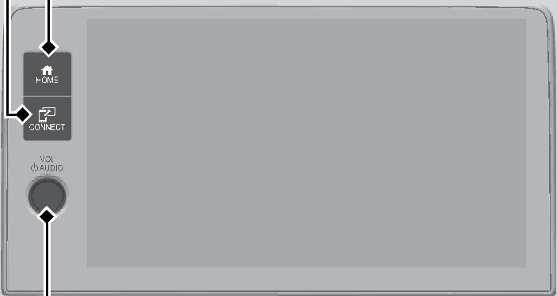

<!-- GENERATED:START function=374efa7b7563 (generated; edits inside this block are overwritten by the next publish — write your own notes outside it) -->
# 5. Audio System Basic Operation

<b>Function path:</b> Features / Audio System Basic Operation <b>Source:</b> printed page 216, 217 <b>Test-ready:</b> no — procedure missing or thresholds unfilled

Every "Presumed requirement" row below is machine-derived from the Owner's Manual text by rule-based extraction — not AI-written — and traceable to the printed page in its Source column.

## Figures (areas of the original PDF; the OM has no figure numbers or captions)

- Figure 5-1 source: p.217
- (Copied from OM) VOL/ AUDIO (Volume/Power) Knob

## 5-2-1. Service overview

| # | Presumed requirement | Strength | Source |
|---|---|---|---|
| 1 | Audio System Basic OperationLeft Selector Wheel. | capability | p.216 / text |

## 5-2-2. Service requirements

| # | Presumed requirement | Strength | Source |
|---|---|---|---|
| 1 | Step -When selecting the audio mode Press the (Home) button, then roll up or down to select Audio on the driver information interface, and then press the left selector wheel. Roll up or down: To cycle through the audio modes, roll up or down and then press the left selector wheel:. | capability | p.216 / bullet |
| 2 | Audio System Basic OperationBluetooth. | capability | p.216 / text |
| 3 | Audio System Basic OperationApple CarPlay. | capability | p.216 / text |
| 4 | Audio System Basic OperationAndroid Auto. | capability | p.216 / text |
| 5 | Audio System Basic OperationTo use the audio system function, the power mode must be in ACCESSORY or ON. | capability | p.217 / text |
| 6 | Audio System Basic Operation(Connect) Button (Home) Button. | capability | p.217 / text |
| 7 | Audio System Basic OperationVOL/ AUDIO (Volume/Power) Knob. | capability | p.217 / text |
| 8 | Audio System Basic Operation(Home) button: Press to go to the home screen. 2 Using the audio/information screen P.218 (Connect) button: Press to operate Apple CarPlay or Android Auto. VOL/ AUDIO (Volume/Power) knob: Press to turn the audio system on and off. Turn to adjust the volume. | capability | p.217 / text |
<!-- GENERATED:END function=374efa7b7563 -->

