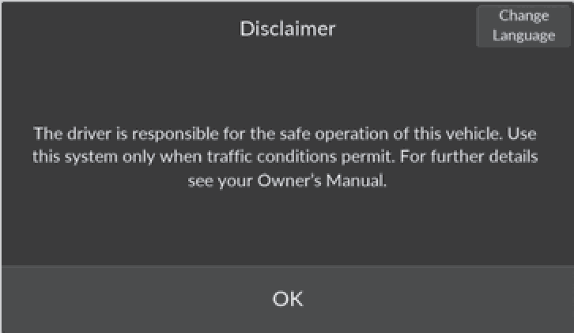

<!-- GENERATED:START function=bcfb0a6ac033 (generated; edits inside this block are overwritten by the next publish — write your own notes outside it) -->
# 6. Start Up

<b>Function path:</b> Features / Start Up <b>Source:</b> printed page 218 <b>Test-ready:</b> no — procedure missing or thresholds unfilled

Every "Presumed requirement" row below is machine-derived from the Owner's Manual text by rule-based extraction — not AI-written — and traceable to the printed page in its Source column.

## Figures (areas of the original PDF; the OM has no figure numbers or captions)

- Figure 6-1 source: p.218
- (Copied from OM) displayed.

## 6-2-1. Service overview

| # | Presumed requirement | Strength | Source |
|---|---|---|---|
| 1 | Start UpThe 9” Color Touchscreen starts automatically when you set the power mode to ACCESSORY or ON. At start-up, the following screen about the disclaimer will be displayed. | constraint | p.218 / text |
<!-- GENERATED:END function=bcfb0a6ac033 -->

