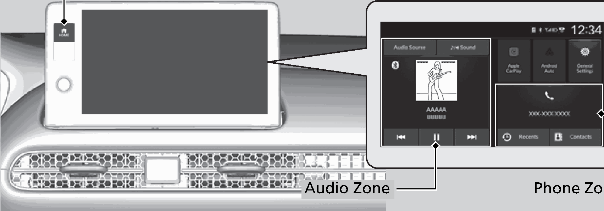
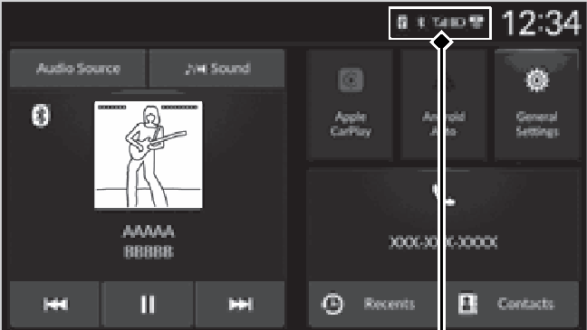
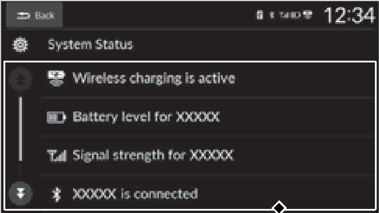
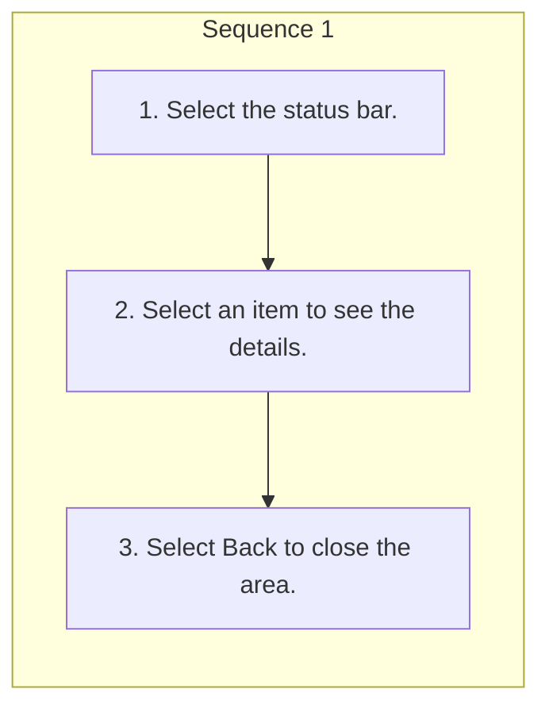

<!-- GENERATED:START function=35d169773242 (generated; edits inside this block are overwritten by the next publish — write your own notes outside it) -->
# 8. Audio/Information Screen

<b>Function path:</b> Features / Audio/Information Screen <b>Source:</b> printed page 219, 220, 221 <b>Test-ready:</b> yes — no unfilled thresholds and a procedure is present

Every "Presumed requirement" row below is machine-derived from the Owner's Manual text by rule-based extraction — not AI-written — and traceable to the printed page in its Source column.

## Figures (areas of the original PDF; the OM has no figure numbers or captions)

- Figure 8-1 source: p.219
- (Copied from OM) Press the

- Figure 8-2 source: p.221
- (Copied from OM) Status Bar

- Figure 8-3 source: p.221
- (Copied from OM) Status Bar

## Procedure

| Seq | Step | Operation (Copied from OM) | Source |
|---|---|---|---|
| 1 | 1 | Select the status bar. | p.221 / step |
| 1 | 2 | Select an item to see the details. | p.221 / step |
| 1 | 3 | Select Back to close the area. | p.221 / step |

## 8-2-1. Service overview

| # | Presumed requirement | Strength | Source |
|---|---|---|---|
| 1 | Audio/Information ScreenDisplays the audio status. From this display, you can go to various setup options. | capability | p.219 / text |
| 2 | Audio/Information ScreenSwitching the Display. | capability | p.219 / text |
| 3 | Audio/Information ScreenUsing the audio/information screen. | capability | p.219 / text |
| 4 | Audio/Information ScreenPress the button to go to the home screen. Select the following zones or icons on the home screen. | capability | p.219 / text |
| 5 | Audio/Information ScreenAudio zone Displays the audio information for each. 2 Playing AM/FM Radio P.223 2 Music Playback via Wired Connection P.226 2 Music Playback via USB Flash Drive P.228 2 Playing Bluetooth® Audio P.230. | capability | p.219 / text |
| 6 | Audio/Information Screen1Using the audio/information screen Touchscreen operation Home Screen. | capability | p.219 / text |

## 8-2-2. Service requirements

| # | Presumed requirement | Strength | Source |
|---|---|---|---|
| 1 | Step -Use simple gestures - including touching, swiping and scrolling - to operate certain audio functions. | capability | p.219 / bullet |
| 2 | Step -Some items may be grayed-out during driving to reduce the potential for distraction. | capability | p.219 / bullet |
| 3 | Step -You can select them when the vehicle is stopped. | constraint | p.219 / bullet |
| 4 | Step -Wearing gloves may limit or prevent touchscreen response. | capability | p.219 / bullet |
| 5 | Audio/Information ScreenPhone zone Displays the HFL information. 2 Bluetooth® HandsFreeLink® P.267. | capability | p.220 / text |
| 6 | Audio/Information ScreenApple CarPlay/Android Auto Displays Apple CarPlay or Android Auto. 2 Apple CarPlay P.233 2 Android AutoTM P.237. | capability | p.220 / text |
| 7 | Audio/Information ScreenStatus Bar. | capability | p.221 / text |
| 8 | Step -The status area appears. | capability | p.221 / bullet |
| 9 | Audio/Information ScreenStatus Bar. | capability | p.221 / text |
| 10 | Audio/Information ScreenStatus Area. | capability | p.221 / text |

## 8-4. User settings

| # | Presumed requirement | Strength | Source |
|---|---|---|---|
| 1 | Audio/Information ScreenYou can change the touchscreen sensitivity setting. 2 Customized Features P.261 Audio Zone Phone Zone. | capability | p.219 / text |
| 2 | Audio/Information ScreenGeneral Settings Enters the customizing menu screen. 2 Customized Features P.261. | capability | p.220 / text |
<!-- GENERATED:END function=35d169773242 -->

