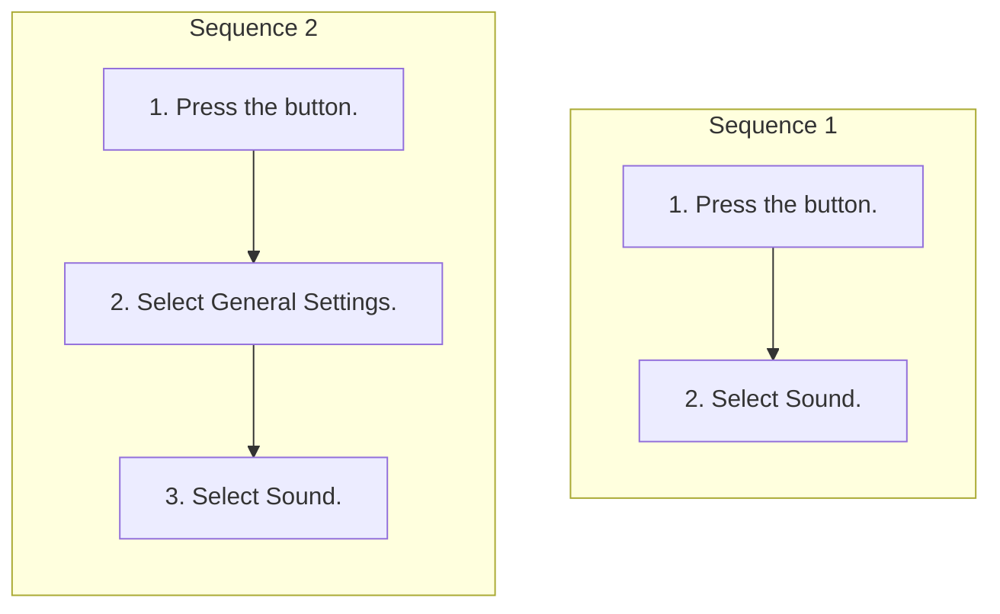

<!-- GENERATED:START function=920b13a446e3 (generated; edits inside this block are overwritten by the next publish — write your own notes outside it) -->
# 9. Adjusting the Sound

<b>Function path:</b> Features / Adjusting the Sound <b>Source:</b> printed page 222 <b>Test-ready:</b> yes — no unfilled thresholds and a procedure is present

Every "Presumed requirement" row below is machine-derived from the Owner's Manual text by rule-based extraction — not AI-written — and traceable to the printed page in its Source column.

## Procedure (2 sequences; the manual restarts the numbering)

| Seq | Step | Operation (Copied from OM) | Source |
|---|---|---|---|
| 1 | 1 | Press the button. | p.222 / step |
| 1 | 2 | Select Sound. | p.222 / step |
| 2 | 1 | Press the button. | p.222 / step |
| 2 | 2 | Select General Settings. | p.222 / step |
| 2 | 3 | Select Sound. | p.222 / step |

## 9-2-1. Service overview

| # | Presumed requirement | Strength | Source |
|---|---|---|---|
| 1 | Adjusting the SoundSelect an item from the following choices:. | capability | p.222 / text |

## 9-2-2. Service requirements

| # | Presumed requirement | Strength | Source |
|---|---|---|---|
| 1 | Step -Bass / Mid / Treble: Bass, Midrange, Treble. | capability | p.222 / bullet |
| 2 | Step -Balance / Fader: Balance, Fader. | capability | p.222 / bullet |
| 3 | Step -Speed Volume Compensation: Sets the amount of volume increase. | capability | p.222 / bullet |
| 4 | Adjusting the Sound1Adjusting the Sound The Speed Volume Compensation (SVC) adjusts the volume level based on the vehicle speed. As you go faster, audio volume increases. As you slow down, audio volume decreases. | capability | p.222 / text |
| 5 | Adjusting the SoundYou can also adjust the sound by the following procedure. | capability | p.222 / text |
| 6 | Adjusting the SoundTo reset each setting for Bass / Mid / Treble and Balance / Fader, select Reset to Default on each setting screen. | capability | p.222 / text |
<!-- GENERATED:END function=920b13a446e3 -->

