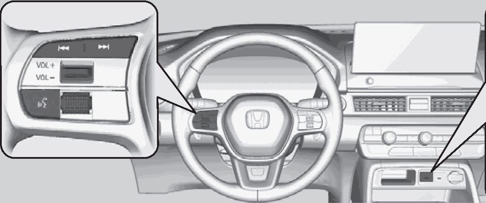
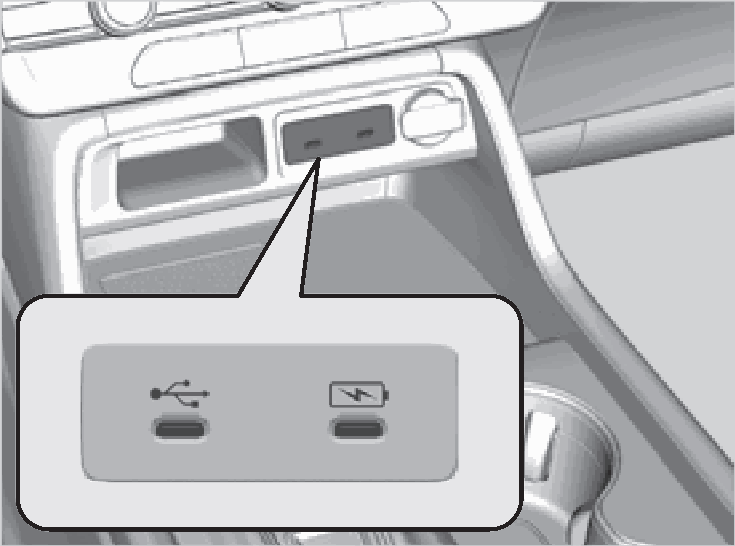
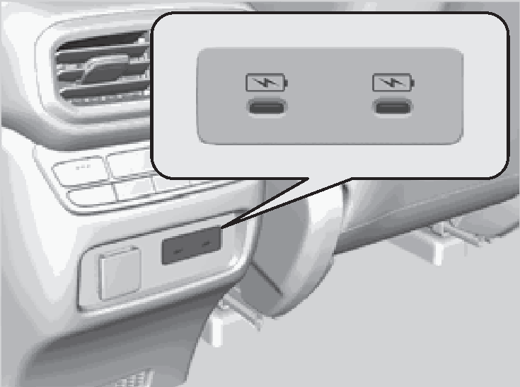
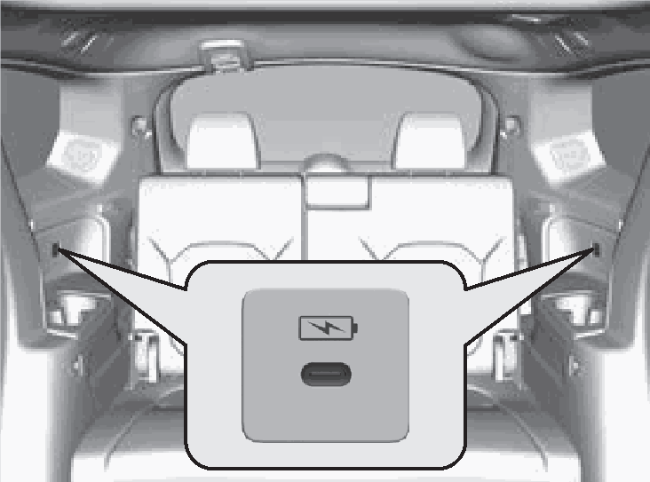

<!-- GENERATED:START function=95b41420c160 (generated; edits inside this block are overwritten by the next publish — write your own notes outside it) -->
# 1. USB Ports

<b>Function path:</b> Audio System / USB Ports <b>Source:</b> printed page 264, 265, 266 <b>Test-ready:</b> no — procedure missing or thresholds unfilled

Every "Presumed requirement" row below is machine-derived from the Owner's Manual text by rule-based extraction — not AI-written — and traceable to the printed page in its Source column.

## Figures (areas of the original PDF; the OM has no figure numbers or captions)

- Figure 1-1 source: p.264
- (Copied from OM) Remote Controls

- Figure 1-2 source: p.265
- (Copied from OM) On the back of the console

- Figure 1-3 source: p.265
- (Copied from OM) compartment

- Figure 1-4 source: p.266
- (Copied from OM) On both sides of the third row seats*

## 1-2-1. Service overview

| # | Presumed requirement | Strength | Source |
|---|---|---|---|
| 1 | USB PortsAbout Your Audio System. | capability | p.264 / text |
| 2 | USB PortsThe audio system features AM/FM radio service. It can also play USB flash drives, iPod, iPhone, smartphones, and Bluetooth® devices. | capability | p.264 / text |
| 3 | USB PortsYou can operate the audio system from the knob on the panel, the remote controls on the steering wheel, or the icons on the touchscreen interface. | capability | p.264 / text |
| 4 | USB PortsRemote Controls. | capability | p.264 / text |
| 5 | USB Ports1About Your Audio System State or local laws may prohibit the operation of handheld electronic devices while operating a vehicle. | capability | p.264 / text |
| 6 | USB PortsUSB Flash Drive. | capability | p.264 / text |
| 7 | USB PortsUSB Ports. | capability | p.265 / text |
| 8 | USB PortsOn the front panel. | capability | p.265 / text |
| 9 | USB PortsOn the back of the console compartment. | capability | p.265 / text |
| 10 | USB PortsUSB charging/connector port (. | capability | p.265 / text |
| 11 | USB Ports) 1USB Ports The USB port is for charging devices, playing. | capability | p.265 / text |

## 1-2-2. Service requirements

| # | Presumed requirement | Strength | Source |
|---|---|---|---|
| 1 | Step -Do not leave any devices or USB flash drives in the audio files, and connecting compatible vehicle. Direct sunlight and high temperatures may damage it. phones with Apple CarPlay or Android Auto. | capability | p.265 / bullet |
| 2 | Step -We recommend that you use a USB cable if you are. | constraint | p.265 / bullet |
| 3 | Step -To prevent any potential issues, be sure attaching a USB flash drive to the USB port. to use an Apple MFi Certified Lightning. | capability | p.265 / bullet |
| 4 | Step -Do not connect any devices or USB flash drives Connector for Apple CarPlay. USB cables using a hub. should be certified by USB-IF to be. | capability | p.265 / bullet |
| 5 | Step -Do not use a device such as a card reader or hard disk compliant with USB 2.0 Standard. drive, as the device or your files may be damaged. | capability | p.265 / bullet |
| 6 | Step -We recommend backing up your data before using. | capability | p.265 / bullet |
| 7 | USB PortsUSB charging port on the front panel. | capability | p.265 / text |
| 8 | USB Portsthe device in your vehicle. and the back of the console. | capability | p.265 / text |
| 9 | Step -Displayed messages may vary depending on the compartment ( ) device model and software version. The USB port is only for charging devices. | capability | p.265 / bullet |
| 10 | Step -The USB ports on the front panel and the back of the console compartment support USB Power Delivery. | capability | p.265 / bullet |
| 11 | Step -USB standard output When using 1 port: 5V/3A(15W), 9V/3A(27W), 15V/3A(45W), 20V/3A(60W) When using both ports: 5V/3A(15W), 9V/3A(27W), 20V/2.25A(45W), Max 60W in total For amperage details, read the operating manual of the device that needs to be charged. | constraint | p.265 / bullet |
| 12 | Step -The USB port also supports PPS (Programmable Power Supply). PPS 5.0V-21V (Max 60W). | capability | p.265 / bullet |
| 13 | USB PortsOn both sides of the third row seats*. | capability | p.266 / text |
| 14 | USB PortsUSB charging port on both sides of the. | capability | p.266 / text |
| 15 | USB Portsthird row seats ( )* The USB port (3.0A) is only for charging devices. | capability | p.266 / text |
| 16 | Step -The USB port can supply up to 3.0A of power. It does not output 3.0A unless requested by the device. | constraint | p.266 / bullet |

## 1-5. Exception operation

| # | Presumed requirement | Strength | Source |
|---|---|---|---|
| 1 | Step -Some devices may not work even if they are. | constraint | p.265 / bullet |
| 2 | Step -You cannot play music even if you have connected to the USB ports. connected music players to it. Supplementary information about USB Charging:. | constraint | p.265 / bullet |
| 3 | Step -Charging may not start or may operate slowly depending on the connected devices and cables. Using only one port while not connecting anything (including cables) to the other port may solve the issue. | capability | p.265 / bullet |
| 4 | Step -You cannot play music even if you have connected music players to it. | constraint | p.266 / bullet |
<!-- GENERATED:END function=95b41420c160 -->

