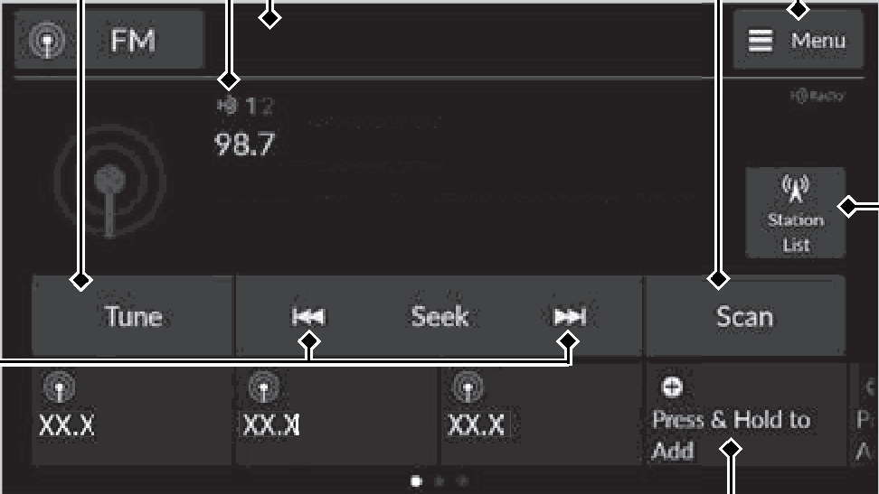
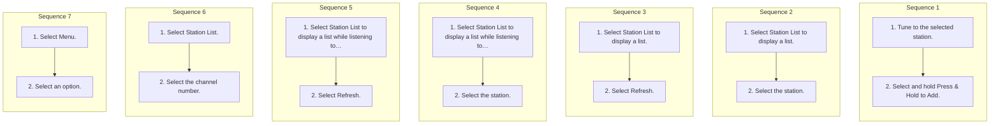

<!-- GENERATED:START function=35b7539e28da (generated; edits inside this block are overwritten by the next publish — write your own notes outside it) -->
# 11. Playing AM/FM Radio

<b>Function path:</b> Audio System Basic Operation / Playing AM/FM Radio <b>Source:</b> printed page 287, 288, 289, 290 <b>Test-ready:</b> yes — no unfilled thresholds and a procedure is present

Every "Presumed requirement" row below is machine-derived from the Owner's Manual text by rule-based extraction — not AI-written — and traceable to the printed page in its Source column.

## Figures (areas of the original PDF; the OM has no figure numbers or captions)

- Figure 11-1 source: p.287
- (Copied from OM) Audio/Information Screen

## Procedure (7 sequences; the manual restarts the numbering)

| Seq | Step | Operation (Copied from OM) | Source |
|---|---|---|---|
| 1 | 1 | Tune to the selected station. | p.288 / step |
| 1 | 2 | Select and hold Press &amp; Hold to Add. | p.288 / step |
| 2 | 1 | Select Station List to display a list. | p.288 / step |
| 2 | 2 | Select the station. | p.288 / step |
| 3 | 1 | Select Station List to display a list. | p.288 / step |
| 3 | 2 | Select Refresh. | p.288 / step |
| 4 | 1 | Select Station List to display a list while listening to an FM station. | p.289 / step |
| 4 | 2 | Select the station. | p.289 / step |
| 5 | 1 | Select Station List to display a list while listening to an FM station. | p.289 / step |
| 5 | 2 | Select Refresh. | p.289 / step |
| 6 | 1 | Select Station List. | p.290 / step |
| 6 | 2 | Select the channel number. | p.290 / step |
| 7 | 1 | Select Menu. | p.290 / step |
| 7 | 2 | Select an option. | p.290 / step |

## Numeric thresholds (filled in by a tester)
Filled: 1 / unfilled: 0

| Threshold | Matching text (Copied from OM) | Kind | Unit | Value | Status | Evidence | Filled by |
|---|---|---|---|---|---|---|---|
| f6e829c5d602 | for 10 seconds | duration | seconds | 10 | from_manual | Stated in the OM: "10" | — |

## 11-2-1. Service overview

| # | Presumed requirement | Strength | Source |
|---|---|---|---|
| 1 | Playing AM/FM RadioPlaying AM/FM Radio. | capability | p.287 / text |
| 2 | Playing AM/FM RadioIcon Select to display the subchannel list screen. | capability | p.287 / text |
| 3 | Playing AM/FM RadioTune Icon Select to use the on-screen keyboard for entering the radio frequency directly. | capability | p.287 / text |
| 4 | Playing AM/FM RadioSeek Icons Select or to search up and down on the selected band for a station with a strong signal. | capability | p.287 / text |
| 5 | Playing AM/FM RadioAudio/Information Screen. | capability | p.287 / text |
| 6 | Playing AM/FM RadioScan Icon Select to scan each station with a strong signal. | capability | p.287 / text |
| 7 | Playing AM/FM RadioMenu Select to display the menu screen. | capability | p.287 / text |
| 8 | Playing AM/FM RadioStation List Select to display the station list screen. | capability | p.287 / text |
| 9 | Playing AM/FM RadioFavorite Station Icons, Add Favorite Tune the radio frequency for a favorite station. Press and hold + Press &amp; Hold to Add to store the station. Swipe left or right on the screen to move to the next or previous favorite station list. | capability | p.287 / text |
| 10 | Playing AM/FM RadioFavorite Station. | capability | p.288 / text |
| 11 | Playing AM/FM RadioTo add a station:. | capability | p.288 / text |
| 12 | Playing AM/FM RadioEditing a favorite station. | capability | p.288 / text |
| 13 | Playing AM/FM RadioSelect and hold the desired favorite station icon. The following items are available:. | capability | p.288 / text |

## 11-2-2. Service requirements

| # | Presumed requirement | Strength | Source |
|---|---|---|---|
| 1 | Step -Remove Favorite: Delete the favorite station icon from the favorite station list. | capability | p.288 / bullet |
| 2 | Step -Replace with (number): Replace the stored favorite station icon. | capability | p.288 / bullet |
| 3 | Step -Add to Home: Add the shortcut icon of the stored favorite station to the home screen. | capability | p.288 / bullet |
| 4 | Playing AM/FM RadioStation List. | capability | p.288 / text |
| 5 | Playing AM/FM RadioLists the strongest stations on the selected band. | capability | p.288 / text |
| 6 | Playing AM/FM RadioManual update. | capability | p.288 / text |
| 7 | Playing AM/FM RadioUpdates your available station list at any time. | capability | p.288 / text |
| 8 | Playing AM/FM Radio1Favorite Station Switching the Audio Mode Roll the left selector wheel or select the audio source icon on the screen. 2 Audio Remote Controls P.268. | capability | p.288 / text |
| 9 | Playing AM/FM RadioYou can store 12 AM/FM stations into preset memory. | capability | p.288 / text |
| 10 | Playing AM/FM RadioSamples each of the strongest stations on the selected band for 10 seconds. To turn off scan, select Stop or Back. | capability | p.289 / text |
| 11 | Playing AM/FM RadioRadio Data System (RDS). | capability | p.289 / text |
| 12 | Playing AM/FM RadioProvides text data information related to your selected RDS-capable FM station. | capability | p.289 / text |
| 13 | Playing AM/FM RadioTo find an RDS station from Station List. | capability | p.289 / text |
| 14 | Playing AM/FM RadioManual update. | capability | p.289 / text |
| 15 | Playing AM/FM RadioUpdates your available station list at any time. | capability | p.289 / text |
| 16 | Playing AM/FM Radio1Radio Data System (RDS) When you select an RDS-capable FM station, the RDS automatically turns on, and the frequency display changes to the station name. However, when the signals of that station become weak, the display changes from the station name to the frequency. | constraint | p.289 / text |
| 17 | Playing AM/FM RadioHD Subchannel. | capability | p.290 / text |
| 18 | Playing AM/FM RadioDisplays the subchannel list when an HD RadioTM station is selected while listening to an FM station. | constraint | p.290 / text |
| 19 | Playing AM/FM RadioAM/FM Settings. | capability | p.290 / text |
| 20 | Playing AM/FM RadioChanges the AM/FM settings. | capability | p.290 / text |
| 21 | Step -HD Radio: Automatically choose a digital or an analog channel, or listen to analog only. | capability | p.290 / bullet |
| 22 | Step -Artwork: Turns the artwork display on and off. | capability | p.290 / bullet |
<!-- GENERATED:END function=35b7539e28da -->

