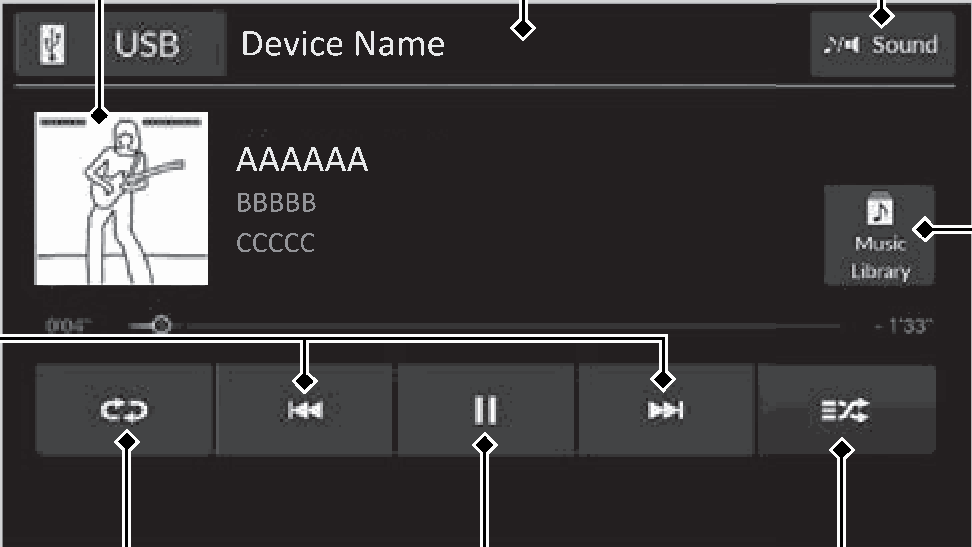

<!-- GENERATED:START function=0ea47a2b9199 (generated; edits inside this block are overwritten by the next publish — write your own notes outside it) -->
# 12. Music Playback via Wired Connection

<b>Function path:</b> Audio System Basic Operation / Music Playback via Wired Connection <b>Source:</b> printed page 291, 292, 293 <b>Test-ready:</b> no — procedure missing or thresholds unfilled

Every "Presumed requirement" row below is machine-derived from the Owner's Manual text by rule-based extraction — not AI-written — and traceable to the printed page in its Source column.

## Figures (areas of the original PDF; the OM has no figure numbers or captions)

- Figure 12-1 source: p.291
- (Copied from OM) Audio/Information Screen

## 12-2-1. Service overview

| # | Presumed requirement | Strength | Source |
|---|---|---|---|
| 1 | Music Playback via Wired ConnectionMusic Playback via Wired Connection. | capability | p.291 / text |
| 2 | Music Playback via Wired ConnectionUsing your USB connector, connect the device to the USB charging/connector port, then select the USB icon. 2 USB Ports P.265. | capability | p.291 / text |
| 3 | Music Playback via Wired ConnectionCover Art. | capability | p.291 / text |
| 4 | Music Playback via Wired Connection/ (Skip/Seek) Icons Select or to change songs. Select and hold to move rapidly within a song. | capability | p.291 / text |
| 5 | Music Playback via Wired ConnectionRepeat Icon Select to repeat the current song. | capability | p.291 / text |
| 6 | Music Playback via Wired ConnectionAudio/Information Screen. | capability | p.291 / text |
| 7 | Music Playback via Wired ConnectionSound Icon Select to display the sound settings. | capability | p.291 / text |
| 8 | Music Playback via Wired ConnectionMusic Library Select to display the music search screen. | capability | p.291 / text |
| 9 | Music Playback via Wired ConnectionShuffle Icon Select to play all songs in the current category in random order. | capability | p.291 / text |
| 10 | Music Playback via Wired ConnectionPlay/Pause Icon. | capability | p.291 / text |
| 11 | Music Playback via Wired ConnectionHow to Select a Song from the Music Search List. | capability | p.292 / text |
| 12 | Music Playback via Wired Connection1.Select Music Library. 2.Select a search category (e.g., Artists, Albums, etc.). 3.Continue making selections until you find the song of your choice. | capability | p.292 / text |
| 13 | Music Playback via Wired Connection1Music Playback via Wired Connection Available operating functions vary on models or versions. Some functions may not be available on the vehicle’s audio system. | capability | p.292 / text |
| 14 | Music Playback via Wired ConnectionIf an iPhone is connected via Apple CarPlay, the USB source will be unavailable and audio files on the phone will be playable only within Apple CarPlay. | capability | p.292 / text |
| 15 | Music Playback via Wired ConnectionHow to Select a Play Mode. | capability | p.293 / text |
| 16 | Music Playback via Wired ConnectionYou can select shuffle and repeat modes when playing a song. | constraint | p.293 / text |
| 17 | Music Playback via Wired ConnectionShuffle/Repeat. | capability | p.293 / text |
| 18 | Music Playback via Wired ConnectionRepeatedly select the shuffle or repeat icon until you find a play mode option of your preference. | capability | p.293 / text |
| 19 | Music Playback via Wired ConnectionPlay Mode Menu Items Shuffle Shuffle off: Shuffle mode turns off. Shuffle all songs: Plays all available songs in a selected list in random order. | capability | p.293 / text |
| 20 | Music Playback via Wired ConnectionRepeat Repeat off: Repeat mode turns off. Repeat song: Repeats the current song. Repeat all: Repeats all available songs in a selected list. | capability | p.293 / text |
<!-- GENERATED:END function=0ea47a2b9199 -->

