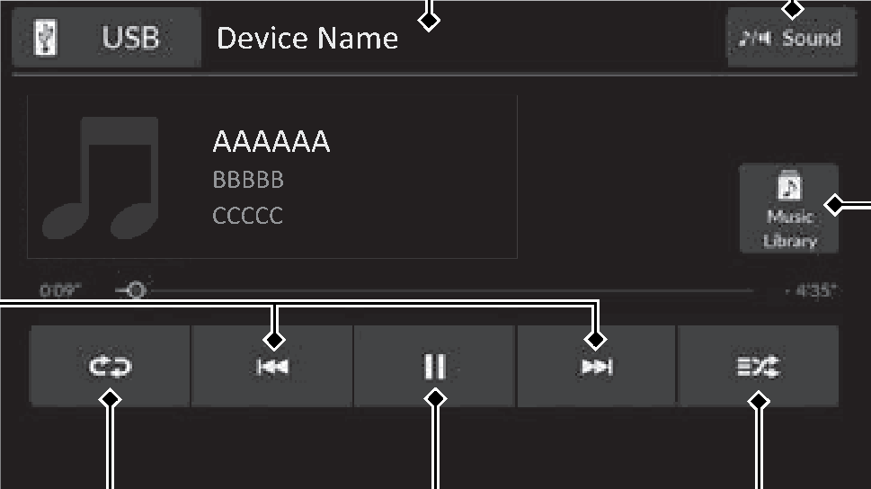
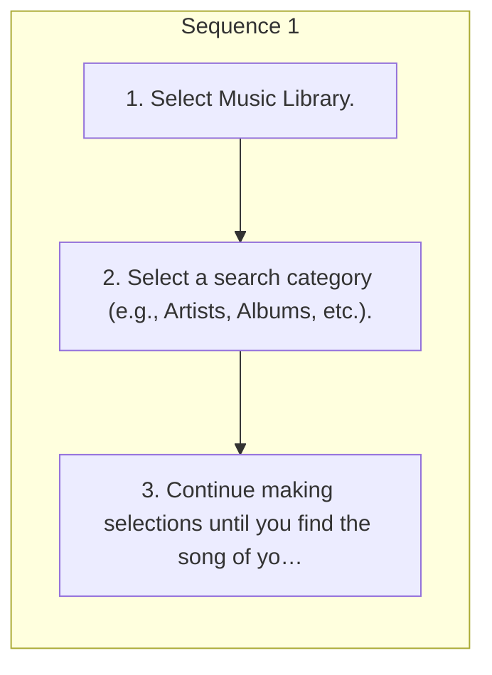

<!-- GENERATED:START function=65adcb3696ea (generated; edits inside this block are overwritten by the next publish — write your own notes outside it) -->
# 13. Music Playback via USB Flash Drive

<b>Function path:</b> Audio System Basic Operation / Music Playback via USB Flash Drive <b>Source:</b> printed page 294, 295, 296 <b>Test-ready:</b> no — procedure missing or thresholds unfilled

Every "Presumed requirement" row below is machine-derived from the Owner's Manual text by rule-based extraction — not AI-written — and traceable to the printed page in its Source column.

## Figures (areas of the original PDF; the OM has no figure numbers or captions)

- Figure 13-1 source: p.294
- (Copied from OM) Audio/Information Screen

## Procedure

| Seq | Step | Operation (Copied from OM) | Source |
|---|---|---|---|
| 1 | 1 | Select Music Library. | p.295 / step |
| 1 | 2 | Select a search category (e.g., Artists, Albums, etc.). | p.295 / step |
| 1 | 3 | Continue making selections until you find the song of your choice. | p.295 / step |

## Numeric thresholds (filled in by a tester)
Filled: 0 / unfilled: 1

| Threshold | Matching text (Copied from OM) | Kind | Unit | Value | Status | Evidence | Filled by |
|---|---|---|---|---|---|---|---|
| 360cc73f9051 | repeatedly until | count | times | **unfilled** | unfilled | — | — |

## 13-2-1. Service overview

| # | Presumed requirement | Strength | Source |
|---|---|---|---|
| 1 | Music Playback via USB Flash DriveMusic Playback via USB Flash Drive. | capability | p.294 / text |
| 2 | Music Playback via USB Flash DriveYour audio system reads and plays audio files on a USB flash drive. Connect your USB flash drive to the USB charging/connector port, then select the USB icon. 2 USB Ports P.265. | capability | p.294 / text |
| 3 | Music Playback via USB Flash DriveAudio/Information Screen. | capability | p.294 / text |
| 4 | Music Playback via USB Flash Drive/ (Skip/Seek) Icons Select or to change files. Select and hold to move rapidly within a file. | capability | p.294 / text |
| 5 | Music Playback via USB Flash DriveRepeat Icon Select to repeat the current file. | capability | p.294 / text |
| 6 | Music Playback via USB Flash DrivePlay/Pause Icon. | capability | p.294 / text |
| 7 | Music Playback via USB Flash DriveSound Icon Select to display the sound settings. | capability | p.294 / text |
| 8 | Music Playback via USB Flash DriveMusic Library Select to display the music search screen. | capability | p.294 / text |
| 9 | Music Playback via USB Flash DriveRandom Icon Select to play all files in the current category in random order. | capability | p.294 / text |
| 10 | Music Playback via USB Flash DriveHow to Select a File from the Music Search List. | capability | p.295 / text |
| 11 | Music Playback via USB Flash Drive1Music Playback via USB Flash Drive Use the recommended USB flash drives. 2 General Information on the Audio System P.325. | capability | p.295 / text |
| 12 | Music Playback via USB Flash DriveWMA files protected by digital rights management (DRM) cannot be played. The audio system displays The selected file cannot be played on this system, then skips to the next file. | constraint | p.295 / text |
| 13 | Music Playback via USB Flash DriveHow to Select a Play Mode. | capability | p.296 / text |
| 14 | Music Playback via USB Flash DriveYou can select random and repeat modes when playing a file. | constraint | p.296 / text |
| 15 | Music Playback via USB Flash DriveRandom/Repeat. | capability | p.296 / text |
| 16 | Music Playback via USB Flash DriveSelect random or repeat icon repeatedly until a desired mode. | capability | p.296 / text |
| 17 | Music Playback via USB Flash DriveRandom Random off: Random mode turns off. Random all files: Plays all files in random order. Random in folder: Plays all files in the current folder in random order. | capability | p.296 / text |
| 18 | Music Playback via USB Flash DriveRepeat Repeat off: Repeat mode turns off. Repeat file: Repeats the current playing file. Repeat in folder: Repeats all files in the current folder. | capability | p.296 / text |
<!-- GENERATED:END function=65adcb3696ea -->

