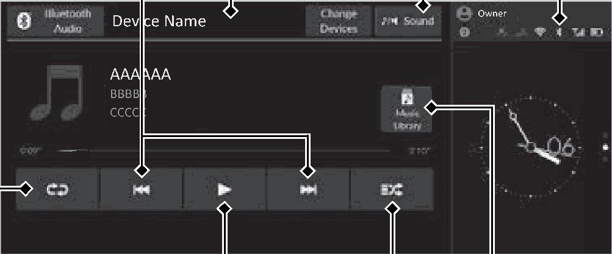
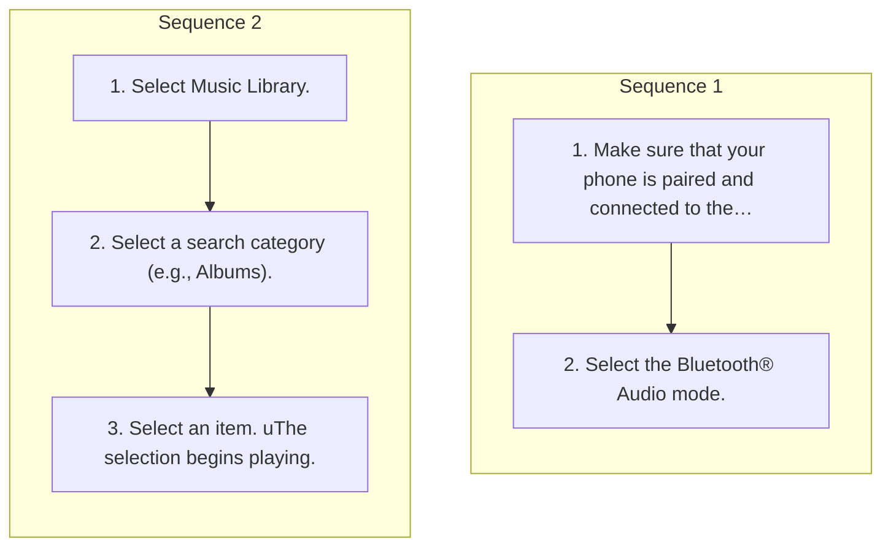

<!-- GENERATED:START function=a78de7491615 (generated; edits inside this block are overwritten by the next publish — write your own notes outside it) -->
# 14. Playing Bluetooth® Audio

<b>Function path:</b> Audio System Basic Operation / Playing Bluetooth® Audio <b>Source:</b> printed page 297, 298, 299 <b>Test-ready:</b> no — procedure missing or thresholds unfilled

Every "Presumed requirement" row below is machine-derived from the Owner's Manual text by rule-based extraction — not AI-written — and traceable to the printed page in its Source column.

## Figures (areas of the original PDF; the OM has no figure numbers or captions)

- Figure 14-1 source: p.297
- (Copied from OM) Play/Pause Icon

## Procedure (2 sequences; the manual restarts the numbering)

| Seq | Step | Operation (Copied from OM) | Source |
|---|---|---|---|
| 1 | 1 | Make sure that your phone is paired and connected to the system. 2 Phone Setup P.373 | p.298 / step |
| 1 | 2 | Select the Bluetooth® Audio mode. | p.298 / step |
| 2 | 1 | Select Music Library. | p.298 / step |
| 2 | 2 | Select a search category (e.g., Albums). | p.298 / step |
| 2 | 3 | Select an item. uThe selection begins playing. | p.298 / step |

## Numeric thresholds (filled in by a tester)
Filled: 0 / unfilled: 1

| Threshold | Matching text (Copied from OM) | Kind | Unit | Value | Status | Evidence | Filled by |
|---|---|---|---|---|---|---|---|
| a2ddfabcf5b1 | Repeatedly select the shuffle or repeat icon until | count | times | **unfilled** | unfilled | — | — |

## 14-2-1. Service overview

| # | Presumed requirement | Strength | Source |
|---|---|---|---|
| 1 | Playing Bluetooth® AudioPlaying Bluetooth® Audio. | capability | p.297 / text |
| 2 | Playing Bluetooth® AudioYour audio system allows you to listen to music from your Bluetooth®-compatible phone. This function is available when the phone is paired and connected to the vehicle’s Bluetooth® HandsFreeLink® (HFL) system. 2 Phone Setup P.373. | constraint | p.297 / text |
| 3 | Playing Bluetooth® Audio/ (Skip/Seek) Icons Sound Icon Select Select to display the to change file. or sound settings. Select and hold to move rapidly within a file. | capability | p.297 / text |
| 4 | Playing Bluetooth® AudioAudio/Information Bluetooth® Indicator Screen Appears when your phone is connected to HFL. | constraint | p.297 / text |
| 5 | Playing Bluetooth® AudioPlay/Pause Icon. | capability | p.297 / text |
| 6 | Playing Bluetooth® AudioMusic Library Select to display the music search screen. | capability | p.297 / text |
| 7 | Playing Bluetooth® AudioRepeat Icon Shuffle Icon Select to repeat the current file. Select to play all files in the current category in random order. | capability | p.297 / text |
| 8 | Playing Bluetooth® Audio1Playing Bluetooth® Audio Not all Bluetooth®-enabled phones with streaming audio capabilities are compatible with the system. For a list of compatible phones:. | capability | p.297 / text |

## 14-2-2. Service requirements

| # | Presumed requirement | Strength | Source |
|---|---|---|---|
| 1 | Step -U.S.: Visit https://mygarage.honda.com/s/hondahandsfreelink-compatibility-check, or call 1-888- 528-7876. | capability | p.297 / bullet |
| 2 | Step -Canada: Call 1-855-490-7351. | capability | p.297 / bullet |
| 3 | Playing Bluetooth® AudioIt may be illegal to perform some data device functions while driving. | capability | p.297 / text |
| 4 | Playing Bluetooth® AudioOnly one phone can be used with HFL at a time. When there is more than one paired phone in the vehicle, the first paired phone the system finds is automatically connected. | constraint | p.297 / text |
| 5 | Playing Bluetooth® AudioThe connected phone for Bluetooth® Audio can be different. | capability | p.297 / text |
| 6 | Playing Bluetooth® AudioIf more than one phone is paired to the HFL system, there may be a delay before the system begins to play. | capability | p.297 / text |
| 7 | Playing Bluetooth® AudioTo Play Bluetooth® Audio Files. | capability | p.298 / text |
| 8 | Playing Bluetooth® AudioIf the phone is not recognized, another HFL-compatible phone, which is not compatible for Bluetooth® Audio, may already be connected. | capability | p.298 / text |
| 9 | Playing Bluetooth® AudioSearching for Music. | capability | p.298 / text |
| 10 | Playing Bluetooth® Audio1To Play Bluetooth® Audio Files To play the audio files, you may need to operate your phone. If so, follow the phone maker’s operating instructions. | constraint | p.298 / text |
| 11 | Playing Bluetooth® AudioSwitching to another mode pauses the music playing from your phone. | capability | p.298 / text |
| 12 | Playing Bluetooth® AudioYou can change the connected phone by selecting Change Devices. 2 Phone Setup P.373. | capability | p.298 / text |
| 13 | Playing Bluetooth® AudioHow to Select a Play Mode. | capability | p.299 / text |
| 14 | Playing Bluetooth® AudioYou can select shuffle and repeat modes when playing a file. | constraint | p.299 / text |
| 15 | Playing Bluetooth® AudioShuffle/Repeat. | capability | p.299 / text |
| 16 | Playing Bluetooth® AudioShuffle Shuffle off: Shuffle mode to off. Shuffle all files: Plays all available files in a selected list in random order. | capability | p.299 / text |
| 17 | Playing Bluetooth® AudioRepeat Repeat off: Repeat mode to off. Repeat file: Repeats the current file. Repeat group: Repeats the current group. Repeat all: Repeats all files. | capability | p.299 / text |

## 14-4. User settings

| # | Presumed requirement | Strength | Source |
|---|---|---|---|
| 1 | Playing Bluetooth® AudioRepeatedly select the shuffle or repeat icon until you find a play mode option of your preference. | capability | p.299 / text |

## 14-5. Exception operation

| # | Presumed requirement | Strength | Source |
|---|---|---|---|
| 1 | Playing Bluetooth® AudioIn some cases, the name of the artist, album, or file may not appear correctly. | capability | p.297 / text |
| 2 | Playing Bluetooth® AudioSome functions may not be available on some devices. | capability | p.297 / text |
| 3 | Playing Bluetooth® AudioIf a phone is currently connected via Apple CarPlay or Android Auto, Bluetooth® Audio from that phone will be unavailable. 2 Phone Setup P.373. | capability | p.297 / text |
| 4 | Playing Bluetooth® Audio1Searching for Music Depending on the Bluetooth® device you connect, some or all of the lists may not be displayed. | capability | p.298 / text |
| 5 | Playing Bluetooth® Audio1How to Select a Play Mode Depending on the Bluetooth® device you connect, some or all of the functions may not be displayed. | capability | p.299 / text |
<!-- GENERATED:END function=a78de7491615 -->

