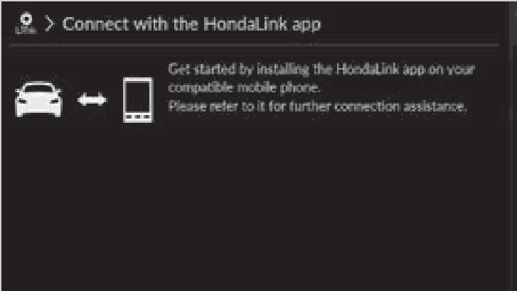
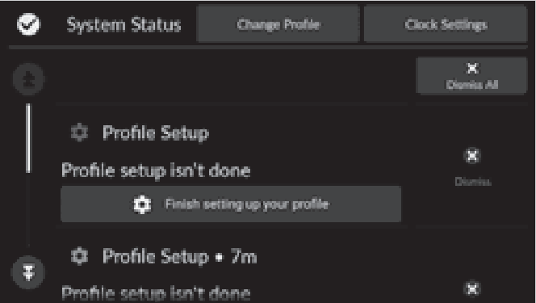
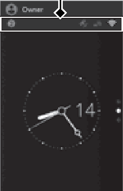
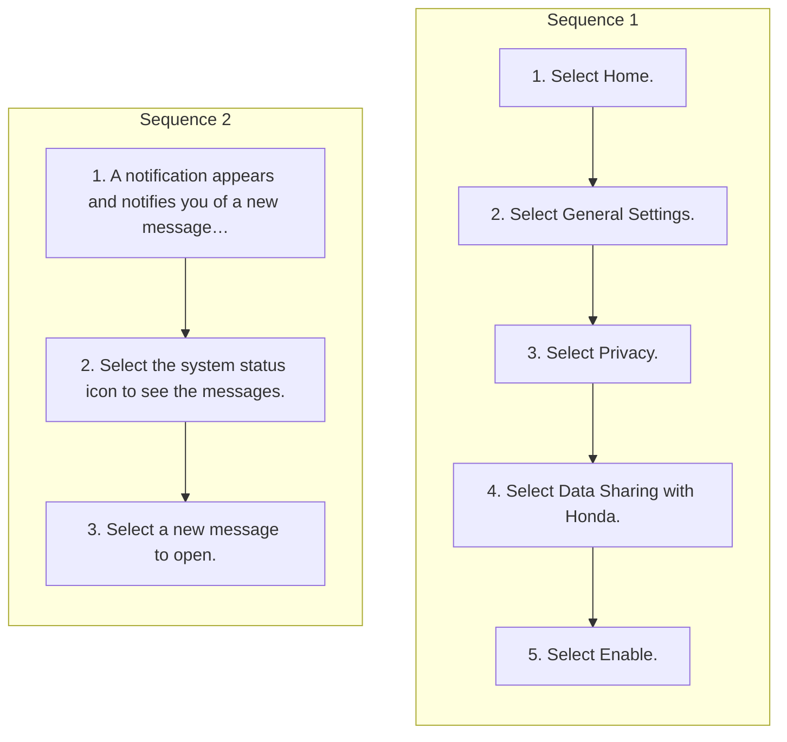

<!-- GENERATED:START function=c91c02774e47 (generated; edits inside this block are overwritten by the next publish — write your own notes outside it) -->
# 15. HondaLink®

<b>Function path:</b> Audio System Basic Operation / HondaLink® <b>Source:</b> printed page 300, 301, 302 <b>Test-ready:</b> yes — no unfilled thresholds and a procedure is present

Every "Presumed requirement" row below is machine-derived from the Owner's Manual text by rule-based extraction — not AI-written — and traceable to the printed page in its Source column.

## Figures (areas of the original PDF; the OM has no figure numbers or captions)

- Figure 15-1 source: p.300
- (Copied from OM) OK.

- Figure 15-2 source: p.302
- (Copied from OM) Notification

- Figure 15-3 source: p.302
- (Copied from OM) Notification

## Procedure (2 sequences; the manual restarts the numbering)

| Seq | Step | Operation (Copied from OM) | Source |
|---|---|---|---|
| 1 | 1 | Select Home. | p.300 / step |
| 1 | 2 | Select General Settings. | p.300 / step |
| 1 | 3 | Select Privacy. | p.300 / step |
| 1 | 4 | Select Data Sharing with Honda. | p.300 / step |
| 1 | 5 | Select Enable. | p.300 / step |
| 2 | 1 | A notification appears and notifies you of a new message on the B-zone. | p.302 / step |
| 2 | 2 | Select the system status icon to see the messages. | p.302 / step |
| 2 | 3 | Select a new message to open. | p.302 / step |

## 15-2-1. Service overview

| # | Presumed requirement | Strength | Source |
|---|---|---|---|
| 1 | HondaLink®HondaLink®. | capability | p.300 / text |
| 2 | HondaLink®HondaLink® connects you to the latest information from Honda. You can connect your phone wirelessly through Wi-Fi or Bluetooth®. 2 Wi-Fi Connection P.306 2 Phone Setup P.373. | capability | p.300 / text |
| 3 | HondaLink®To Connect to HondaLink®. | capability | p.300 / text |
| 4 | HondaLink®Use the following procedure to connect to HondaLink®. | capability | p.300 / text |
| 5 | HondaLink®To enable the HondaLink® service. | capability | p.300 / text |
| 6 | HondaLink®You must consent to location sharing to enable the HondaLink® service. | capability | p.300 / text |
| 7 | HondaLink®To link with HondaLink®. | capability | p.300 / text |
| 8 | HondaLink®You can see the connection guide screen after launching HondaLink® when there is no connection to a network. If you do not need this guide, select the check-box and select OK. | constraint | p.300 / text |
| 9 | HondaLink®1HondaLink® If your vehicle has a telematics control unit (TCU), you can use HondaLink® without connecting the phone. | constraint | p.300 / text |
| 10 | HondaLink®The HondaLink® connect app is compatible with most iPhone and Android phones. | capability | p.300 / text |
| 11 | HondaLink®If the system is connected to the HondaLink® connect app through Bluetooth® and another Bluetooth® audio device is connected, the Bluetooth® connection to the HondaLink® connect app will be severed. | capability | p.300 / text |
| 12 | HondaLink®Some cell phone carriers charge for tethering and smartphone data use. Check your phone’s data subscription package. | capability | p.300 / text |
| 13 | HondaLink®If there is an active connection to Apple CarPlay or Android Auto, HondaLink® can only be connected through Wi-Fi. | capability | p.300 / text |
| 14 | HondaLink®HondaLink® Menu. | capability | p.301 / text |

## 15-2-2. Service requirements

| # | Presumed requirement | Strength | Source |
|---|---|---|---|
| 1 | Step -Vehicle Notifications Displays instruction messages when the vehicle needs service. | constraint | p.301 / bullet |
| 2 | Step -Connect Honda Displays tips for vehicle usage, and get support via roadside assistance or customer service center. | capability | p.301 / bullet |
| 3 | Step -Connect Displays your phone connection status and HondaLink® subscription status. | capability | p.301 / bullet |
| 4 | HondaLink®Vehicle Information and Message from Honda Tips. | capability | p.302 / text |
| 5 | HondaLink®You can check the messages that are received quickly in the shortcut operation. | capability | p.302 / text |
| 6 | HondaLink®Notification. | capability | p.302 / text |
| 7 | Step -A notification is continuously displayed on the B-zone until the new message is read. | capability | p.302 / bullet |
<!-- GENERATED:END function=c91c02774e47 -->

