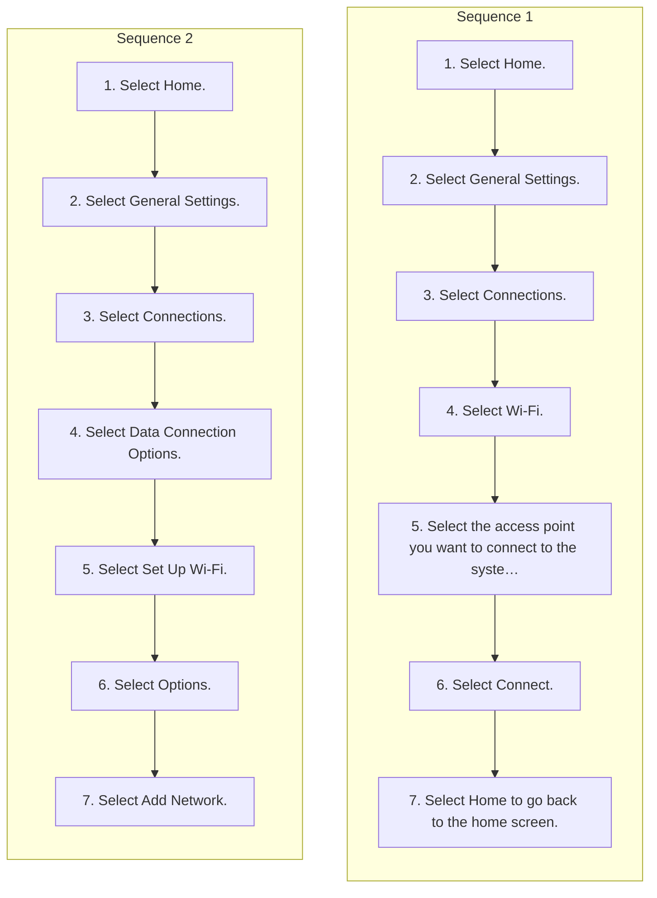

<!-- GENERATED:START function=cb52882e923b (generated; edits inside this block are overwritten by the next publish — write your own notes outside it) -->
# 17. Wi-Fi Connection

<b>Function path:</b> Audio System Basic Operation / Wi-Fi Connection <b>Source:</b> printed page 306, 307 <b>Test-ready:</b> yes — no unfilled thresholds and a procedure is present

Every "Presumed requirement" row below is machine-derived from the Owner's Manual text by rule-based extraction — not AI-written — and traceable to the printed page in its Source column.

## Procedure (2 sequences; the manual restarts the numbering)

| Seq | Step | Operation (Copied from OM) | Source |
|---|---|---|---|
| 1 | 1 | Select Home. | p.306 / step |
| 1 | 2 | Select General Settings. | p.306 / step |
| 1 | 3 | Select Connections. | p.306 / step |
| 1 | 4 | Select Wi-Fi. | p.306 / step |
| 1 | 5 | Select the access point you want to connect to the system. | p.306 / step |
| 1 | 6 | Select Connect. | p.306 / step |
| 1 | 7 | Select Home to go back to the home screen. | p.306 / step |
| 2 | 1 | Select Home. | p.307 / step |
| 2 | 2 | Select General Settings. | p.307 / step |
| 2 | 3 | Select Connections. | p.307 / step |
| 2 | 4 | Select Data Connection Options. | p.307 / step |
| 2 | 5 | Select Set Up Wi-Fi. | p.307 / step |
| 2 | 6 | Select Options. | p.307 / step |
| 2 | 7 | Select Add Network. | p.307 / step |

## 17-2-1. Service overview

| # | Presumed requirement | Strength | Source |
|---|---|---|---|
| 1 | Wi-Fi ConnectionWi-Fi Connection. | capability | p.306 / text |
| 2 | Wi-Fi ConnectionThis vehicle is equipped with Wi-Fi connectivity. You can connect to an external Wi- 1Wi-Fi Connection Fi hotspot or communication device. In addition, the vehicle can be used by other communication devices as a Wi-Fi hotspot via the telematics unit (TCU). | capability | p.306 / text |

## 17-2-2. Service requirements

| # | Presumed requirement | Strength | Source |
|---|---|---|---|
| 1 | Step -Connect the vehicle to a Wi-Fi hotspot. | capability | p.306 / bullet |
| 2 | Step -Use Wi-Fi inside the vehicle. | capability | p.306 / bullet |
| 3 | Wi-Fi ConnectionConnect the vehicle to a Wi-Fi hotspot. | capability | p.306 / text |
| 4 | Step -To change the Wi-Fi settings, select Options. | capability | p.306 / bullet |
| 5 | Step -When the connection is successful, the status text Connected next to the network name is displayed on the list. | capability | p.306 / bullet |
| 6 | Wi-Fi ConnectionWi-Fi and Wi-Fi Direct are registered trademarks of Wi-Fi Alliance®. | capability | p.306 / text |
| 7 | Wi-Fi ConnectionSome cell phone carriers charge for tethering and smartphone data use. Check your phone’s data subscription package. | capability | p.306 / text |
| 8 | Wi-Fi ConnectionCheck your phone manual to find out if the phone has Wi-Fi connectivity. | constraint | p.306 / text |
| 9 | Wi-Fi ConnectionYou can confirm whether Wi-Fi connection is on or off with the icon on the Wi-Fi network list. Transmission speed and others will not be displayed on this screen. | capability | p.306 / text |
| 10 | Wi-Fi ConnectionIn case of Wi-Fi connection with your phone, make sure your phone’s Wi-Fi setting is in access point (tethering) mode. | capability | p.306 / text |
| 11 | Wi-Fi ConnectionUse Wi-Fi inside the vehicle. | capability | p.307 / text |
| 12 | Wi-Fi ConnectionYou can set the network as a Wi-Fi hotspot of this audio system. Use the following steps to set up. | capability | p.307 / text |
| 13 | Wi-Fi ConnectionThe following options are available for the setup. | capability | p.307 / text |
| 14 | Step -Network SSID: Set this network name. | capability | p.307 / bullet |
| 15 | Step -Security: Set a password to be required when connecting a Wi-Fi device to this network. | constraint | p.307 / bullet |

## 17-4. User settings

| # | Presumed requirement | Strength | Source |
|---|---|---|---|
| 1 | Wi-Fi ConnectionWhen you select Access Point, you can set up a wireless connection from the phone to the vehicle. 2 Customized Features P.346. | capability | p.306 / text |

## 17-5. Exception operation

| # | Presumed requirement | Strength | Source |
|---|---|---|---|
| 1 | Wi-Fi Connection1Connect the vehicle to a Wi-Fi hotspot You cannot go through the setting procedure while the vehicle is moving. Park in a safe place to set the audio system in Wi-Fi mode. | constraint | p.306 / text |
<!-- GENERATED:END function=cb52882e923b -->

