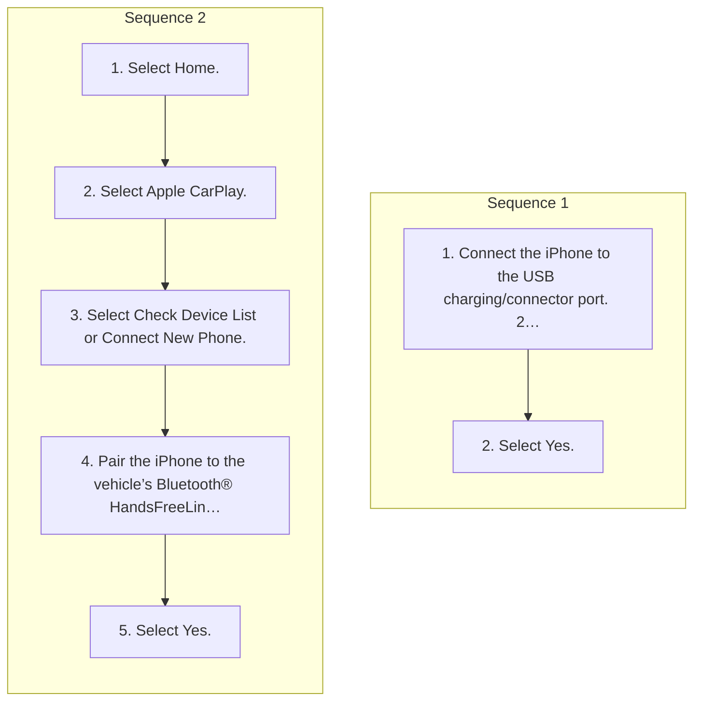

<!-- GENERATED:START function=8aa01a78a644 (generated; edits inside this block are overwritten by the next publish — write your own notes outside it) -->
# 19. Apple CarPlay

<b>Function path:</b> Audio System Basic Operation / Apple CarPlay <b>Source:</b> printed page 309, 310, 311, 312 <b>Test-ready:</b> yes — no unfilled thresholds and a procedure is present

Every "Presumed requirement" row below is machine-derived from the Owner's Manual text by rule-based extraction — not AI-written — and traceable to the printed page in its Source column.

## Procedure (2 sequences; the manual restarts the numbering)

| Seq | Step | Operation (Copied from OM) | Source |
|---|---|---|---|
| 1 | 1 | Connect the iPhone to the USB charging/connector port. 2 USB Ports P.265 | p.311 / step |
| 1 | 2 | Select Yes. | p.311 / step |
| 2 | 1 | Select Home. | p.311 / step |
| 2 | 2 | Select Apple CarPlay. | p.311 / step |
| 2 | 3 | Select Check Device List or Connect New Phone. | p.311 / step |
| 2 | 4 | Pair the iPhone to the vehicle’s Bluetooth® HandsFreeLink® (HFL) system. 2 Phone Setup P.373 | p.311 / step |
| 2 | 5 | Select Yes. | p.311 / step |

## 19-2-1. Service overview

| # | Presumed requirement | Strength | Source |
|---|---|---|---|
| 1 | Apple CarPlayApple CarPlay. | capability | p.309 / text |
| 2 | Apple CarPlayIf you connect an Apple CarPlay-compatible iPhone to the system via the USB port or wirelessly, and the Apple CarPlay icon is selected, you can use Apple CarPlay on the audio/information screen. 2 USB Ports P.265. | capability | p.309 / text |
| 3 | Apple CarPlay1Apple CarPlay We recommend that you update iOS to the latest version when using Apple CarPlay. | constraint | p.309 / text |
| 4 | Apple CarPlayPark in a safe place before connecting your iPhone to Apple CarPlay and when launching any compatible apps. | constraint | p.309 / text |
| 5 | Apple CarPlayWhile connected to Apple CarPlay, it is not possible to use Bluetooth® Audio or HandsFreeLink®. You can only make calls or listen to music through Apple CarPlay. Other previously paired phones can use the Bluetooth® Audio. | capability | p.309 / text |
| 6 | Apple CarPlayWhen using Hands Free, you can only control it with Siri. 2 Operating Apple CarPlay with Siri P.312. | capability | p.309 / text |
| 7 | Apple CarPlayApple CarPlay and Android Auto cannot run at the same time. | constraint | p.309 / text |
| 8 | Apple CarPlayFor details on countries and regions where Apple CarPlay is available, as well as information pertaining to function, refer to the Apple website. | capability | p.309 / text |
| 9 | Apple CarPlayUse of Apple CarPlay will result in the transmission of certain user and vehicle information (such as vehicle location, speed, and status) to your iPhone to enhance the Apple CarPlay experience. You will need to consent to the sharing of this information on the audio/information screen. | capability | p.309 / text |
| 10 | Apple CarPlayApple CarPlay Menu. | capability | p.310 / text |
| 11 | Apple CarPlayFor details on available applications, please refer to the Apple CarPlay website. Apps displayed on your screen can be changed with your iPhone. Select the Honda icon on the Apple CarPlay menu screen to go back to the home screen. | capability | p.310 / text |
| 12 | Apple CarPlay1Apple CarPlay Apple CarPlay Operating Requirements &amp; Limitations Apple CarPlay requires a compatible iPhone with an active cellular connection and data plan. Your carrier’s rate plans will apply. | capability | p.310 / text |
| 13 | Apple CarPlayChanges in operating systems, hardware, software, and other technology integral to providing Apple CarPlay functionality, as well as new or revised governmental regulations, may result in a decrease or cessation of Apple CarPlay functionality and services. Honda cannot and does not provide any warranty or guarantee of future Apple CarPlay performance or functionality. | constraint | p.310 / text |
| 14 | Apple CarPlayIt is possible to use third-party apps if they are compatible with Apple CarPlay. Refer to the Apple website for information on compatible apps. | constraint | p.310 / text |
| 15 | Apple CarPlayConnect Apple CarPlay Using the USB Cable. | capability | p.311 / text |

## 19-2-2. Service requirements

| # | Presumed requirement | Strength | Source |
|---|---|---|---|
| 1 | Step -The confirmation screen will be displayed. | capability | p.311 / bullet |
| 2 | Step -If you do not allow this consent, select No. | capability | p.311 / bullet |
| 3 | Apple CarPlayYou may change the consent settings under the Connections settings menu. | capability | p.311 / text |
| 4 | Apple CarPlayConnect Apple CarPlay Wirelessly. | capability | p.311 / text |
| 5 | Apple CarPlay1Apple CarPlay Only initialize Apple CarPlay when you are safely parked. When Apple CarPlay first detects your iPhone, you will need to set up your iPhone. Refer to the instruction manual that came with your iPhone. | constraint | p.311 / text |
| 6 | Apple CarPlayYou can also use the method below to set up Apple CarPlay: Select Home General Settings Connections Manage Device Connections Select Device. | capability | p.311 / text |
| 7 | Apple CarPlayUse of user and vehicle information The use and handling of user and vehicle information transmitted to/from your iPhone by Apple CarPlay is governed by the Apple iOS terms and conditions and Apple’s Privacy Policy. | capability | p.311 / text |
| 8 | Apple CarPlayOperating Apple CarPlay with Siri. | capability | p.312 / text |
| 9 | Apple CarPlayPress and hold the (Talk) button to activate Siri. Press again to deactivate Siri. Press and release to activate standard voice recognition system. | capability | p.312 / text |
| 10 | Apple CarPlay1Operating Apple CarPlay with Siri Below are examples of questions and commands for Siri:. | capability | p.312 / text |
| 11 | Step -What movies are playing today? | capability | p.312 / bullet |
| 12 | Step -Call dad at work. | capability | p.312 / bullet |
| 13 | Step -What song is this? | capability | p.312 / bullet |
| 14 | Step -How’s the weather tomorrow? | capability | p.312 / bullet |
| 15 | Step -Read my latest email. | capability | p.312 / bullet |
| 16 | Apple CarPlayFor more information, please visit www.apple.com/ios/siri. | capability | p.312 / text |

## 19-5. Exception operation

| # | Presumed requirement | Strength | Source |
|---|---|---|---|
| 1 | Apple CarPlayIf there is a problem with the connection of your iPhone, an error code will be displayed. 2 Customized Features P.346. | capability | p.311 / text |
| 2 | Apple CarPlayWireless Apple CarPlay and AT&amp;T Hotspot cannot be used at the same time. When using Apple CarPlay and AT&amp;T Hotspot at the same time, connect to Apple CarPlay with a USB cable. | constraint | p.311 / text |
<!-- GENERATED:END function=8aa01a78a644 -->

