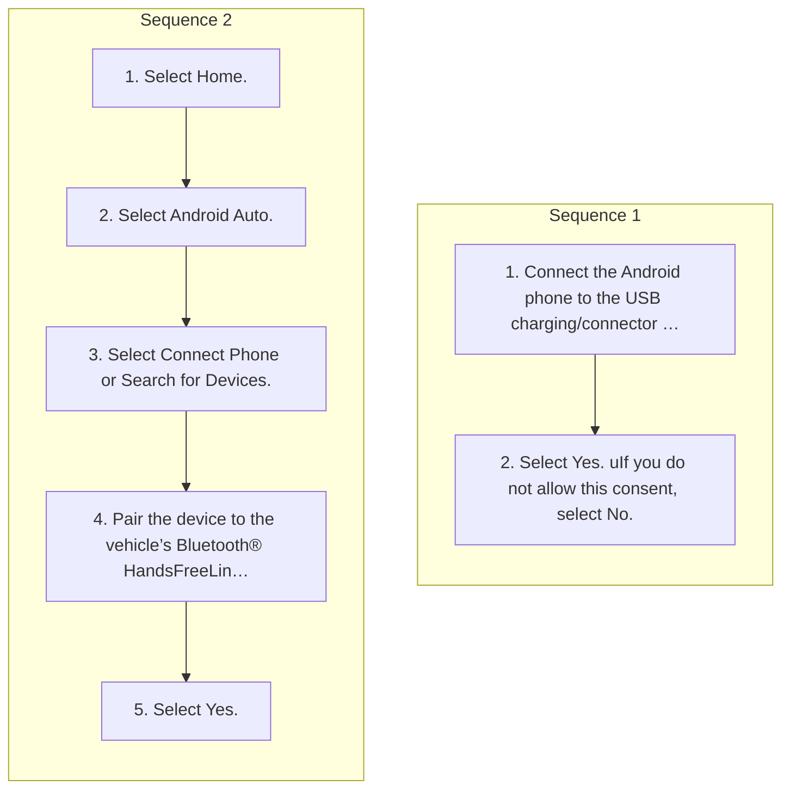

<!-- GENERATED:START function=0d32977a5361 (generated; edits inside this block are overwritten by the next publish — write your own notes outside it) -->
# 20. Android AutoTM

<b>Function path:</b> Audio System Basic Operation / Android AutoTM <b>Source:</b> printed page 313, 314, 315, 316 <b>Test-ready:</b> yes — no unfilled thresholds and a procedure is present

Every "Presumed requirement" row below is machine-derived from the Owner's Manual text by rule-based extraction — not AI-written — and traceable to the printed page in its Source column.

## Procedure (2 sequences; the manual restarts the numbering)

| Seq | Step | Operation (Copied from OM) | Source |
|---|---|---|---|
| 1 | 1 | Connect the Android phone to the USB charging/connector port. 2 USB Ports P.265 uThe confirmation screen will be displayed. | p.315 / step |
| 1 | 2 | Select Yes. uIf you do not allow this consent, select No. | p.315 / step |
| 2 | 1 | Select Home. | p.315 / step |
| 2 | 2 | Select Android Auto. | p.315 / step |
| 2 | 3 | Select Connect Phone or Search for Devices. | p.315 / step |
| 2 | 4 | Pair the device to the vehicle’s Bluetooth® HandsFreeLink® (HFL) system. 2 Phone Setup P.373 | p.315 / step |
| 2 | 5 | Select Yes. | p.315 / step |

## 20-2-1. Service overview

| # | Presumed requirement | Strength | Source |
|---|---|---|---|
| 1 | Android AutoTMAndroid AutoTM. | capability | p.313 / text |
| 2 | Android AutoTMWhen you connect an AndroidTM phone to the audio system via the USB port or wirelessly, and the Android Auto icon is selected, you can use Android Auto on the audio/information screen. We recommend that you complete this tutorial while safely parked before using Android Auto. 2 USB Ports P.265. | capability | p.313 / text |
| 3 | Android AutoTM1Android AutoTM Bluetooth® A2DP cannot be used while your phone is connected to Android Auto. | constraint | p.313 / text |
| 4 | Android AutoTMPark in a safe place before connecting your Android phone to Android Auto and when launching any compatible apps. | constraint | p.313 / text |
| 5 | Android AutoTMApple CarPlay and Android Auto cannot run at the same time. | constraint | p.313 / text |
| 6 | Android AutoTMGoogle, Android, Android Auto, Google Maps and other marks are trademarks of Google LLC. Compatible Android phone and compatible active data plan required. | capability | p.313 / text |
| 7 | Android AutoTMTo use each of Android Auto’s features, say a wakeup word while the Android Auto screen is displayed, or press and hold the (Talk) button to activate Google Assistant. 2 Operating Android Auto with Google Assistant P.316. | capability | p.313 / text |
| 8 | Android AutoTMAndroid Auto Menu. | capability | p.314 / text |
| 9 | Android AutoTMFor details on available applications, please refer to the Android Auto website. Apps displayed on your screen can be changed with your smartphone. Select the Honda icon on the Android Auto menu screen to go back to the home screen. | capability | p.314 / text |
| 10 | Android AutoTM1Android AutoTM For details on countries and regions where Android Auto is available, as well as information pertaining to function, refer to the Android Auto website. | capability | p.314 / text |
| 11 | Android AutoTMScreens may differ depending on the version of the Android Auto app you are using. | capability | p.314 / text |
| 12 | Android AutoTMAndroid Auto Operating Requirements &amp; Limitations Android Auto requires a compatible Android phone with an active cellular connection and data plan. Your carrier’s rate plans will apply. | capability | p.314 / text |
| 13 | Android AutoTMChanges in operating systems, hardware, software, and other technology integral to providing Android Auto functionality, as well as new or revised governmental regulations, may result in a decrease or cessation of Android Auto functionality and services. Honda cannot and does not provide any warranty or guarantee of future Android Auto performance or functionality. | constraint | p.314 / text |
| 14 | Android AutoTMIt is possible to use third-party apps if they are compatible with Android Auto. Refer to the Android Auto website for information on compatible apps. | constraint | p.314 / text |
| 15 | Android AutoTMConnect Android Auto Using the USB Cable. | capability | p.315 / text |
| 16 | Android AutoTMYou may change the consent settings under the Connections settings menu. | capability | p.315 / text |
| 17 | Android AutoTMConnect Android Auto Wirelessly. | capability | p.315 / text |
| 18 | Android AutoTM1Android AutoTM Only initialize Android Auto when you are safely parked. When Android Auto first detects your phone, you will need to set up your phone so that auto pairing is possible. Please refer to your phone’s instructions. | constraint | p.315 / text |
| 19 | Android AutoTMYou can use the method below to change Android Auto settings after you have completed the initial setup: Select Home General Settings Connections Manage Device Connections Select Device. | capability | p.315 / text |
| 20 | Android AutoTMUse of user and vehicle information The use and handling of user and vehicle information transmitted to/from your phone by Android Auto is governed by Google’s Privacy Policy. | capability | p.315 / text |
| 21 | Android AutoTMIf there is a problem with the connection of your smartphone, an error code will be displayed. 2 Customized Features P.346. | capability | p.315 / text |
| 22 | Android AutoTMWireless Android Auto and AT&amp;T Hotspot cannot be used at the same time. When using Android Auto and AT&amp;T Hotspot at the same time, connect to Android Auto with a USB cable. | constraint | p.315 / text |
| 23 | Android AutoTMOperating Android Auto with Google Assistant. | capability | p.316 / text |
| 24 | Android AutoTMPress and hold the (Talk) button to operate Android Auto with your voice. Press and release to activate the standard voice recognition system. | capability | p.316 / text |
| 25 | Android AutoTM1Operating Android Auto with Google Assistant Below are examples of commands you can give with voice recognition:. | capability | p.316 / text |

## 20-2-2. Service requirements

| # | Presumed requirement | Strength | Source |
|---|---|---|---|
| 1 | Step -Reply to text. | capability | p.316 / bullet |
| 2 | Step -Call my wife. | capability | p.316 / bullet |
| 3 | Step -Navigate to Honda. | capability | p.316 / bullet |
| 4 | Step -Play my music. | capability | p.316 / bullet |
| 5 | Step -Send a text message to my wife. | capability | p.316 / bullet |
| 6 | Step -Call flower shop. | capability | p.316 / bullet |
| 7 | Android AutoTMFor more information, please refer to the Android Auto website. | capability | p.316 / text |
<!-- GENERATED:END function=0d32977a5361 -->

