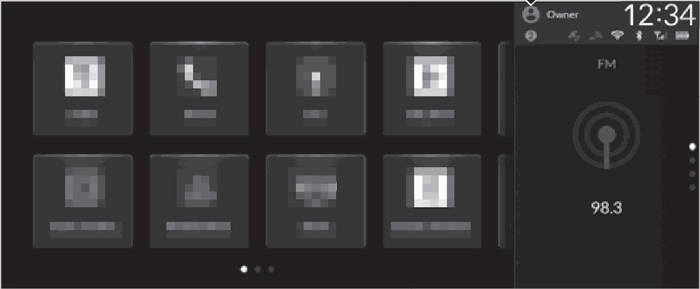
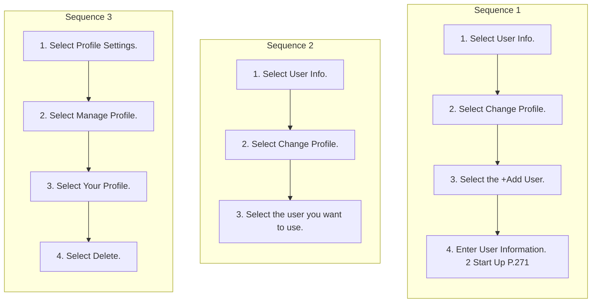

<!-- GENERATED:START function=21db6d0177b4 (generated; edits inside this block are overwritten by the next publish — write your own notes outside it) -->
# 22. User Information

<b>Function path:</b> Audio System Basic Operation / User Information <b>Source:</b> printed page 319, 320, 321, 322 <b>Test-ready:</b> yes — no unfilled thresholds and a procedure is present

Every "Presumed requirement" row below is machine-derived from the Owner's Manual text by rule-based extraction — not AI-written — and traceable to the printed page in its Source column.

## Figures (areas of the original PDF; the OM has no figure numbers or captions)

- Figure 22-1 source: p.319
- (Copied from OM) a User Information

- Figure 22-2 source: p.320
- (Copied from OM) website.

## Procedure (3 sequences; the manual restarts the numbering)

| Seq | Step | Operation (Copied from OM) | Source |
|---|---|---|---|
| 1 | 1 | Select User Info. | p.321 / step |
| 1 | 2 | Select Change Profile. | p.321 / step |
| 1 | 3 | Select the +Add User. | p.321 / step |
| 1 | 4 | Enter User Information. 2 Start Up P.271 | p.321 / step |
| 2 | 1 | Select User Info. | p.322 / step |
| 2 | 2 | Select Change Profile. | p.322 / step |
| 2 | 3 | Select the user you want to use. | p.322 / step |
| 3 | 1 | Select Profile Settings. | p.322 / step |
| 3 | 2 | Select Manage Profile. | p.322 / step |
| 3 | 3 | Select Your Profile. | p.322 / step |
| 3 | 4 | Select Delete. | p.322 / step |

## 22-2-1. Service overview

| # | Presumed requirement | Strength | Source |
|---|---|---|---|
| 1 | User InformationUser Information. | capability | p.319 / text |
| 2 | User Informationa User Information. | capability | p.319 / text |
| 3 | User Information1User Information This feature cannot be used while driving. | constraint | p.319 / text |
| 4 | User InformationYou can customize settings individually for each user. 2 Profile Settings P.323. | capability | p.319 / text |
| 5 | User InformationYou can customize security settings for each user. If you have forgotten security settings, you will need to delete the user and create a new one. If you have forgotten security settings for the Owner user, please contact a dealer or Honda Customer Service. 2 Customer Service Information P.682. | constraint | p.319 / text |
| 6 | User InformationCertain features are unavailable when using a newly created user or the Guest user. | constraint | p.319 / text |
| 7 | User InformationYou can add and change users, as well as customize user settings. By registering a user, you can personalize your vehicle settings. You can select a user when the audio/information screen loads, even when the doors are open or unlocked. | constraint | p.320 / text |
| 8 | User InformationBy linking your profile with your Google Account, you can enjoy a more personalized Google built-in experience. For more assistance on account linking, visit the Google website. | capability | p.320 / text |
| 9 | User InformationRegistering a User. | capability | p.321 / text |

## 22-2-2. Service requirements

| # | Presumed requirement | Strength | Source |
|---|---|---|---|
| 1 | Step -You can also add users when Profile Settings Change Profile is selected. 2 Profile Settings P.323. | constraint | p.321 / bullet |
| 2 | Step -You can add users even when the doors are open and unlocked. | constraint | p.321 / bullet |
| 3 | User Information1Registering a User Profile can be changed only when the vehicle is parked. | constraint | p.321 / text |
| 4 | User InformationYou can add up to 4 users other than the Owner user and the Guest user. | capability | p.321 / text |
| 5 | User InformationWhen you add a user, the audio/information screen is loaded under that user. | capability | p.321 / text |
| 6 | User InformationSwitching Users. | capability | p.322 / text |
| 7 | Step -You can also change users when Profile Settings Change Profile is selected. 2 Profile Settings P.323. | constraint | p.322 / bullet |
| 8 | Step -You can switch users even when the doors are open and unlocked. | constraint | p.322 / bullet |
| 9 | User InformationDeleting Users. | capability | p.322 / text |
| 10 | User Information1Switching Users Profile can be changed only when the vehicle is parked. | constraint | p.322 / text |
| 11 | User Information1Deleting Users When the profile currently being used is deleted, the audio/information screen is loaded under the Guest user. | constraint | p.322 / text |
| 12 | User InformationDepending on the version of your OS, the steps for deleting a user may differ from the instructions on this page. Follow the on-screen prompts. | capability | p.322 / text |

## 22-4. User settings

| # | Presumed requirement | Strength | Source |
|---|---|---|---|
| 1 | User InformationUsers with customized security settings can restrict screen operations by selecting the Screen Lock shortcut. | capability | p.322 / text |
| 2 | User InformationWhile using the Owner user, you can delete other users via General Settings Advanced Settings. 2 Customized Features P.346. | capability | p.322 / text |

## 22-5. Exception operation

| # | Presumed requirement | Strength | Source |
|---|---|---|---|
| 1 | User InformationThe transmitter settings may not be switched when you change the Owner user. If this happens, change to a different user and then try switching to the desired user again. | constraint | p.322 / text |
<!-- GENERATED:END function=21db6d0177b4 -->

