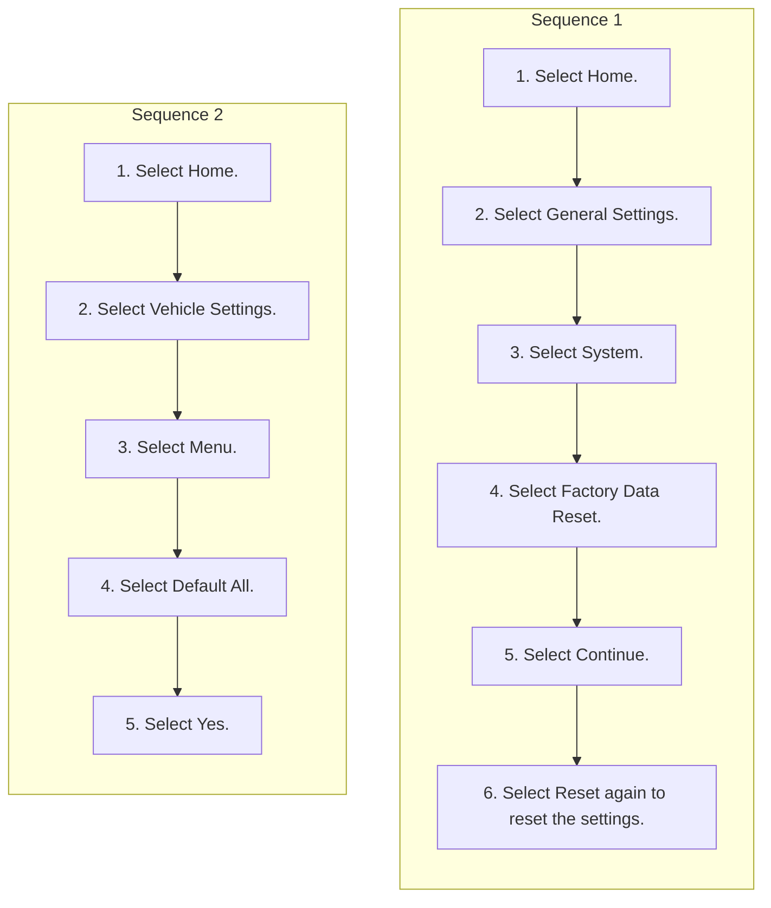

<!-- GENERATED:START function=32f7d7d9f4d3 (generated; edits inside this block are overwritten by the next publish — write your own notes outside it) -->
# 25. Defaulting All the Settings

<b>Function path:</b> Customized Features / Defaulting All the Settings <b>Source:</b> printed page 368 <b>Test-ready:</b> yes — no unfilled thresholds and a procedure is present

Every "Presumed requirement" row below is machine-derived from the Owner's Manual text by rule-based extraction — not AI-written — and traceable to the printed page in its Source column.

## Procedure (2 sequences; the manual restarts the numbering)

| Seq | Step | Operation (Copied from OM) | Source |
|---|---|---|---|
| 1 | 1 | Select Home. | p.368 / step |
| 1 | 2 | Select General Settings. | p.368 / step |
| 1 | 3 | Select System. | p.368 / step |
| 1 | 4 | Select Factory Data Reset. | p.368 / step |
| 1 | 5 | Select Continue. | p.368 / step |
| 1 | 6 | Select Reset again to reset the settings. | p.368 / step |
| 2 | 1 | Select Home. | p.368 / step |
| 2 | 2 | Select Vehicle Settings. | p.368 / step |
| 2 | 3 | Select Menu. | p.368 / step |
| 2 | 4 | Select Default All. | p.368 / step |
| 2 | 5 | Select Yes. | p.368 / step |

## 25-2-1. Service overview

| # | Presumed requirement | Strength | Source |
|---|---|---|---|
| 1 | Defaulting All the SettingsDefaulting All the Settings. | capability | p.368 / text |
| 2 | Defaulting All the SettingsReset all the menu and customized settings as the factory defaults. | capability | p.368 / text |
| 3 | Defaulting All the SettingsDefaulting System Settings. | capability | p.368 / text |
| 4 | Defaulting All the SettingsOnly the Owner user can execute this command. If current profile is not the Owner user, please switch users. 2 Switching Users P.322. | constraint | p.368 / text |

## 25-2-2. Service requirements

| # | Presumed requirement | Strength | Source |
|---|---|---|---|
| 1 | Step -A confirmation message appears on the screen. | capability | p.368 / bullet |
| 2 | Step -The system will reboot. | capability | p.368 / bullet |
| 3 | Defaulting All the SettingsDefaulting Vehicle Settings. | capability | p.368 / text |
| 4 | Defaulting All the Settings1Defaulting All the Settings When you transfer the vehicle to a third-party, reset all settings to default and delete all personal data. | constraint | p.368 / text |
| 5 | Defaulting All the SettingsIf you perform Factory Data Reset, it will reset the preinstalled apps to their factory default. | capability | p.368 / text |

## 25-5. Exception operation

| # | Presumed requirement | Strength | Source |
|---|---|---|---|
| 1 | Defaulting All the SettingsIf you perform Factory Data Reset, you cannot use the HondaLink® because it goes offline. 2 HondaLink® P.300. | constraint | p.368 / text |
<!-- GENERATED:END function=32f7d7d9f4d3 -->

