<!-- GENERATED:START function=7570545883b7 (generated; edits inside this block are overwritten by the next publish — write your own notes outside it) -->
# 26. System

<b>Function path:</b> Features / System <b>Source:</b> printed page 326, 327, 328, 329, 330, 331, 332, 333, 334, 335, 336, 337, 338, 339, 340, 341, 342, 343, 344, 345 <b>Test-ready:</b> no — procedure missing or thresholds unfilled

Every "Presumed requirement" row below is machine-derived from the Owner's Manual text by rule-based extraction — not AI-written — and traceable to the printed page in its Source column.

## Procedure

```mermaid
flowchart TD
    S1["1. SOFTWARE. This AGREEMENT grants you a non-exclusive, lim…"]
    S2["2. HONDA Services. The SOFTWARE may provide you with access…"]
    S3["3. Open-Source Software. The SOFTWARE and SERVICES may inco…"]
    S4["4. Provider Services. The SOFTWARE may provide you with acc…"]
    S5["5. License Limitations and Restrictions on Use. (a) Limited…"]
    S6["6. Intellectual Property Rights. All title and intellectual…"]
    S7["7. Export Restrictions: You acknowledge that the SOFTWARE a…"]
    S8["1. HONDA reserves the right to suspend or terminate your ac…"]
    S9["2. Eligibility/Registration/Activation. The SOFTWARE is int…"]
    S10["3. Use of PROVIDER SERVICES through the SOFTWARE. Certain P…"]
    S11["4. Links to Third Party Sites: The SOFTWARE may provide you…"]
    S12["5. Unauthorized Use and Abuse. You are responsible for ensu…"]
    S13["6. SOFTWARE Updates. The SOFTWARE and SERVICES may be updat…"]
    S14["7. Uninstalling, Removing, and Replacing the SOFTWARE. Repl…"]
    S15["1. Vehicle Geolocation Information. You acknowledge that yo…"]
    S16["2. Potential Map Inaccuracy and Route Safety. Maps used by …"]
    S17["3. Speech Recognition: You acknowledge and understand that …"]
    S18["4. Distraction Hazards. Navigation features may require man…"]
    S19["1. Information Collection, Use, Transmission and Storage of…"]
    S20["2. Information Storage. Depending on the type of multimedia…"]
    S21["1. Limitations on YOUR liability. HONDA cannot recover from…"]
    S22["2. Limitation on HONDA and PROVIDER liability. Neither HOND…"]
    S23["1. Termination. This AGREEMENT is effective until terminate…"]
    S24["2. Transfer: You may permanently transfer your rights under…"]
    S1 --> S2
    S2 --> S3
    S3 --> S4
    S4 --> S5
    S5 --> S6
    S6 --> S7
    S7 --> S8
    S8 --> S9
    S9 --> S10
    S10 --> S11
    S11 --> S12
    S12 --> S13
    S13 --> S14
    S14 --> S15
    S15 --> S16
    S16 --> S17
    S17 --> S18
    S18 --> S19
    S19 --> S20
    S20 --> S21
    S21 --> S22
    S22 --> S23
    S23 --> S24
```

| Seq | Step | Operation (Copied from OM) | Source |
|---|---|---|---|
| 1 | 1 | SOFTWARE. This AGREEMENT grants you a non-exclusive, limited, and revocable license to use the SOFTWARE and SERVICES solely (a) as installed on your VEHICLE by HONDA, (b) as updated on your Vehicle by HONDA, you (but only as and when directed by HONDA), or a DEALER and (c) as permitted under the terms of this AGREEMENT. | p.328 / step |
| 2 | 2 | HONDA Services. The SOFTWARE may provide you with access to various HONDA SERVICES. Installation, activation, or use of HONDA SERVICES may require your consent to additional terms, conditions, and privacy policies applicable to those HONDA SERVICES (the “HONDA TERMS”). You acknowledge and agree that any collection, use, sharing of data generated by your VEHICLE or your use of your VEHICLE, and your use of the HONDA SERVICES shall be subject to this AGREEMENT and any additional HONDA TERMS that may be specifically applicable to such HONDA SERVICES or data generation. The HONDA SERVICES may collect, use, and share such data while you are using the SOFTWARE. | p.328 / step |
| 3 | 3 | Open-Source Software. The SOFTWARE and SERVICES may incorporate software licensed to HONDA under free or open-source licenses which govern HONDA’s distribution and your use of such software. HONDA and the third-party authors, licensors, and distributors of such software disclaim all warranties and all liability arising from any and all use or distribution of the software. To the extent such software is provided under terms that differ from the applicable free or open-source licenses, those terms are offered by HONDA alone. Additional information regarding free and open-source software incorporated in the SOFTWARE and SERVICES is available in this manual or within the SOFTWARE. | p.329 / step |
| 4 | 4 | Provider Services. The SOFTWARE may provide you with access to various PROVIDER SERVICES. Installation or use of such PROVIDER SERVICES may require your consent to additional terms, conditions, and privacy policies of the applicable PROVIDER (the “PROVIDER TERMS”). This AGREEMENT restricts the manner in which you can install and use PROVIDER SERVICES but does not grant you a license or permission to use such PROVIDER SERVICES. Your permission to use PROVIDER SERVICES is limited and subject to any license grants, conditions, and limitations included in the PROVIDER TERMS. You acknowledge that any collection, use, sharing of your information, targeted advertising practices by PROVIDERS, and your use of the PROVIDER SERVICES shall be subject to both this AGREEMENT and any applicable PROVIDER TERMS. The PROVIDER SERVICES may collect, use, and share such information while you are using the SOFTWARE. | p.329 / step |
| 5 | 5 | License Limitations and Restrictions on Use. (a) Limited License. You understand and agree that the SOFTWARE and SERVICES are licensed, not sold, to you solely for use in accordance with this AGREEMENT and any applicable PROVIDER TERMS, and any documentation for the VEHICLE made available to you by HONDA (any “DOCUMENTATION”). HONDA and its licensors reserve all rights in the SOFTWARE and HONDA SERVICES not expressly granted to you under this AGREEMENT. PROVIDERS and their licensors reserve all rights in the PROVIDER SERVICES not expressly granted to you under the applicable PROVIDER TERMS. | p.329 / step |
| 6 | 6 | Intellectual Property Rights. All title and intellectual property rights in and to the SOFTWARE and SERVICES, the accompanying DOCUMENTATION, and all copies of the SOFTWARE or SERVICES are owned by HONDA, PROVIDERS, or their suppliers or licensors. This AGREEMENT does not grant you any rights in connection with any trademarks or service marks of HONDA, PROVIDERS, or their licensors, affiliates, or suppliers. | p.330 / step |
| 7 | 7 | Export Restrictions: You acknowledge that the SOFTWARE and SERVICES are subject to U.S., European Union, and other export jurisdictions. You agree to comply with all applicable international and national laws that apply to the SOFTWARE and SERVICES, including the U.S. Export Administration Regulations, as well as end-user, end-use, and destination restrictions issued by the U.S. and other governments. | p.331 / step |
| 8 | 1 | HONDA reserves the right to suspend or terminate your access to and use of the SOFTWARE or SERVICES if you are found to be in violation of this AGREEMENT or as reasonably deemed necessary by HONDA. | p.331 / step |
| 9 | 2 | Eligibility/Registration/Activation. The SOFTWARE is intended for and available to individuals who (a) are of legal age of majority in their jurisdiction of residence (and at least 18 years of age), or are younger than 18 years of age and possess a valid driver’s license issued by their jurisdiction of residence, and (b) own or have permissive access to a compatible VEHICLE. We do not knowingly collect any information, including personal information, from children under 13. If we learn or are notified that we have collected personal information of a child under 13, we will immediately take steps to delete such information. | p.331 / step |
| 10 | 3 | Use of PROVIDER SERVICES through the SOFTWARE. Certain PROVIDER SERVICES made available through the SOFTWARE may require that you register or otherwise have an account with the PROVIDER and agree to PROVIDER TERMS. Any use of any of such PROVIDER SERVICES within the SOFTWARE is subject to this AGREEMENT and the applicable PROVIDER TERMS. HONDA does not exercise control over such PROVIDER SERVICES and is not responsible or liable for the availability, security, or content of such PROVIDER SERVICES, and the inclusion of any PROVIDER SERVICES does not imply a referral from, the approval of, or the endorsement by HONDA of such PROVIDER SERVICES. HONDA is not responsible or liable, directly or indirectly, for any damage relating to or resulting from your use of the PROVIDER SERVICES. | p.331 / step |
| 11 | 4 | Links to Third Party Sites: The SOFTWARE may provide you with the ability to access third-party sites and content through the use of the SOFTWARE or SERVICES. The third-party sites and content are not under the control of HONDA. HONDA is not responsible or liable, directly or indirectly, for such third-party websites and their content or for any damage relating to or resulting from your access or use of such websites and content. | p.331 / step |
| 12 | 5 | Unauthorized Use and Abuse. You are responsible for ensuring your (and any authorized third parties’) use of the SOFTWARE and SERVICES remains in compliance with this AGREEMENT and all other applicable HONDA TERMS and PROVIDER TERMS. You acknowledge and agree that any use of the SOFTWARE or SERVICES occurring through your VEHICLE will be deemed your actions and that HONDA and PROVIDERS may rely upon such actions. You agree to immediately notify us if you suspect fraudulent or abusive activity involving the SOFTWARE or SERVICES. If you so notify us or if we otherwise suspect fraudulent or abusive activity, you agree to cooperate with us in any fraud investigation and to use any fraud prevention measures we prescribe. Your failure to immediately notify us or cooperate to use such measures will result in your liability for all fraudulent usage or abusive activity associated with your VEHICLE. | p.332 / step |
| 13 | 6 | SOFTWARE Updates. The SOFTWARE and SERVICES may be updated when your VEHICLE is serviced by a DEALER or remotely, over-the- air, by HONDA from time to time; such updates may occur with or without further notice or your future consent. The SOFTWARE may be updated at HONDA’s discretion and for any purpose including, without limitation, to patch or otherwise improve the SOFTWARE or SERVICES functionality, security, or stability. All updates to the SOFTWARE and SERVICES are subject to this AGREEMENT and any other applicable HONDA TERMS and PROVIDER TERMS. | p.332 / step |
| 14 | 7 | Uninstalling, Removing, and Replacing the SOFTWARE. Replacing SOFTWARE or HONDA SERVICES with software or firmware not provided and installed by HONDA or a DEALER will render all representations and warranties for the SOFTWARE, HONDA SERVICES, and VEHICLE functionality reliant upon the SOFTWARE or HONDA SERVICES null and void. | p.332 / step |
| 15 | 1 | Vehicle Geolocation Information. You acknowledge that your VEHICLE may be equipped with certain traffic and map features. The traffic feature will automatically collect and transmit, through GPS technology, your Vehicle’s current location (longitude and latitude), travel direction and speed (“VEHICLE GEOLOCATION INFORMATION”) to HONDA and PROVIDERS. The VEHICLE GEOLOCATION INFORMATION is used by HONDA and PROVIDERS to provide traffic and navigation-related information to you, but may also be used to provide other SERVICES or offers to you. HONDA will not use such VEHICLE GEOLOCATION INFORMATION for its own marketing efforts, or provide such information to unaffiliated third parties for their own purposes, without your express consent. | p.332 / step |
| 16 | 2 | Potential Map Inaccuracy and Route Safety. Maps used by this system may be inaccurate because of changes in roads, traffic controls, routing, or driving conditions. Always use good judgment and common sense when following suggested routes. Do not follow the route suggestions if doing so would result in an unsafe or illegal driving maneuver, if you would be placed in an unsafe situation, or if you would be directed into an area that you consider unsafe. Do not rely on any navigation features included in the system to route you to emergency services. Not all emergency services such as police, fire stations, hospitals, or clinics are likely to be contained in the map database for such navigation features. Ask local authorities or an emergency services operator for such locations and routes. The driver is ultimately responsible for the safe operation of the vehicle and therefore, must evaluate whether it is safe to follow the suggested directions. Any navigation features are provided only as an aid. Make your driving decisions based on your observations of local conditions and existing traffic regulations. Navigation features are not a substitute for your personal judgment. Any route suggestions made by the SOFTWARE or SERVICES should never replace any local traffic regulations or your personal judgment or knowledge of safe driving practices. | p.333 / step |
| 17 | 3 | Speech Recognition: You acknowledge and understand that HONDA and PROVIDERS may record, retain, and use voices commands when you use the speech recognition components of the SOFTWARE or SERVICES. You and all VEHICLE operators and passengers (a) consent to the recording and retention of voice commands in support of providing speech recognition components and (b) release HONDA and PROVIDERS from all claims, liabilities, and losses that may result from any use of such recorded voice commands. Recognition errors are inherent in speech recognition. It is your responsibility to monitor any speech recognition functions included in the system and address any errors. Neither HONDA nor PROVIDERS will be liable for any damages arising out of errors in the speech recognition process. | p.333 / step |
| 18 | 4 | Distraction Hazards. Navigation features may require manual (non-verbal) input or setup. Attempting to perform such set-up or insert data while driving can seriously distract your attention and could cause a crash or other serious consequences; the ability to undertake such interactions may also be limited by state or local law, which laws you are responsible to know and follow. Even occasional short scans of the screen may be hazardous if your attention has been diverted away from your driving at a critical time. Pull over and stop the vehicle in a safe and legal manner before attempting to access a function of the system requiring prolonged attention. Do not raise the volume excessively. Keep the volume at a level where you can still hear outside traffic and emergency signals while driving. Driving while unable to hear these sounds could result in a crash. | p.333 / step |
| 19 | 1 | Information Collection, Use, Transmission and Storage of Data. Consent to Use of Data: You agree that HONDA and PROVIDERS may collect and use your information gathered in any manner as part of product support services related to the SOFTWARE or related services. HONDA may share such information with third parties, including, without limitation, PROVIDERS, third party software and services suppliers, their affiliates and/or their designated agents, solely to improve their products or to provide services or technologies to you. HONDA, third party software and systems suppliers, their affiliates and/or their designated agent may disclose this information to others, but not in a form that personally identifies you. | p.334 / step |
| 20 | 2 | Information Storage. Depending on the type of multimedia system you have in your VEHICLE, certain information may be stored for ease of use of the SOFTWARE including, without limitation, search history, location history in certain applications, previous and saved destinations, map locations within certain applications, and device numbers and contact information. | p.334 / step |
| 21 | 1 | Limitations on YOUR liability. HONDA cannot recover from you any consequential, indirect, incidental, or special damages, or attorney’s fees in connection with your use of the SOFTWARE or HONDA SERVICES. HONDA WAIVES TO THE FULLEST EXTENT ALLOWED BY LAW ANY CLAIM FOR DAMAGES OTHER THAN DIRECT, COMPENSATORY DAMAGES AS LIMITED IN THIS AGREEMENT. | p.335 / step |
| 22 | 2 | Limitation on HONDA and PROVIDER liability. Neither HONDA nor PROVIDERS will be liable to you or any other party for consequential, indirect, incidental, special, or punitive damages (including without limitation lost profits) in connection with your use of the SOFTWARE or SERVICES, even if HONDA or PROVIDERS are aware of the possibility of such damages. These limitations apply to all claims, including, without limitation, claims in contract and tort (such as negligence, product liability and strict liability). To the extent that a jurisdiction does not permit the exclusion or limitation of liability as set forth herein our liability is limited to the maximum extent permitted by law in such states. If HONDA or PROVIDERS are found liable to you for any reason, you agree that the aggregate liability of all these parties to you for any claim is limited to ten U.S. dollars (US $10.00). Neither HONDA nor any PROVIDER would have agreed to provide the SOFTWARE or SERVICES to you if you did not agree to this limitation. This amount is the sole and exclusive liability of HONDA and PROVIDERS to you, and is payable as liquidated damages and not as a penalty. Except where prohibited by law, you may not bring any claim against HONDA or any third-party beneficiary more than two (2) years after the claim arises. We do not have any liability for SOFTWARE or SERVICES interruptions of any length. | p.336 / step |
| 23 | 1 | Termination. This AGREEMENT is effective until terminated by you or US. WE may terminate this AGREEMENT for any or no reason, and with or without notice to you. Your rights under this AGREEMENT will terminate automatically without notice from US if you fail to comply with any term of this AGREEMENT. Upon termination of this AGREEMENT, you shall cease all use of the SOFTWARE and SERVICES. | p.337 / step |
| 24 | 2 | Transfer: You may permanently transfer your rights under this AGREEMENT only as part of a sale or transfer of the VEHICLE, provided you retain no copies, you transfer all of the SOFTWARE and HONDA SERVICES (including all component parts, the media and printed materials, and any upgrades), and the recipient agrees to the terms of this AGREEMENT. You agree to notify HONDA upon the sale or transfer of the VEHICLE. To contact HONDA, please refer to the HONDA contact information provided in the DOCUMENTATION. | p.337 / step |

## Numeric thresholds (filled in by a tester)
Filled: 0 / unfilled: 3

| Threshold | Matching text (Copied from OM) | Kind | Unit | Value | Status | Evidence | Filled by |
|---|---|---|---|---|---|---|---|
| 48766fb9710b | from time to time | frequency | — | **unfilled** | unfilled | — | — |
| 862a6dac4ac8 | from time to time | frequency | — | **unfilled** | unfilled | — | — |
| 49eb0e80e437 | from time to time | frequency | — | **unfilled** | unfilled | — | — |

## 26-2-1. Service overview

| # | Presumed requirement | Strength | Source |
|---|---|---|---|
| 1 | Systemthe next file. | capability | p.326 / text |
| 2 | SystemiPod Appears when the iPod is empty. No Data USB flash drive Appears when the USB flash drive is empty. | constraint | p.326 / text |
| 3 | SystemAppears when an unsupported device is connected. If it appears when a supported device is connected, reconnect the device. Error Appears when unsupported formats are in the device. Check that compatible files are stored on the device. | constraint | p.326 / text |
| 4 | SystemAppears when only a HUB is connected. If it appears, connect a USB flash drive to USB Hub Unsupported the HUB. | constraint | p.326 / text |
| 5 | SystemA charging error has occurred with the Appears when an incompatible device is connected. Disconnect the device. Then, connected USB device. When safe please turn the audio system off and turn it on again. Do not reconnect the device that check the compatibility of the device and USB caused the error. cable and try again. | constraint | p.326 / text |
| 6 | SystemSolution. | capability | p.326 / text |
| 7 | SystemCompatible iPod, iPhone, and USB Flash Drives. | capability | p.327 / text |
| 8 | System■iPod and iPhone Model Compatibility. | capability | p.327 / text |
| 9 | SystemModel Made for iPod touch (6th generation)/iPod touch (7th generation) Made for iPhone 5s/iPhone 6/iPhone 6 Plus/iPhone 6s/iPhone 6s Plus/iPhone SE/ iPhone 7/iPhone 7 Plus/iPhone 8/iPhone 8 Plus/iPhone X/iPhone XS/iPhone XS Max/ iPhone XR/iPhone 11/iPhone 11 Pro/iPhone 11 Pro Max/iPhone SE (2nd generation)/iPhone 12 mini/iPhone 12/iPhone 12 Pro/iPhone 12 Pro Max/iPhone 13 mini/iPhone 13/iPhone 13 Pro/iPhone 13 Pro Max/iPhone SE (3rd generation)/ iPhone 14/iPhone 14 Plus/iPhone 14 Pro/iPhone 14 Pro Max/iPhone 15/iPhone 15 Plus/iPhone 15 Pro/iPhone 15 Pro Max. | capability | p.327 / text |
| 10 | System■USB Flash Drives. | capability | p.327 / text |
| 11 | SystemPlease use a recommended USB flash drive of 256MB or higher formatted with FAT16 or FAT32. | capability | p.327 / text |

## 26-2-2. Service requirements

| # | Presumed requirement | Strength | Source |
|---|---|---|---|
| 1 | Step -Some versions of MP3, WMA, AAC, FLAC, WAV or Opus formats may be unsupported. | capability | p.327 / bullet |
| 2 | Step -Only AAC format files recorded with iTunes are playable on this unit. | capability | p.327 / bullet |
| 3 | SystemThe Lightning connector works with iPhone 5s, iPhone 6, iPhone 6 Plus, iPhone 6S, iPhone 6S Plus, iPhone SE, iPhone 7, iPhone 7 Plus, iPhone 8, iPhone 8 Plus, iPhone X, iPhone XS, iPhone XS Max, iPhone XR, iPhone 11, iPhone 11 Pro, iPhone 11 Pro Max, iPhone SE (2nd generation), iPhone 12 mini, iPhone 12, iPhone 12 Pro, iPhone 12 Pro Max, iPhone 13 mini, iPhone 13, iPhone 13 Pro, iPhone 13 Pro Max, iPhone SE (3rd generation), iPhone 14, iPhone 14 Plus, iPhone 14 Pro, iPhone 14 Pro Max, iPod touch (6th generation), iPod touch (7th generation). | capability | p.327 / text |
| 4 | SystemUSB works with iPhone 5s, iPhone 6, iPhone 6 Plus, iPhone 6S, iPhone 6S Plus, iPhone SE, iPhone 7, iPhone 7 Plus, iPhone 8, iPhone 8 Plus, iPhone X, iPhone XS, iPhone XS Max, iPhone XR, iPhone 11, iPhone 11 Pro, iPhone 11 Pro Max, iPhone SE (2nd generation), iPhone 12 mini, iPhone 12, iPhone 12 Pro, iPhone 12 Pro Max, iPhone 13 mini, iPhone 13, iPhone 13 Pro, iPhone 13 Pro Max, iPhone SE (3rd generation), iPhone 14, iPhone 14 Plus, iPhone 14 Pro, iPhone 14 Pro Max, iPhone 15, iPhone 15 Plus, iPhone 15 Pro, iPhone 15 Pro Max, iPod touch (6th generation), iPod touch (7th generation). | capability | p.327 / text |
| 5 | System1USB Flash Drives Files on the USB flash drive are played in their stored order. This order may be different from the order displayed on your PC or device. | capability | p.327 / text |
| 6 | SystemHonda App License Agreement. | capability | p.328 / text |
| 7 | System■END USER LICENSE AGREEMENT. | capability | p.328 / text |
| 8 | SystemPLEASE CAREFULLY READ THIS END USER LICENSE AGREEMENT (THIS “AGREEMENT”) WHICH GOVERNS YOUR USE OF THE SOFTWARE INSTALLED ON YOUR HONDA OR ACURA VEHICLE (YOUR “VEHICLE”) AS WELL AS THE APPLICATIONS, SERVICES, FUNCTIONS, AND CONTENT PROVIDED THROUGH THE SOFTWARE (COLLECTIVELY, THE “SERVICES”). YOUR USE OF THE SOFTWARE OR SERVICES WILL SERVE AS YOUR CONSENT TO THE TERMS OF THIS AGREEMENT. THE SOFTWARE IS OWNED (OR LICENSED), PROVIDED, AND/OR OPERATED BY AMERICAN HONDA MOTOR CO. INC., (“HONDA,” “US,” “WE,” OR “OUR”), WITH ITS BUSINESS ADDRESS AT 1919 TORRANCE BLVD., TORRANCE, CA 90501. REFERENCE TO “HONDA” IN THIS AGREEMENT INCLUDES HONDA’S PARENT COMPANY AND ITS AFFILIATES AND DESIGNATED AGENTS. THE SERVICES ARE OWNED (OR LICENSED), PROVIDED, AND/OR OPERATED BY HONDA OR A THIRD-PARTY SERVICE PROVIDER (A “PROVIDER”). REFERENCE TO A “PROVIDER” IN THIS AGREEMENT INCLUDES SUCH PROVIDER’S PARENT COMPANY, AFFILIATES, AND DESIGNATED AGENTS. | capability | p.328 / text |
| 9 | SystemA. Description of the Software. The SOFTWARE includes the software, firmware and the like, installed and executing on your VEHICLE during manufacture, and thereafter updated from time to time by HONDA, you or an authorized HONDA dealer (a “DEALER”). The SOFTWARE allows you to access and use a variety of SERVICES, including but not limited to: (a) HONDA applications, services, and content provided through the SOFTWARE (together, “HONDA SERVICES”); and (b) PROVIDER applications, services, and content provided through the SOFTWARE (together, “PROVIDER SERVICES”), each of which may provide access to various information, media, content, and services. | capability | p.328 / text |
| 10 | SystemB. SOFTWARE Licensing and Intellectual Property. | capability | p.328 / text |
| 11 | SystemC. SOFTWARE Operation. | capability | p.331 / text |
| 12 | SystemE. Information Collection and Storage. | capability | p.334 / text |
| 13 | System(b) VEHICLE Geolocation Data (non-navigation/map based). If you opt-in to geolocation-based SERVICES, your vehicle’s geolocation data (latitude and longitude) will be automatically sent from your VEHICLE to HONDA and PROVIDERS. | constraint | p.334 / text |
| 14 | System(c) You understand that the inputting or uploading of information to your VEHICLE’s multimedia system or the SOFTWARE or SERVICES is at your own risk and that HONDA is not responsible for unauthorized access to or use of any personal or other information. All information uploaded to the SOFTWARE and SERVICES may be stored on your VEHICLES’s multimedia system and you understand that the security and safety of your VEHICLE’s multimedia system is your sole responsibility. | capability | p.334 / text |
| 15 | SystemG. LIMITATIONS ON LIABILITY. You and HONDA are each waiving important rights. | capability | p.335 / text |
| 16 | SystemH. Survival. You agree that the limitations of liability and indemnities in this AGREEMENT will survive even after the AGREEMENT has ended. These limitations of liability apply not only to you, but to anyone using the SOFTWARE or SERVICES via your VEHICLE, to anyone making a claim on your behalf, and to any claims made by your family, employees, customers, or others arising out of or relating to your VEHICLE, the SOFTWARE, or SERVICES. | capability | p.336 / text |
| 17 | SystemI. Availability/Interruption. The SOFTWARE and certain SERVICES are made available through your VEHICLE’s compatible multimedia system when the VEHICLE is turned on. Certain SERVICES may be available only through your compatible mobile device when it is within the operating range of the VEHICLE and a wireless carrier. The availability of the SOFTWARE and SERVICES may be subject to transmission limitation or interruption, including but not limited to technical obsolesce or sunsetting of the hardware, software or firmware, inside of or external to the Vehicle, required for data transmission or receipt. HONDA does not guarantee that the SOFTWARE, SERVICES, or any portion thereof will be available at all times or in all areas. You acknowledge and agree that HONDA is not responsible for performance degradation, interruption or delays. You acknowledge that HONDA shall not be liable to you if the SOFTWARE or SERVICES in a given location are not available. If the SOFTWARE or SERVICES are not available within your intended location, you agree that your sole remedy shall be to cease using the SOFTWARE and SERVICES. | constraint | p.337 / text |
| 18 | SystemJ. PRODUCT SUPPORT: Product support for the SOFTWARE is provided by HONDA. For product support, please refer to HONDA instructions provided in the DOCUMENTATION. Should you have any questions concerning this AGREEMENT, or if you desire to contact HONDA for any other reason, please refer to the HONDA contact information provided in the DOCUMENTATION. | constraint | p.337 / text |
| 19 | SystemK. Termination and Transfer. | capability | p.337 / text |
| 20 | SystemL. Changes to the SOFTWARE or SERVICES. WE may change, modify, or update the SOFTWARE or SERVICES from time to time. Unless explicitly stated otherwise, any new features or services that augment or enhance the SOFTWARE or SERVICES in the future shall respectively be considered part of the SOFTWARE or SERVICES and subject to this AGREEMENT. WE reserve the right at any time and from time to time to interrupt, restrict, modify, suspend, discontinue, temporarily or permanently, the SOFTWARE or SERVICES (or any portion thereof), with or without notice to you, and you agree that HONDA shall not be liable to you or to any third party for any modification, suspension or discontinuance of the SOFTWARE or SERVICES. | constraint | p.338 / text |
| 21 | SystemM. ARBITRATION: PLEASE READ THIS ARBITRATION PROVISION CAREFULLY TO UNDERSTAND YOUR RIGHTS. YOU AGREE THAT ANY CLAIM THAT YOU MAY HAVE IN THE FUTURE MUST BE RESOLVED THROUGH BINDING ARBITRATION. YOU WAIVE THE RIGHT TO HAVE YOUR DISPUTE HEARD IN COURT AND WAIVE THE RIGHT TO BRING CLASS CLAIMS. YOU UNDERSTAND THAT DISCOVERY AND APPEAL RIGHTS ARE MORE LIMITED IN ARBITRATION. Arbitration is a method of resolving a claim, dispute or controversy without filing a lawsuit. By agreeing to arbitrate, the right to go to court is waived and instead claims, disputes or controversies are submitted to binding arbitration. This provision sets forth the terms and conditions of our agreement. YOU and HONDA agree and acknowledge that this Agreement affects interstate commerce and the Federal Arbitration Act (“FAA”) applies. By using the Software, Vehicle, or Services, YOU elect to have disputes resolved by arbitration. YOU, HONDA or any involved third party may pursue a Claim. “Claim” means any dispute between YOU, HONDA, or any involved third party relating to your use of the Software, the Vehicle, or the Services, this Agreement, or our relationship, including any representations, omissions or warranties. “Claim” does not include personal injury or wrongful death claims. YOU or HONDA may seek remedies in small claims court or provisional judicial remedies without arbitrating. In addition, notwithstanding anything herein to the contrary, YOU or HONDA may seek equitable relief in a court of competent jurisdiction. YOU or HONDA may select arbitration with American Arbitration Association, JAMS or National Arbitration and Mediation. Contact these sponsors for their rules. The hearing will be in the federal district where YOU reside. If agreed, it may be by telephone or written submissions. Filing and arbitrator fees to be paid per the sponsor rules. You may contact the sponsor for a fee waiver. If no fee waivers, HONDA will pay filing and arbitrator fees up to $5,000, unless law requires more. Each party is responsible for other fees. Arbitrator may award costs or fees to prevailing party, if permitted by law. HONDA will not seek fees, unless the claims are frivolous. | define | p.338 / text |
| 22 | SystemArbitrator shall be an attorney or current or retired judge familiar with automotive or consumer software. The arbitrator shall follow substantive law, statute of limitations and decide all issues relating to the interpretation, construction, enforceability and applicability of this provision. The arbitrator may order relief permitted by law. This provision is governed and enforceable by the FAA. An award shall include a written opinion and be final, subject to appeal by the FAA. This provision survives termination of this Agreement or relationship, bankruptcy, assignment or transfer. If part of this provision is unenforceable, the remainder remains in effect. If unenforceability allows arbitration as a class action, then this provision is entirely unenforceable. You may opt out within 30 days of your initial use of the Software by sending a signed, written notice to HONDA at American Honda Motor Co., Inc. Honda Automobile Customer Service Mail Stop CHI-5, 1919 Torrance Blvd. Torrance, CA 90501-2746. HONDA reserves the right to make changes to this provision after providing written notice and an opportunity to opt out. | constraint | p.339 / text |
| 23 | SystemLegal Information on Apple CarPlay/Android Auto. | capability | p.340 / text |
| 24 | System■OWNER’S MANUAL LICENSE/LIABILITY STATEMENTS. | capability | p.340 / text |
| 25 | SystemUSE OF APPLE CARPLAY IS SUBJECT TO YOUR AGREEMENT TO THE CARPLAY TERMS OF USE, WHICH ARE INCLUDED AS PART OF THE APPLE iOS TERMS OF USE. IN SUMMARY, THE CARPLAY TERMS OF USE DISCLAIM APPLE AND ITS SERVICE PROVIDERS’ LIABILITY IF THE SERVICES FAIL TO PERFORM CORRECTLY OR ARE DISCONTINUED, STRICTLY LIMIT APPLE AND ITS SERVICE PROVIDERS’ OTHER LIABILITIES, DESCRIBE THE KINDS OF USER INFORMATION (INCLUDING, FOR EXAMPLE, VEHICLE LOCATION, VEHICLE SPEED, AND VEHICLE STATUS) BEING GATHERED AND STORED BY APPLE AND ITS SERVICE PROVIDERS, AND DISCLOSE CERTAIN POSSIBLE RISKS ASSOCIATED WITH THE USE OF CARPLAY, INCLUDING THE POTENTIAL FOR DRIVER DISTRACTION. SEE APPLE’S PRIVACY POLICY FOR DETAILS REGARDING APPLE’S USE AND HANDLING OF DATA UPLOADED BY CARPLAY. | constraint | p.340 / text |
| 26 | SystemUSE OF ANDROID AUTO IS SUBJECT TO YOUR AGREEMENT TO THE ANDROID AUTO TERMS OF USE WHICH MUST BE AGREED TO WHEN THE ANDROID AUTO APPLICATION IS DOWNLOADED TO YOUR ANDROID PHONE. IN SUMMARY, THE ANDROID AUTO TERMS OF USE DISCLAIM GOOGLE AND ITS SERVICE PROVIDERS’ LIABILITY IF THE SERVICES FAIL TO PERFORM CORRECTLY OR ARE DISCONTINUED, STRICTLY LIMIT GOOGLE AND ITS SERVICE PROVIDERS’ OTHER LIABILITIES, DESCRIBE THE KINDS OF USER INFORMATION (INCLUDING, FOR EXAMPLE, VEHICLE LOCATION, VEHICLE SPEED, AND VEHICLE STATUS) BEING GATHERED AND STORED BY GOOGLE AND ITS SERVICE PROVIDERS, AND DISCLOSE CERTAIN POSSIBLE RISKS ASSOCIATED WITH THE USE OF ANDROID AUTO, INCLUDING THE POTENTIAL FOR DRIVER DISTRACTION. SEE GOOGLE’S PRIVACY POLICY FOR DETAILS REGARDING GOOGLE’S USE AND HANDLING OF DATA UPLOADED BY ANDROID AUTO. | constraint | p.340 / text |
| 27 | System■DISCLAIMER OF WARRANTIES; LIMITATION ON LIABILITY. | capability | p.341 / text |
| 28 | SystemAbout Open Source Licenses. | capability | p.342 / text |
| 29 | SystemTo see the open source license information, follow these steps. 1.Select Home. 2.Select General Settings. 3.Select Advanced Settings. 4.Select System. 5.Select Legal Information. 6.Select Third-party licenses. | capability | p.342 / text |
| 30 | SystemLicense Information. | capability | p.343 / text |
| 31 | System■Bluetooth®. | capability | p.343 / text |
| 32 | SystemThe Bluetooth® word mark and logos are registered trademarks owned by Bluetooth SIG, Inc. and any use of such marks by ALPS ALPINE CO.,LTD is under license. Other trademarks and trade names are those of their respective owners. https://www.bluetooth.com/develop-with-bluetooth/marketing-branding/. | capability | p.343 / text |
| 33 | System■Windows Media. | capability | p.343 / text |
| 34 | SystemThis product is protected by certain intellectual property rights of Microsoft. Use or distribution of such technology outside of this product is prohibited without a license from Microsoft. | capability | p.343 / text |
| 35 | System“Made for iPod,” and “Made for iPhone,” mean that an electronic accessory has been designed to connect specifically to iPod, or iPhone, respectively, and has been certified by the developer to meet Apple performance standards. Apple is not responsible for the operation of this device or its compliance with safety and regulatory standards. Please note that the use of this accessory with iPod, or iPhone, may affect wireless performance. Apple, the Apple Logo, iPhone, iPod touch are trademarks of Apple Inc., registered in the U.S. and other countries. Apple CarPlay, iPod, iPhone, iTunes, Siri and Lightning are trademarks of Apple Inc. App Store is a service mark of Apple Inc. | capability | p.344 / text |
| 36 | SystemMpeg4 Visual THIS PRODUCT IS LICENSED UNDER THE MPEG-4 VISUAL PATENT PORTFOLIO LICENSE FOR THE PERSONAL AND NON-COMMERCIAL USE OF A CONSUMER FOR (i) ENCODING VIDEO IN COMPLIANCE WITH THE MPEG-4 VISUALA STANDARD (“MPEG-4 VIDEO”) AND/OR (ii) DECODING MPEG-4 VIDEO THAT WAS ENCODED BY A CONSUMER ENGAGED IN A PERSONAL AND NONCOMMERCIAL ACTIVITY AND/OR WAS OBTAINED FROM A VIDEO PROVIDER LICENSED BY MPEG LA TO PROVIDE MPEG-4 VIDEO. NO LICENSE IS GRANTED OR SHALL BE IMPLIED FOR ANY OTHER USE. ADDITIONAL INFORMATION INCLUDING THAT RELATING TO PROMOTIONAL, INTERNAL AND COMMERCIAL USES AND LICENSING MAY BE OBTAINED FROM MPEG LA, LLC. SEE HTTP://WWW.MPEGLA.COM. | capability | p.345 / text |
| 37 | SystemVC-1 THIS PRODUCT IS LICENSED UNDER THE VC-1 PATENT PORTFOLIO LICENSE FOR THE PERSONAL AND NON-COMMERCIAL USE OF A CONSUMER TO (i) ENCODE VIDEO IN COMPLIANCE WITH THE VC-1 STANDARD (“VC-1 VIDEO”) AND/OR (ii) DECODE VC-1 VIDEO THAT WAS ENCODED BY A CONSUMER ENGAGED IN A PERSONAL AND NON-COMMERCIAL ACTIVITY AND/OR WAS OBTAINED FROM A VIDEO PROVIDER LICENSED TO PROVIDE VC-1 VIDEO. NO LICENSE IS GRANTED OR SHALL BE IMPLIED FOR ANY OTHER USE. ADDITIONAL INFORMATION MAY BE OBTAINED FROM MPEG LA, L.L.C. SEE HTTP://WWW.MPEGLA.COM. | capability | p.345 / text |

## 26-5. Exception operation

| # | Presumed requirement | Strength | Source |
|---|---|---|---|
| 1 | Step -Some digital audio players may not be compatible. | capability | p.327 / bullet |
| 2 | Step -Some USB flash drives (e.g., a device with security lockout) may not work. | capability | p.327 / bullet |
| 3 | Step -Some software files may not allow for audio play or text data display. | capability | p.327 / bullet |
| 4 | System1iPod and iPhone Model Compatibility This system may not work with all software versions of these devices. | capability | p.327 / text |
| 5 | System(b) Restrictions on Use. The licenses granted under this AGREEMENT do not permit you to use the SOFTWARE or SERVICES on a device other than your VEHICLE. As a condition of using the SOFTWARE and SERVICES, you agree that you may not and will not: (1) copy, download, distribute, modify, publish, sell, rent, lease, lend, license, sublicense, reuse, or create derivative works of the SOFTWARE or SERVICES or any of the content or other material within the SOFTWARE or SERVICES, including without limitation, HONDA or PROVIDER names, logos, or any other trademarks of HONDA or PROVIDERS or used in association with the SOFTWARE or any SERVICES, except as required to use the SOFTWARE or SERVICES in accordance with this AGREEMENT, any applicable PROVIDER TERMS, and the DOCUMENTATION; (2) access or use the SOFTWARE or SERVICES in any manner intended to damage or impair the operation of the SOFTWARE or SERVICES or interfere with anyone else’s use and enjoyment of the SOFTWARE or SERVICES; (3) access or attempt to access any system or server on which the SOFTWARE or SERVICES is hosted or modify or alter the SOFTWARE or SERVICES in any way; (4) use the SOFTWARE or SERVICES for any unlawful purpose, or in violation of any third party rights; (5) use the SOFTWARE or SERVICES in violation of any applicable traffic regulations, rules or laws, including but not limited to any driver distraction laws, rules or regulations; (6) violate the terms of this AGREEMENT, any HONDA TERMS, any PROVIDER TERMS or other applicable third-party terms, conditions, and privacy policies; or (7) reverse engineer, decompile, disassemble, attempt to derive the source code of, nor permit others to reverse engineer, decompile, or disassemble, or attempt to derive the source code of the SOFTWARE or SERVICES, except and only to the extent that such activity is expressly permitted (a) by applicable law notwithstanding this limitation or (b) the terms of applicable free or opensource software licenses. | capability | p.330 / text |
| 6 | SystemD. SOFTWARE Operational Notices and Warnings. | capability | p.332 / text |
| 7 | System(a) Vehicle Health Information. Your VEHICLE may remotely transmit information regarding the status and health of your VEHICLE (“VEHICLE INFORMATION”) to HONDA without notification to you. VEHICLE INFORMATION may contain VEHICLE maintenance and malfunction status that is derived from VEHICLE diagnostic data and includes, but is not limited to, status of powered doors and windows, battery life data, battery charging data, VEHICLE speed, coolant temperature, air compressor revolution, output power, warning codes, diagnostic trouble codes, fuel injection volume, and engine rotations per minute. VEHICLE HEALTH INFORMATION may be used by HONDA for research and development, to deliver HONDA SERVICES and information to you, and to contact you, and is retained only for a period of time necessary to fulfill these goals. | capability | p.334 / text |
| 8 | SystemF. NO WARRANTY. You understand and agree that your use of the SOFTWARE and SERVICES are solely at your own risk and that you will be solely responsible for any damage to your VEHICLE’s multimedia system or any other equipment or any loss of data that may result from your use of the SOFTWARE or SERVICES. THE SOFTWARE AND SERVICES ARE PROVIDED ON AN “AS IS” AND “AS AVAILABLE” BASIS WITHOUT ANY WARRANTY OF ANY KIND, EXPRESSED, IMPLIED OR STATUTORY. WE SPECIFICALLY DISCLAIM ANY IMPLIED WARRANTIES OF MERCHANTABILITY, FITNESS FOR A PARTICULAR PURPOSE, AND NON-INFRINGEMENT. HONDA makes no warranties that the SOFTWARE or SERVICES will meet your requirements, or that the SOFTWARE or SERVICES will be uninterrupted, timely, secure, noninfringing or error free. You understand and agree that you are responsible for any and all charges, costs or expenses associated with your use of the SOFTWARE or SERVICES. Advice or information, whether oral or written, obtained by you from us or through the SOFTWARE or SERVICES are provided for informational purposes only and will not create any warranty not expressly made herein. You should not rely on any such information or advice. We assume no liability or responsibility for any errors or omissions in the SOFTWARE or SERVICES. We do not make any warranty or representation that your use of the material displayed on, or obtained through, the SOFTWARE or SERVICES is non-infringing of any rights of any third party. Any decision or action taken by you on the basis of information or content provided via the application is at your sole discretion and risk. HONDA and PROVIDERS are not responsible or liable for any such decision, or for the accuracy, completeness, usefulness, or availability of any content or information displayed, transmitted, or otherwise made available via the SOFTWARE or SERVICES. To the extent jurisdictions do not allow the exclusion of certain warranties, some of the above exclusions may not apply to you. | capability | p.335 / text |
| 9 | System(a) Release of HONDA and PROVIDERS For yourself and anyone else claiming under you, you agree to release and discharge HONDA, PROVIDERS, their respective officers, directors, and employees, and each third-party beneficiary from all claims, liabilities and losses in connection with the SOFTWARE or SERVICES, including, but not limited to claims for personal injury or property damage arising from the total or partial failure of performance of the SOFTWARE or SERVICES, even if caused by or based upon the negligence, gross negligence, strict products liability, Deceptive Trade Practices Act violations, bad faith, or breach of warranty of us or the malfunction of the SOFTWARE or SOFTWARE SERVICES. YOU AGREE TO WAIVE TO THE FULLEST EXTENT ALLOWED BY LAW, ANY CLAIM FOR DAMAGES OTHER THAN DIRECT, COMPENSATORY DAMAGES AS LIMITED IN THIS AGREEMENT. YOU HEREBY RELEASE AND DISCHARGE HONDA AND ITS LICENSORS AND CONTRACTORS (INCLUDING ANY THIRD PARTIES PROVIDING ALL OR PART OF THE SOFTWARE OR SERVICES) FROM AND AGAINST ANY CLAIMS, DAMAGES, EXPENSES AND LIABILITY ARISING FROM OR RELATED TO ANY INJURIES, DAMAGES, OR LOSSES TO ANY PERSON (INCLUDING DEATH) OR PROPERTY OF ANY KIND RESULTING IN WHOLE OR PART, DIRECTLY OR INDIRECTLY, FROM YOUR USE OF THE SOFTWARE OR SERVICES. | constraint | p.336 / text |
| 10 | SystemN. Miscellaneous: You may not assign this AGREEMENT without HONDA’s prior written consent. This AGREEMENT and any additional HONDA TERMS and PROVIDER TERMS represents the entire agreement between you and US. HONDA may amend the terms of this AGREEMENT by providing you with notices of such updated terms. If you do not consent to be bound by the updated terms, your sole remedy will be to cease using the SOFTWARE and SERVICES. If any part of this AGREEMENT is found invalid, void, or unenforceable, the balance of the AGREEMENT will remain valid and enforceable according to its terms. To the fullest extent permitted by law, and except as explicitly provided otherwise, this AGREEMENT and any disputes arising out of or relating to it will be governed by the laws of the State of California, except that California laws concerning choice of law or conflicts shall not apply if they would cause the substantive law of another jurisdiction to apply. Notwithstanding the foregoing, Section M shall be governed by the Federal Arbitration Act and the laws of the State of California, as applicable, as set forth therein. The failure to enforce any term of this AGREEMENT on one occasion shall not prevent enforcement on any other occasion or the enforcement of any other term. Headings and captions shall not be considered included for purposes of interpretation or application hereof, but are for convenience only. | constraint | p.339 / text |
| 11 | SystemYOU EXPRESSLY ACKNOWLEDGE AND AGREE THAT USE OF APPLE CARPLAY OR ANDROID AUTO (“THE APPLICATIONS”) IS AT YOUR SOLE RISK AND THAT THE ENTIRE RISK AS TO SATISFACTORY QUALITY, PERFORMANCE, ACCURACY AND EFFORT IS WITH YOU TO THE MAXIMUM EXTENT PERMITTED BY APPLICABLE LAW, AND THAT THE APPLICATIONS AND INFORMATION ON THE APPLICATIONS IS PROVIDED “AS IS” AND “AS AVAILABLE,” WITH ALL FAULTS AND WITHOUT WARRANTY OF ANY KIND, AND HONDA HEREBY DISCLAIMS ALL WARRANTIES AND CONDITIONS WITH RESPECT TO THE APPLICATIONS AND INFORMATION ON THE APPLICATIONS, EITHER EXPRESS, IMPLIED OR STATUTORY, INCLUDING, BUT NOT LIMITED TO, THE IMPLIED WARRANTIES AND/OR CONDITIONS OF MERCHANTABILITY, SATISFACTORY QUALITY, FITNESS FOR A PARTICULAR PURPOSE, ACCURACY, QUIET ENJOYMENT, AND NON- INFRINGEMENT OF THIRD PARTY RIGHTS. NO ORAL OR WRITTEN INFORMATION OR ADVICE GIVEN BY HONDA OR AN AUTHORIZED REPRESENTATIVE SHALL CREATE A WARRANTY. AS EXAMPLES, AND WITHOUT LIMITATION, HONDA DISCLAIMS ANY WARRANTY REGARDING THE ACCURACY OF DATA PROVIDED BY THE APPLICATIONS, SUCH AS THE ACCURACY OF DIRECTIONS, ESTIMATED TRAVEL TIME, SPEED LIMITS, ROAD CONDITIONS, NEWS, WEATHER, TRAFFIC, OR OTHER CONTENT PROVIDED BY APPLE, GOOGLE, THEIR AFFILIATES, OR THIRD PARTY PROVIDERS; HONDA DOES NOT GUARANTEE AGAINST LOSS OF APPLICATION DATA, WHICH MAY BE LOST AT ANY TIME; HONDA DOES NOT GUARANTEE THAT THE APPLICATIONS OR ANY SERVICES PROVIDED THROUGH THEM WILL BE PROVIDED AT ALL TIMES OR THAT ANY OR ALL SERVICES WILL BE AVAILABLE AT ANY PARTICULAR TIME OR LOCATION. FOR EXAMPLE, SERVICES MAY BE SUSPENDED OR INTERRUPTED WITHOUT NOTICE FOR REPAIR, MAINTENANCE, SECURITY FIXES, UPDATES, ETC., SERVICES MAY BE UNAVAILABLE IN YOUR AREA OR LOCATION, ETC. IN ADDITION, YOU UNDERSTAND THAT CHANGES IN THIRD PARTY TECHNOLOGY OR GOVERNMENT REGULATION MAY RENDER THE SERVICES AND/OR APPLICATIONS OBSOLETE AND/OR UNUSABLE. | capability | p.341 / text |
| 12 | SystemTO THE EXTENT NOT PROHIBITED BY LAW, IN NO EVENT SHALL HONDA OR ITS AFFILIATES BE LIABLE FOR PERSONAL INJURY, OR ANY INCIDENTAL, SPECIAL, INDIRECT OR CONSEQUENTIAL DAMAGES WHATSOEVER, INCLUDING, WITHOUT LIMITATION, DAMAGES FOR LOSS OF PROFITS, CORRUPTION OR LOSS OF DATA, FAILURE TO TRANSMIT OR RECEIVE ANY DATA, BUSINESS INTERRUPTION OR ANY OTHER COMMERCIAL DAMAGES OR LOSSES, ARISING OUT OF OR RELATED TO THE APPLICATIONS OR YOUR USE OF OR INABILITY TO USE THE APPLICATIONS OR INFORMATION ON THE APPLICATIONS, HOWEVER CAUSED, REGARDLESS OF THE THEORY OF LIABILITY (CONTRACT, TORT OR OTHERWISE) AND EVEN IF HONDA WERE ADVISED OF THE POSSIBILITY OF SUCH DAMAGES. SOME STATES AND JURISDICTIONS DISALLOW THE EXCLUSION OR LIMITATION OF LIABILITY FOR DAMAGES, SO THESE LIMITATIONS AND EXCLUSIONS MAY NOT APPLY TO YOU. IN NO EVENT SHALL HONDA’S TOTAL LIABILITY TO YOU FOR ALL DAMAGES (OTHER THAN AS MAY BE REQUIRED BY APPLICABLE LAW IN CASES INVOLVING PERSONAL INJURY) EXCEED THE AMOUNT OF FIVE DOLLARS ($5.00). THE FOREGOING LIMITATIONS WILL APPLY EVEN IF THE ABOVE STATED REMEDY FAILS OF ITS ESSENTIAL PURPOSE. | constraint | p.341 / text |
<!-- GENERATED:END function=7570545883b7 -->

