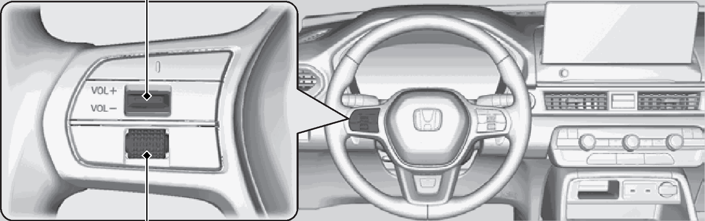
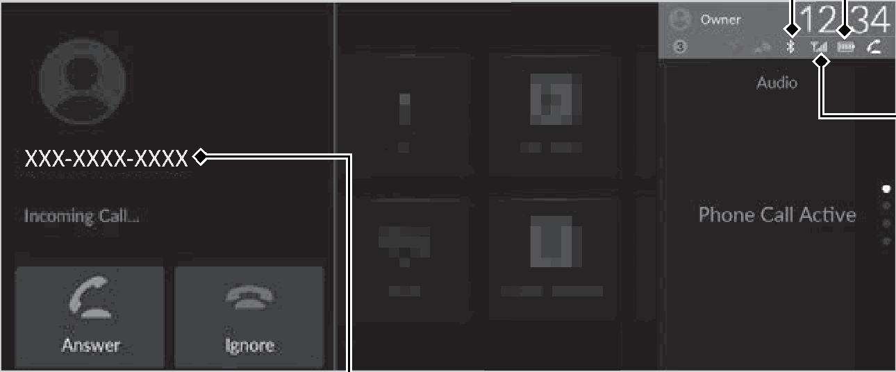

<!-- GENERATED:START function=1ce7baa0fdef (generated; edits inside this block are overwritten by the next publish — write your own notes outside it) -->
# 26. Using HFL

<b>Function path:</b> Bluetooth® HandsFreeLink® / Using HFL <b>Source:</b> printed page 369, 370, 371 <b>Test-ready:</b> no — procedure missing or thresholds unfilled

Every "Presumed requirement" row below is machine-derived from the Owner's Manual text by rule-based extraction — not AI-written — and traceable to the printed page in its Source column.

## Figures (areas of the original PDF; the OM has no figure numbers or captions)

- Figure 26-1 source: p.369
- (Copied from OM) Left Selector Wheel

- Figure 26-2 source: p.371
- (Copied from OM) Caller’s Name (if registered)/

## 26-2-1. Service overview

| # | Presumed requirement | Strength | Source |
|---|---|---|---|
| 1 | Using HFLBluetooth® HandsFreeLink® (HFL) allows you to place and receive phone calls using 1Bluetooth® HandsFreeLink® your vehicle’s audio system without handling your cell phone. | capability | p.369 / text |
| 2 | Using HFLUsing HFL. | capability | p.369 / text |
| 3 | Using HFLHFL Buttons. | capability | p.369 / text |
| 4 | Using HFLVOL(+/VOL(- (Volume) Switch. | capability | p.369 / text |
| 5 | Using HFLLeft Selector Wheel. | capability | p.369 / text |
| 6 | Using HFLPlace your phone where you can get good reception. | capability | p.369 / text |
| 7 | Using HFLTo use HFL, you need a Bluetooth®-compatible cell phone. For a list of compatible phones, pairing procedures, and special feature capabilities:. | capability | p.369 / text |

## 26-2-2. Service requirements

| # | Presumed requirement | Strength | Source |
|---|---|---|---|
| 1 | Step -U.S.: Visit https://mygarage.honda.com/s/hondahandsfreelink-compatibility-check, or call 1-888- 528-7876. | capability | p.369 / bullet |
| 2 | Step -Canada: Call 1-855-490-7351. | capability | p.369 / bullet |
| 3 | Using HFLVoice control tips. | capability | p.369 / text |
| 4 | Step -Aim the vents away from the ceiling and close the windows, as noise coming from them may interfere with the microphones. | capability | p.369 / bullet |
| 5 | Step -If the microphones pick up voices other than yours, the command may be misinterpreted. | capability | p.369 / bullet |
| 6 | Step -To change the volume level, the volume level is able to change by the audio system’s volume. | capability | p.369 / bullet |
| 7 | Using HFLLeft Selector Wheel: Roll up or down to select Phone on the driver information interface, and then press the left selector wheel. | capability | p.370 / text |
| 8 | Using HFL1Bluetooth® HandsFreeLink® Wireless Technology Bluetooth® The Bluetooth® word mark and logos are registered trademarks owned by Bluetooth SIG, Inc., and any use of such marks by Honda Motor Co., Ltd., is under license. Other trademarks and trade names are those of their respective owners. | capability | p.370 / text |
| 9 | Using HFLHFL Limitations An incoming call on HFL will interrupt the audio system when it is playing. It will resume when the call is ended. | constraint | p.370 / text |
| 10 | Using HFLHFL Status Display. | capability | p.371 / text |
| 11 | Using HFLThe audio/information screen notifies you when there is an incoming call. | constraint | p.371 / text |
| 12 | Using HFLBluetooth® Indicator Appears when your phone is connected to HFL. | constraint | p.371 / text |
| 13 | Using HFLCaller’s Name (if registered)/ Caller’s Number (if not registered). | capability | p.371 / text |
| 14 | Using HFLLimitations for Manual Operation. | capability | p.371 / text |
| 15 | Using HFL1HFL Status Display The information that appears on the audio/ information screen varies between phone models. | capability | p.371 / text |
| 16 | Using HFLBattery Level Status. | capability | p.371 / text |
| 17 | Using HFLSignal Strength. | capability | p.371 / text |

## 26-5. Exception operation

| # | Presumed requirement | Strength | Source |
|---|---|---|---|
| 1 | Using HFLTo use the system, the Bluetooth setting must be On. If there is an active connection to Apple CarPlay, HFL is unavailable. | constraint | p.369 / text |
| 2 | Using HFLCertain manual functions are disabled or inoperable while the vehicle is in motion. You cannot select a grayed-out option until the vehicle is stopped. | constraint | p.371 / text |
<!-- GENERATED:END function=1ce7baa0fdef -->

