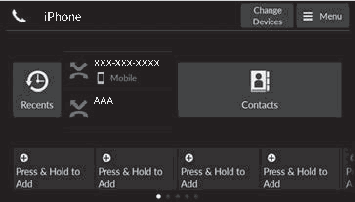
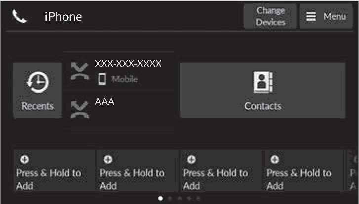
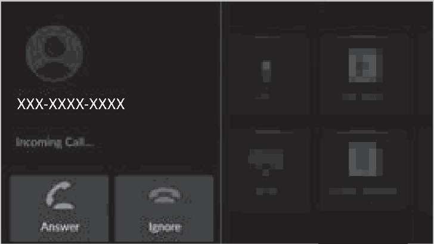
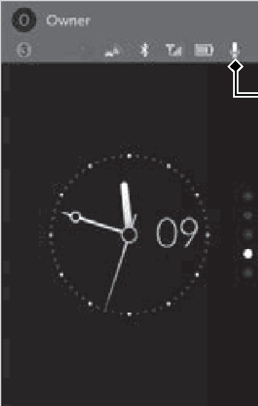

<!-- GENERATED:START function=a9918ba7a001 (generated; edits inside this block are overwritten by the next publish — write your own notes outside it) -->
# 27. HFL Menus

<b>Function path:</b> Bluetooth® HandsFreeLink® / HFL Menus <b>Source:</b> printed page 372, 373, 374, 375, 376, 377, 378, 379, 380, 381, 382, 383, 384 <b>Test-ready:</b> yes — no unfilled thresholds and a procedure is present

Every "Presumed requirement" row below is machine-derived from the Owner's Manual text by rule-based extraction — not AI-written — and traceable to the printed page in its Source column.

## Figures (areas of the original PDF; the OM has no figure numbers or captions)

- Figure 27-1 source: p.372
- (Copied from OM) 2.Select Phone.

- Figure 27-2 source: p.380
- (Copied from OM) phonebook, call history, or favorite contact

- Figure 27-3 source: p.383
- (Copied from OM) ■Receiving a Call

- Figure 27-4 source: p.384
- (Copied from OM) Mute Icon

## Procedure (18 sequences; the manual restarts the numbering)

```mermaid
flowchart TD
    subgraph SEQ1["Sequence 1"]
    direction TB
    S1_1["1. Select Home."]
    S1_2["2. Select Phone."]
    S1_3["3. Select Menu."]
    S1_1 --> S1_2
    S1_2 --> S1_3
    end
    subgraph SEQ2["Sequence 2"]
    direction TB
    S2_1["1. Select Home."]
    S2_2["2. Select Phone."]
    S2_1 --> S2_2
    end
    subgraph SEQ3["Sequence 3"]
    direction TB
    S3_1["1. Select Home."]
    S3_2["2. Select General Settings."]
    S3_3["3. Select Connections."]
    S3_4["4. Select Manage Device Connections."]
    S3_5["5. Select Options."]
    S3_6["6. Set Bluetooth to On."]
    S3_1 --> S3_2
    S3_2 --> S3_3
    S3_3 --> S3_4
    S3_4 --> S3_5
    S3_5 --> S3_6
    end
    subgraph SEQ4["Sequence 4"]
    direction TB
    S4_1["1. Select Home."]
    S4_2["2. Select Phone."]
    S4_3["3. Select Connect New Device."]
    S4_4["4. Make sure your phone is in search or discoverable mode, …"]
    S4_5["5. Select your phone when it appears on the list."]
    S4_6["6. The system gives you a pairing code on the audio/informa…"]
    S4_7["7. Select Yes."]
    S4_1 --> S4_2
    S4_2 --> S4_3
    S4_3 --> S4_4
    S4_4 --> S4_5
    S4_5 --> S4_6
    S4_6 --> S4_7
    end
    subgraph SEQ5["Sequence 5"]
    direction TB
    S5_1["1. Go to the phone screen. 2 Phone screen P.372"]
    S5_2["2. Select Change Devices."]
    S5_3["3. Select Go to Device List."]
    S5_4["4. Select a phone to connect."]
    S5_5["5. Select Bluetooth or Apple CarPlay, Android Auto."]
    S5_6["6. Select Yes."]
    S5_1 --> S5_2
    S5_2 --> S5_3
    S5_3 --> S5_4
    S5_4 --> S5_5
    S5_5 --> S5_6
    end
    subgraph SEQ6["Sequence 6"]
    direction TB
    S6_1["1. Go to the phone screen. 2 Phone screen P.372"]
    S6_2["2. Select Change Devices."]
    S6_3["3. Select Go to Device List."]
    S6_4["4. Select a phone you want to delete."]
    S6_5["5. Select Delete Device."]
    S6_6["6. A confirmation message appears on the screen. Select Del…"]
    S6_1 --> S6_2
    S6_2 --> S6_3
    S6_3 --> S6_4
    S6_4 --> S6_5
    S6_5 --> S6_6
    end
    subgraph SEQ7["Sequence 7"]
    direction TB
    S7_1["1. Go to the phone menu screen. 2 Phone menu screen P.372"]
    S7_2["2. Select Ringtone."]
    S7_3["3. Select Vehicle or Phone."]
    S7_1 --> S7_2
    S7_2 --> S7_3
    end
    subgraph SEQ8["Sequence 8"]
    direction TB
    S8_1["1. Go to the phone menu screen. 2 Phone menu screen P.372"]
    S8_2["2. Select Auto Phone Call Transfer."]
    S8_3["3. Select On or Off."]
    S8_1 --> S8_2
    S8_2 --> S8_3
    end
    subgraph SEQ9["Sequence 9"]
    direction TB
    S9_1["1. Go to the phone menu screen. 2 Phone menu screen P.372"]
    S9_2["2. Select Auto Sync Phone."]
    S9_3["3. Select On or Off."]
    S9_1 --> S9_2
    S9_2 --> S9_3
    end
    subgraph SEQ10["Sequence 10"]
    direction TB
    S10_1["1. Select Home."]
    S10_2["2. Select Phone."]
    S10_3["3. Select and hold Press & Hold to Add."]
    S10_4["4. Select the From Recents, From Contacts, or Using Enter N…"]
    S10_5["5. Select the phone number."]
    S10_1 --> S10_2
    S10_2 --> S10_3
    S10_3 --> S10_4
    S10_4 --> S10_5
    end
    subgraph SEQ11["Sequence 11"]
    direction TB
    S11_5["5. Input number, and select Enter."]
    end
    subgraph SEQ12["Sequence 12"]
    direction TB
    S12_1["1. Select Home."]
    S12_2["2. Select Phone."]
    S12_3["3. Select and hold a favorite contact."]
    S12_4["4. Select Edit Favorites."]
    S12_5["5. Select a setting you want."]
    S12_6["6. Select Enter or select type."]
    S12_1 --> S12_2
    S12_2 --> S12_3
    S12_3 --> S12_4
    S12_4 --> S12_5
    S12_5 --> S12_6
    end
    subgraph SEQ13["Sequence 13"]
    direction TB
    S13_1["1. Select Home."]
    S13_2["2. Select Phone."]
    S13_3["3. Select and hold a favorite contact."]
    S13_4["4. Select Add to Home."]
    S13_1 --> S13_2
    S13_2 --> S13_3
    S13_3 --> S13_4
    end
    subgraph SEQ14["Sequence 14"]
    direction TB
    S14_1["1. Select Home."]
    S14_2["2. Select Phone."]
    S14_3["3. Select and hold a favorite contact."]
    S14_4["4. Select Remove Favorite."]
    S14_1 --> S14_2
    S14_2 --> S14_3
    S14_3 --> S14_4
    end
    subgraph SEQ15["Sequence 15"]
    direction TB
    S15_1["1. Go to the phone screen. 2 Phone screen P.372"]
    S15_2["2. Select Contacts."]
    S15_3["3. Select a name."]
    S15_4["4. Select a number."]
    S15_1 --> S15_2
    S15_2 --> S15_3
    S15_3 --> S15_4
    end
    subgraph SEQ16["Sequence 16"]
    direction TB
    S16_1["1. Go to the phone menu screen. 2 Phone menu screen P.372"]
    S16_2["2. Select Keypad."]
    S16_3["3. Select a number."]
    S16_4["4. Select Call."]
    S16_1 --> S16_2
    S16_2 --> S16_3
    S16_3 --> S16_4
    end
    subgraph SEQ17["Sequence 17"]
    direction TB
    S17_1["1. Go to the phone screen. 2 Phone screen P.372"]
    S17_2["2. Select Recents."]
    S17_3["3. Select a number."]
    S17_1 --> S17_2
    S17_2 --> S17_3
    end
    subgraph SEQ18["Sequence 18"]
    direction TB
    S18_1["1. Go to the phone screen. 2 Phone screen P.372"]
    S18_2["2. Select desired favorite contact."]
    S18_1 --> S18_2
    end
```

| Seq | Step | Operation (Copied from OM) | Source |
|---|---|---|---|
| 1 | 1 | Select Home. | p.372 / step |
| 1 | 2 | Select Phone. | p.372 / step |
| 1 | 3 | Select Menu. | p.372 / step |
| 2 | 1 | Select Home. | p.372 / step |
| 2 | 2 | Select Phone. | p.372 / step |
| 3 | 1 | Select Home. | p.373 / step |
| 3 | 2 | Select General Settings. | p.373 / step |
| 3 | 3 | Select Connections. | p.373 / step |
| 3 | 4 | Select Manage Device Connections. | p.373 / step |
| 3 | 5 | Select Options. | p.373 / step |
| 3 | 6 | Set Bluetooth to On. | p.373 / step |
| 4 | 1 | Select Home. | p.374 / step |
| 4 | 2 | Select Phone. | p.374 / step |
| 4 | 3 | Select Connect New Device. | p.374 / step |
| 4 | 4 | Make sure your phone is in search or discoverable mode, then select Search for Devices. | p.374 / step |
| 4 | 5 | Select your phone when it appears on the list. | p.374 / step |
| 4 | 6 | The system gives you a pairing code on the audio/information screen. | p.374 / step |
| 4 | 7 | Select Yes. | p.374 / step |
| 5 | 1 | Go to the phone screen. 2 Phone screen P.372 | p.375 / step |
| 5 | 2 | Select Change Devices. | p.375 / step |
| 5 | 3 | Select Go to Device List. | p.375 / step |
| 5 | 4 | Select a phone to connect. | p.375 / step |
| 5 | 5 | Select Bluetooth or Apple CarPlay, Android Auto. | p.375 / step |
| 5 | 6 | Select Yes. | p.375 / step |
| 6 | 1 | Go to the phone screen. 2 Phone screen P.372 | p.375 / step |
| 6 | 2 | Select Change Devices. | p.375 / step |
| 6 | 3 | Select Go to Device List. | p.375 / step |
| 6 | 4 | Select a phone you want to delete. | p.375 / step |
| 6 | 5 | Select Delete Device. | p.375 / step |
| 6 | 6 | A confirmation message appears on the screen. Select Delete. | p.375 / step |
| 7 | 1 | Go to the phone menu screen. 2 Phone menu screen P.372 | p.376 / step |
| 7 | 2 | Select Ringtone. | p.376 / step |
| 7 | 3 | Select Vehicle or Phone. | p.376 / step |
| 8 | 1 | Go to the phone menu screen. 2 Phone menu screen P.372 | p.376 / step |
| 8 | 2 | Select Auto Phone Call Transfer. | p.376 / step |
| 8 | 3 | Select On or Off. | p.376 / step |
| 9 | 1 | Go to the phone menu screen. 2 Phone menu screen P.372 | p.377 / step |
| 9 | 2 | Select Auto Sync Phone. | p.377 / step |
| 9 | 3 | Select On or Off. | p.377 / step |
| 10 | 1 | Select Home. | p.378 / step |
| 10 | 2 | Select Phone. | p.378 / step |
| 10 | 3 | Select and hold Press &amp; Hold to Add. | p.378 / step |
| 10 | 4 | Select the From Recents, From Contacts, or Using Enter Number. | p.378 / step |
| 10 | 5 | Select the phone number. | p.378 / step |
| 11 | 5 | Input number, and select Enter. | p.378 / step |
| 12 | 1 | Select Home. | p.379 / step |
| 12 | 2 | Select Phone. | p.379 / step |
| 12 | 3 | Select and hold a favorite contact. | p.379 / step |
| 12 | 4 | Select Edit Favorites. | p.379 / step |
| 12 | 5 | Select a setting you want. | p.379 / step |
| 12 | 6 | Select Enter or select type. | p.379 / step |
| 13 | 1 | Select Home. | p.379 / step |
| 13 | 2 | Select Phone. | p.379 / step |
| 13 | 3 | Select and hold a favorite contact. | p.379 / step |
| 13 | 4 | Select Add to Home. | p.379 / step |
| 14 | 1 | Select Home. | p.379 / step |
| 14 | 2 | Select Phone. | p.379 / step |
| 14 | 3 | Select and hold a favorite contact. | p.379 / step |
| 14 | 4 | Select Remove Favorite. | p.379 / step |
| 15 | 1 | Go to the phone screen. 2 Phone screen P.372 | p.381 / step |
| 15 | 2 | Select Contacts. | p.381 / step |
| 15 | 3 | Select a name. | p.381 / step |
| 15 | 4 | Select a number. | p.381 / step |
| 16 | 1 | Go to the phone menu screen. 2 Phone menu screen P.372 | p.381 / step |
| 16 | 2 | Select Keypad. | p.381 / step |
| 16 | 3 | Select a number. | p.381 / step |
| 16 | 4 | Select Call. | p.381 / step |
| 17 | 1 | Go to the phone screen. 2 Phone screen P.372 | p.382 / step |
| 17 | 2 | Select Recents. | p.382 / step |
| 17 | 3 | Select a number. | p.382 / step |
| 18 | 1 | Go to the phone screen. 2 Phone screen P.372 | p.382 / step |
| 18 | 2 | Select desired favorite contact. | p.382 / step |

## 27-2-1. Service overview

| # | Presumed requirement | Strength | Source |
|---|---|---|---|
| 1 | HFL MenusHFL Menus. | capability | p.372 / text |
| 2 | HFL MenusThe power mode must be in ACCESSORY or ON to use the system. | capability | p.372 / text |
| 3 | HFL MenusPhone menu screen. | capability | p.372 / text |

## 27-2-2. Service requirements

| # | Presumed requirement | Strength | Source |
|---|---|---|---|
| 1 | Step -Keypad: Enter a phone number to dial. | capability | p.372 / bullet |
| 2 | Step -Latest Call History: Set whether the history shortcut is displayed on the phone screen. | capability | p.372 / bullet |
| 3 | Step -Auto Sync Phone: Set phonebook and call history data to be automatically imported when a phone is paired to HFL. | constraint | p.372 / bullet |
| 4 | Step -Auto Phone Call Transfer: Set calls to automatically transfer from your phone to HFL when you enter the vehicle. | constraint | p.372 / bullet |
| 5 | Step -Ringtone: Select a fixed ringtone or the one from the connected cell phone. | capability | p.372 / bullet |
| 6 | HFL MenusPhone screen. | capability | p.372 / text |
| 7 | Step -(Existing entry list). | capability | p.372 / bullet |
| 8 | Step -Contacts. | capability | p.372 / bullet |
| 9 | Step -Press &amp; Hold to Add. | capability | p.372 / bullet |
| 10 | Step -Change Devices. | capability | p.372 / bullet |
| 11 | HFL Menus1HFL Menus To use HFL, you must first pair your Bluetooth®- compatible cell phone to the system while the vehicle is parked. | capability | p.372 / text |
| 12 | HFL MenusSome functions are limited while driving. | capability | p.372 / text |
| 13 | HFL MenusPhone Setup. | capability | p.373 / text |
| 14 | HFL MenusBluetooth® setup. | capability | p.373 / text |
| 15 | HFL MenusYou can turn Bluetooth® function on and off. | capability | p.373 / text |
| 16 | HFL MenusTo pair a cell phone (when there is no phone paired to the system). | capability | p.374 / text |
| 17 | Step -HFL automatically searches for a Bluetooth® device. | capability | p.374 / bullet |
| 18 | Step -If your phone still does not appear, search for Bluetooth® devices using your phone. From your phone, search for Vehicle Name. | capability | p.374 / bullet |
| 19 | Step -Confirm if the pairing code on the screen and your phone matches. This may vary by phone. | constraint | p.374 / bullet |
| 20 | HFL Menus1Phone Setup Your Bluetooth®-compatible phone must be paired to the system before you can make and receive hands-free calls. | capability | p.374 / text |
| 21 | HFL MenusPhone Pairing Tips:. | capability | p.374 / text |
| 22 | Step -Up to six phones can be paired. | capability | p.374 / bullet |
| 23 | Step -Your phone’s battery may drain faster when it is paired to the system. | constraint | p.374 / bullet |
| 24 | HFL MenusOnce you have paired a phone, you can see it displayed on the screen with one or more icons on the right side. These icons indicate the following: : The phone is compatible with Bluetooth® Audio and HFL. : The phone is compatible with Apple CarPlay. : The phone is compatible with Android Auto. | capability | p.374 / text |
| 25 | HFL MenusTo change the currently paired phone. | capability | p.375 / text |
| 26 | Step -HFL disconnects the connected phone and starts searching for another paired phone. | capability | p.375 / bullet |
| 27 | HFL MenusTo delete a paired phone. | capability | p.375 / text |
| 28 | HFL Menus1To change the currently paired phone If no other phones are found or paired when trying to switch to another phone, the original phone is connected again. | constraint | p.375 / text |
| 29 | HFL MenusTo pair other phones, select + Connect New Device from the Bluetooth screen. | capability | p.375 / text |
| 30 | HFL MenusRingtone. | capability | p.376 / text |
| 31 | HFL MenusYou can change the ringtone setting. | capability | p.376 / text |
| 32 | HFL MenusAutomatic Transferring. | capability | p.376 / text |
| 33 | HFL MenusIf you get into the vehicle while you are on the phone, the call can be automatically transferred to HFL. | capability | p.376 / text |
| 34 | HFL Menus1Ringtone Vehicle: The fixed ringtone sounds from the speakers. Phone: Depending on the make and model of the cell phone, the ringtone stored in the phone will sound if the phone is connected. | constraint | p.376 / text |
| 35 | HFL MenusAutomatic Import of Cellular Phonebook and Call History. | capability | p.377 / text |
| 36 | HFL MenusWhen Auto Sync Phone is set to ON:. | capability | p.377 / text |
| 37 | HFL MenusWhen your phone is paired, the contents of its phonebook and call history are automatically imported to the system. | capability | p.377 / text |
| 38 | HFL MenusChanging the Auto Sync Phone setting. | capability | p.377 / text |
| 39 | HFL Menus1Automatic Import of Cellular Phonebook and Call History On some phones, you will be asked to allow your cellular phonebook to be imported. | capability | p.377 / text |
| 40 | HFL MenusWhen you select a name from the list in the cellular phonebook, you can see category icons. The icons indicate what types of numbers are stored for that name. | capability | p.377 / text |
| 41 | HFL MenusMobile Work. | capability | p.377 / text |
| 42 | HFL MenusHome Other. | capability | p.377 / text |
| 43 | HFL MenusThe phonebook is updated after every connection. Call history is updated after every connection or call. | capability | p.377 / text |
| 44 | HFL MenusFavorite Contacts. | capability | p.378 / text |
| 45 | HFL MenusTo store a number as a favorite contact:. | capability | p.378 / text |
| 46 | HFL MenusFrom Recents, From Contacts. | capability | p.378 / text |
| 47 | HFL MenusUsing Enter Number. | capability | p.378 / text |
| 48 | HFL MenusTo edit a favorite contact. | capability | p.379 / text |
| 49 | HFL MenusAdd a favorite contact to homepage. | capability | p.379 / text |
| 50 | HFL MenusTo delete a favorite contact. | capability | p.379 / text |
| 51 | HFL MenusMaking a Call. | capability | p.380 / text |
| 52 | HFL MenusYou can make calls by inputting any phone Phone screen number, or by using the imported phonebook, call history, or favorite contact entries. | capability | p.380 / text |
| 53 | HFL Menus1Making a Call Once a call is connected, you can hear the voice of the person you are calling through the audio speakers. | capability | p.380 / text |
| 54 | HFL MenusTo make a call using the imported phonebook. | capability | p.381 / text |
| 55 | Step -You can sort by First Name or Last Name. Select the icon on the upper right of the screen. | capability | p.381 / bullet |
| 56 | Step -Dialing starts automatically. | capability | p.381 / bullet |
| 57 | HFL MenusTo make a call using a phone number. | capability | p.381 / text |
| 58 | Step -Use the keyboard on the touch screen for entering numbers. | capability | p.381 / bullet |
| 59 | Step -Dialing starts automatically. | capability | p.381 / bullet |
| 60 | HFL MenusTo make a call using the call history. | capability | p.382 / text |
| 61 | HFL MenusCall history is stored by All, Dialed, Missed, and Received. | capability | p.382 / text |
| 62 | Step -You can sort by All, Dialed, Missed, or Received. Select the icon on the upper right of the screen. | capability | p.382 / bullet |
| 63 | Step -Dialing starts automatically. | capability | p.382 / bullet |
| 64 | HFL MenusTo make a call using a favorite contact entry. | capability | p.382 / text |
| 65 | Step -Dialing starts automatically. | capability | p.382 / bullet |
| 66 | HFL Menus1To make a call using the call history The call history appears only when a phone is connected to the system. | constraint | p.382 / text |
| 67 | HFL MenusReceiving a Call. | capability | p.383 / text |
| 68 | HFL Menus1Receiving a Call Call Waiting When there is an incoming call, an audible Select (answer) to put the current call on hold to notification sounds (if activated) and the answer the incoming call. Incoming Call... screen appears. Select using the left selector wheel to return to the current call. Select (ignore) to ignore the incoming call if you You can answer the call using the left selector do not want to answer it. wheel. Select if you want to hang up the current call. To answer the call, roll up or down to select (answer) on the driver information You can select the icons on the audio/information interface or head-up display* and then press screen instead of the and on the driver the left selector wheel. information interface or head-up display*. | constraint | p.383 / text |
| 69 | Step -If you want to decline or end the call, select (ignore) on the driver information interface or head-up display* using the left selector wheel. | capability | p.383 / bullet |
| 70 | HFL MenusOptions During a Call. | capability | p.384 / text |
| 71 | HFL MenusThe following options are available during a call. Mute: Mute your voice. Transfer to Mobile: Transfer a call from the system to your phone. Keypad: Send numbers during a call. This is useful when you call a menu-driven phone system. The available options are shown on the lower B-Zone half of the screen. | constraint | p.384 / text |
| 72 | HFL MenusSelect the option. Mute Icon. | capability | p.384 / text |
| 73 | Step -The mute icon appears when Mute is selected. Select Unmute to turn it off. | constraint | p.384 / bullet |
| 74 | HFL Menus1Options During a Call You can select the icons on the audio/information screen. | capability | p.384 / text |

## 27-5. Exception operation

| # | Presumed requirement | Strength | Source |
|---|---|---|---|
| 1 | Step -You cannot pair your phone while the vehicle is moving. | constraint | p.374 / bullet |
| 2 | HFL MenusYou can also switch the connection with the icon, icon, or icon in the device list. When , or is selected, cannot be selected. | constraint | p.375 / text |
| 3 | HFL MenusOn some phones, it may not be possible to import the category icons to the system. | capability | p.377 / text |
| 4 | HFL MenusWhile there is an active connection with Apple CarPlay, phone calls cannot be made with HandsFreeLink® and are only made from Apple CarPlay. | constraint | p.380 / text |
<!-- GENERATED:END function=a9918ba7a001 -->

