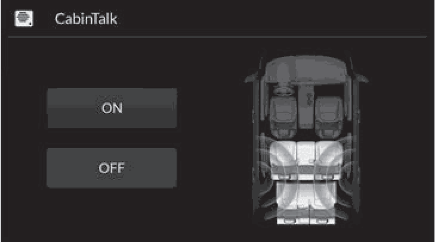

<!-- GENERATED:START function=fde298b9dda6 (generated; edits inside this block are overwritten by the next publish — write your own notes outside it) -->
# 28. CabinTalk®

<b>Function path:</b> Features / CabinTalk® <b>Source:</b> printed page 385 <b>Test-ready:</b> no — procedure missing or thresholds unfilled

Every "Presumed requirement" row below is machine-derived from the Owner's Manual text by rule-based extraction — not AI-written — and traceable to the printed page in its Source column.

## Figures (areas of the original PDF; the OM has no figure numbers or captions)

- Figure 28-1 source: p.385
- (Copied from OM) uSelect OFF to mute your voice.

## 28-2-1. Service overview

| # | Presumed requirement | Strength | Source |
|---|---|---|---|
| 1 | CabinTalk®Your audio system allows your, or the front passenger’s voice to be broadcast to the 1CabinTalk® second and third row seat’s passengers using the rear speakers. | capability | p.385 / text |
| 2 | CabinTalk®How to use. | capability | p.385 / text |
| 3 | CabinTalk®1.Select Home. 2.Select CabinTalk. uSelect OFF to mute your voice. | capability | p.385 / text |
| 4 | CabinTalk®You can adjust the speaker volume by turning the volume knob. | capability | p.385 / text |
<!-- GENERATED:END function=fde298b9dda6 -->

