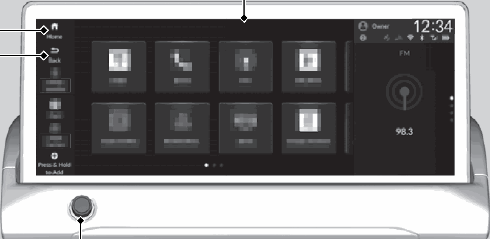
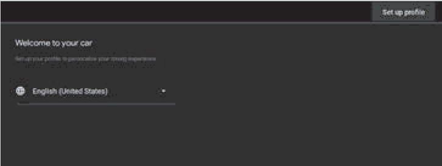
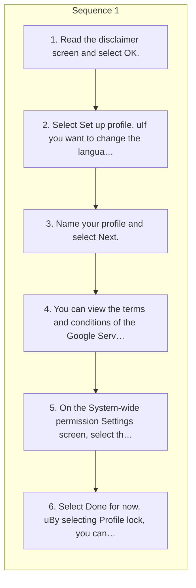

<!-- GENERATED:START function=f1aa70e723ed (generated; edits inside this block are overwritten by the next publish — write your own notes outside it) -->
# 4. Start Up

<b>Function path:</b> Audio System Basic Operation / Start Up <b>Source:</b> printed page 270, 271, 272 <b>Test-ready:</b> no — procedure missing or thresholds unfilled

Every "Presumed requirement" row below is machine-derived from the Owner's Manual text by rule-based extraction — not AI-written — and traceable to the printed page in its Source column.

## Figures (areas of the original PDF; the OM has no figure numbers or captions)

- Figure 4-1 source: p.270
- (Copied from OM) VOL/ AUDIO (Volume/Power) Knob

- Figure 4-2 source: p.272
- (Copied from OM) 1Registering new user information

- Figure 4-3 source: p.272
- (Copied from OM) 3.Name your profile and select Next.

## Procedure

| Seq | Step | Operation (Copied from OM) | Source |
|---|---|---|---|
| 1 | 1 | Read the disclaimer screen and select OK. | p.272 / step |
| 1 | 2 | Select Set up profile. uIf you want to change the language, select English (United States). | p.272 / step |
| 1 | 3 | Name your profile and select Next. | p.272 / step |
| 1 | 4 | You can view the terms and conditions of the Google Services agreement. | p.272 / step |
| 1 | 5 | On the System-wide permission Settings screen, select the data you give permission for the system to access, and select Accept. | p.272 / step |
| 1 | 6 | Select Done for now. uBy selecting Profile lock, you can set security settings for your profile. uBy selecting Set up Google Assistant and apps, you can customize settings related to Google. An internet connection is required to change settings. 2 Wi-Fi Connection P.306 | p.272 / step |

## Numeric thresholds (filled in by a tester)
Filled: 0 / unfilled: 1

| Threshold | Matching text (Copied from OM) | Kind | Unit | Value | Status | Evidence | Filled by |
|---|---|---|---|---|---|---|---|
| d5fd615c6264 | a certain period of time | duration | time | **unfilled** | unfilled | — | — |

## 4-2-1. Service overview

| # | Presumed requirement | Strength | Source |
|---|---|---|---|
| 1 | Start UpTo use the audio system function, the power mode must be in ACCESSORY or ON. 1Audio System Basic Operation. | capability | p.270 / text |
| 2 | Start UpAudio/Information Screen. | capability | p.270 / text |
| 3 | Start UpHome Back. | capability | p.270 / text |
| 4 | Start UpVOL/ AUDIO (Volume/Power) Knob. | capability | p.270 / text |
| 5 | Start UpHome: Select to go to the home screen. Back: Select to go back to the previous screen. VOL/ AUDIO (Volume/Power) Knob: Press to turn the audio system on and off. Turn to adjust the volume. | capability | p.270 / text |
| 6 | Start UpYou can check all apps installed on this system by selecting All Apps. | capability | p.270 / text |
| 7 | Start UpCertain manual functions are disabled or inoperable while the vehicle is in motion. You cannot select a grayed-out option until the vehicle is stopped. | constraint | p.270 / text |
| 8 | Start UpStart Up. | capability | p.271 / text |
| 9 | Start UpThe 12.3" Color Touchscreen starts automatically when you set the power mode to 1Start Up ACCESSORY or ON. At start-up, the disclaimer screen will be displayed. When adding a new user, entry of user information is required at start-up. | constraint | p.271 / text |
| 10 | Start UpSelect OK on the disclaimer screen. uIf you want to change the settings for data upload, select Data Sharing with Honda, then select the Enable/Disable settings on the Data Sharing with Honda screen. uIf you do not select OK, the system will automatically be switched to the home screen, or the top screen of the last executed application, after a certain period of time. uIf there is no registered device, select OK and the Bluetooth® pairing screen will be displayed. uIf you check the box with Do not show this again, this screen will not be displayed. | capability | p.271 / text |
| 11 | Start UpData Sharing with Honda Enable: Data communication available. Disable: Data communication unavailable. | capability | p.271 / text |
| 12 | Start UpRegistering new user information. | capability | p.272 / text |
| 13 | Start Up1Registering new user information Refer to the Google website for more information on setting up a profile. | capability | p.272 / text |
| 14 | Start UpAdditional information for Google Apps and Services is available at mygarage.honda.com (U.S.) or honda.ca (English) / www.honda.ca/fr (French) (Canada). | capability | p.272 / text |
| 15 | Start UpSpecifications may be changed via system updates, etc. | capability | p.272 / text |
<!-- GENERATED:END function=f1aa70e723ed -->

