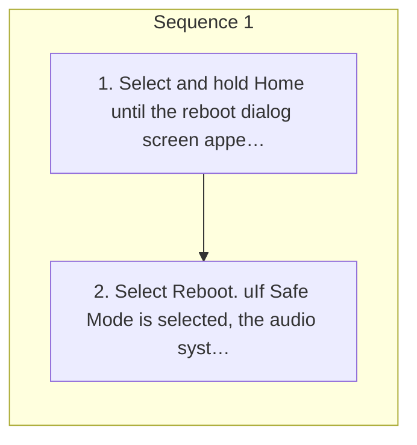

<!-- GENERATED:START function=4aecd100d6a7 (generated; edits inside this block are overwritten by the next publish — write your own notes outside it) -->
# 5. Reboot Audio

<b>Function path:</b> Audio System Basic Operation / Reboot Audio <b>Source:</b> printed page 273 <b>Test-ready:</b> yes — no unfilled thresholds and a procedure is present

Every "Presumed requirement" row below is machine-derived from the Owner's Manual text by rule-based extraction — not AI-written — and traceable to the printed page in its Source column.

## Procedure

| Seq | Step | Operation (Copied from OM) | Source |
|---|---|---|---|
| 1 | 1 | Select and hold Home until the reboot dialog screen appears. | p.273 / step |
| 1 | 2 | Select Reboot. uIf Safe Mode is selected, the audio system will be rebooted with third-party applications turned off. After the power mode has been turned off once, third-party applications can be used again. | p.273 / step |

## 5-2-1. Service overview

| # | Presumed requirement | Strength | Source |
|---|---|---|---|
| 1 | Reboot AudioReboot Audio. | capability | p.273 / text |
| 2 | Reboot AudioYou can reboot the audio system. | capability | p.273 / text |
<!-- GENERATED:END function=4aecd100d6a7 -->

