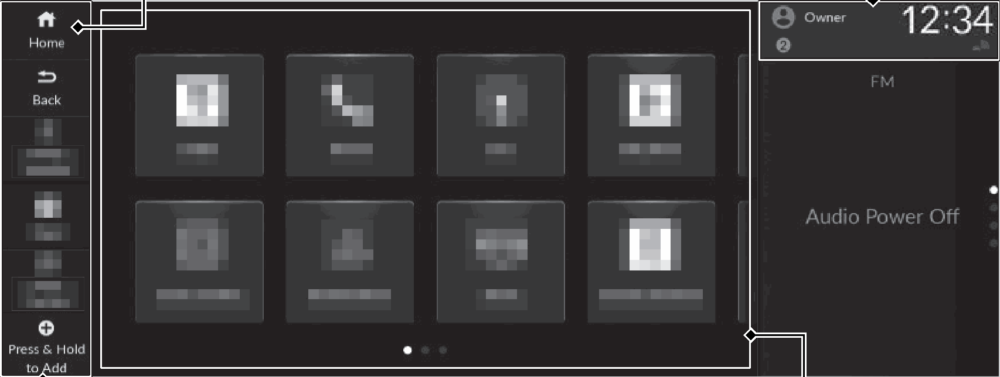
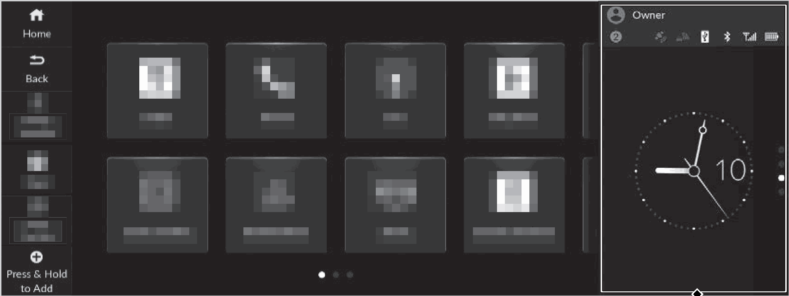
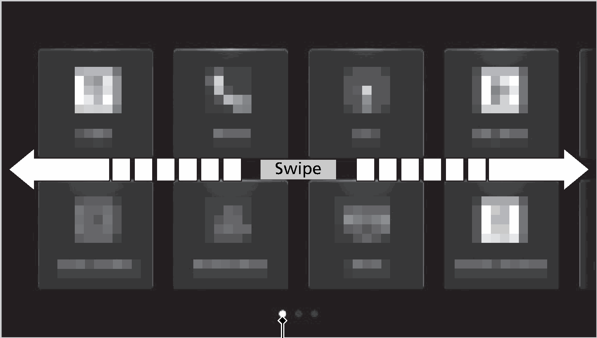
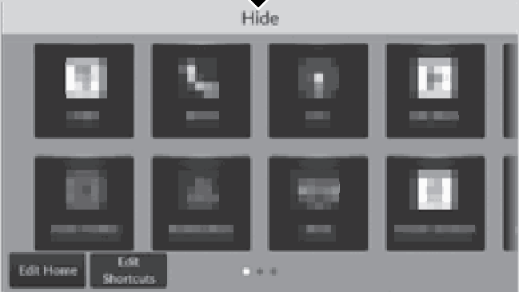
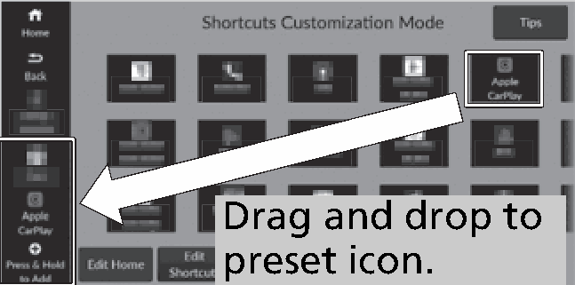
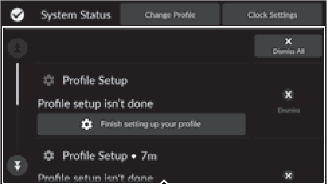
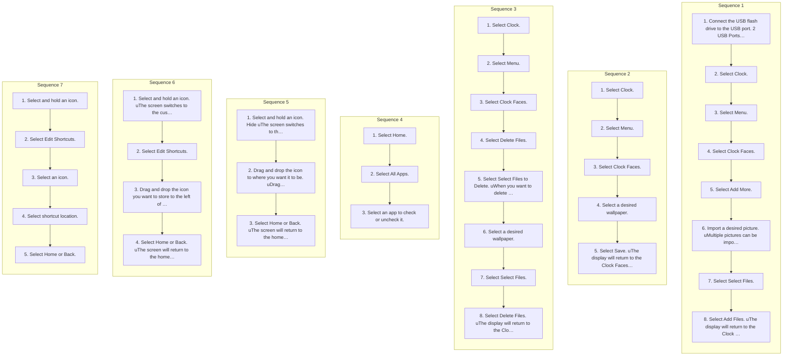

<!-- GENERATED:START function=022558815f1e (generated; edits inside this block are overwritten by the next publish — write your own notes outside it) -->
# 6. Audio/Information Screen

<b>Function path:</b> Audio System Basic Operation / Audio/Information Screen <b>Source:</b> printed page 274, 275, 276, 277, 278, 279, 280, 281 <b>Test-ready:</b> yes — no unfilled thresholds and a procedure is present

Every "Presumed requirement" row below is machine-derived from the Owner's Manual text by rule-based extraction — not AI-written — and traceable to the printed page in its Source column.

## Figures (areas of the original PDF; the OM has no figure numbers or captions)

- Figure 6-1 source: p.274
- (Copied from OM) Mode Change Switch Bar

- Figure 6-2 source: p.276
- (Copied from OM) in the A-Zone.

- Figure 6-3 source: p.279
- (Copied from OM) Swipe

- Figure 6-4 source: p.280
- (Copied from OM) 3.Select Home or Back.

- Figure 6-5 source: p.281
- (Copied from OM) Drag and drop to

- Figure 6-6 source: p.281
- (Copied from OM) Status Area

## Procedure (7 sequences; the manual restarts the numbering)

| Seq | Step | Operation (Copied from OM) | Source |
|---|---|---|---|
| 1 | 1 | Connect the USB flash drive to the USB port. 2 USB Ports P.265 | p.277 / step |
| 1 | 2 | Select Clock. | p.277 / step |
| 1 | 3 | Select Menu. | p.277 / step |
| 1 | 4 | Select Clock Faces. | p.277 / step |
| 1 | 5 | Select Add More. | p.277 / step |
| 1 | 6 | Import a desired picture. uMultiple pictures can be imported at the same time. | p.277 / step |
| 1 | 7 | Select Select Files. | p.277 / step |
| 1 | 8 | Select Add Files. uThe display will return to the Clock Faces screen. | p.277 / step |
| 2 | 1 | Select Clock. | p.278 / step |
| 2 | 2 | Select Menu. | p.278 / step |
| 2 | 3 | Select Clock Faces. | p.278 / step |
| 2 | 4 | Select a desired wallpaper. | p.278 / step |
| 2 | 5 | Select Save. uThe display will return to the Clock Faces screen. | p.278 / step |
| 3 | 1 | Select Clock. | p.278 / step |
| 3 | 2 | Select Menu. | p.278 / step |
| 3 | 3 | Select Clock Faces. | p.278 / step |
| 3 | 4 | Select Delete Files. | p.278 / step |
| 3 | 5 | Select Select Files to Delete. uWhen you want to delete everything wallpaper. Select Delete All Files. | p.278 / step |
| 3 | 6 | Select a desired wallpaper. | p.278 / step |
| 3 | 7 | Select Select Files. | p.278 / step |
| 3 | 8 | Select Delete Files. uThe display will return to the Clock Faces screen. | p.278 / step |
| 4 | 1 | Select Home. | p.280 / step |
| 4 | 2 | Select All Apps. | p.280 / step |
| 4 | 3 | Select an app to check or uncheck it. | p.280 / step |
| 5 | 1 | Select and hold an icon. Hide uThe screen switches to the customization screen. | p.280 / step |
| 5 | 2 | Drag and drop the icon to where you want it to be. uDrag and drop the icon to Hide to remove from the home screen. | p.280 / step |
| 5 | 3 | Select Home or Back. uThe screen will return to the home screen. | p.280 / step |
| 6 | 1 | Select and hold an icon. uThe screen switches to the customization screen. | p.281 / step |
| 6 | 2 | Select Edit Shortcuts. | p.281 / step |
| 6 | 3 | Drag and drop the icon you want to store to the left of the home screen. Drag and drop to uThe icon is stored as a shortcut. preset icon. | p.281 / step |
| 6 | 4 | Select Home or Back. uThe screen will return to the home screen. | p.281 / step |
| 7 | 1 | Select and hold an icon. | p.281 / step |
| 7 | 2 | Select Edit Shortcuts. | p.281 / step |
| 7 | 3 | Select an icon. | p.281 / step |
| 7 | 4 | Select shortcut location. | p.281 / step |
| 7 | 5 | Select Home or Back. | p.281 / step |

## 6-2-1. Service overview

| # | Presumed requirement | Strength | Source |
|---|---|---|---|
| 1 | Audio/Information ScreenAudio/Information Screen. | capability | p.274 / text |
| 2 | Audio/Information ScreenDisplays the audio status and wallpaper. From this display, you can go to various setup options. | capability | p.274 / text |
| 3 | Audio/Information ScreenThe A-Zone is main operation area in the 12.3" Color Touchscreen. | capability | p.274 / text |
| 4 | Audio/Information ScreenSwitching the display. | capability | p.274 / text |
| 5 | Audio/Information ScreenMode Change Switch Bar. | capability | p.274 / text |
| 6 | Audio/Information ScreenSelect Home to go to the home screen. Select the following icons on the home screen or after selecting All Apps. | capability | p.274 / text |
| 7 | Audio/Information Screen1Audio/Information Screen Touchscreen Operation. | capability | p.274 / text |

## 6-2-2. Service requirements

| # | Presumed requirement | Strength | Source |
|---|---|---|---|
| 1 | Step -Use simple gestures - including touching, swiping, and scrolling - to operate certain audio functions. | capability | p.274 / bullet |
| 2 | Step -Some items may be grayed-out during driving to reduce the potential for distraction. | capability | p.274 / bullet |
| 3 | Step -Wearing gloves may limit or prevent touchscreen response. Status Bar. | capability | p.274 / bullet |
| 4 | Audio/Information ScreenTrip Computer. | capability | p.275 / text |
| 5 | Audio/Information ScreenDisplays the trip computer information. | capability | p.275 / text |
| 6 | Step -Current Drive tab: Displays the current trip information. | capability | p.275 / bullet |
| 7 | Step -Trip A/Trip B tab: Displays information for the current and three previous drives. The information is stored every time you reset Trip A/B. To reset the Trip A/B, select Menu, then select Delete Trip History. To change the setting of how to reset Trip A/B, select Menu, then select “Trip A” Reset Timing or “Trip B” Reset Timing. | capability | p.275 / bullet |
| 8 | Audio/Information ScreenDisplays the compass screen. | capability | p.275 / text |
| 9 | Audio/Information Screen1Audio/Information Screen. | capability | p.275 / text |
| 10 | Step -System Updates 2 System Updates P.282. | capability | p.275 / bullet |
| 11 | Step -FM/AM/USB/Bluetooth® Audio 2 Playing AM/FM Radio P.287 2 Music Playback via Wired Connection P.291 2 Music Playback via USB Flash Drive P.294 2 Playing Bluetooth® Audio P.297. | capability | p.275 / bullet |
| 12 | Step -Profile Settings 2 User Information P.319. | capability | p.275 / bullet |
| 13 | Step -Google Assistant/Google Maps/Google Play 2 Google built-in P.317. | capability | p.275 / bullet |
| 14 | Step -HondaLink 2 HondaLink® P.300. | capability | p.275 / bullet |
| 15 | Step -Apple CarPlay/Android Auto 2 Apple CarPlay P.309 2 Android AutoTM P.313. | capability | p.275 / bullet |
| 16 | Step -Wi-Fi Hotspot 2 AT&amp;T Hotspot P.308. | capability | p.275 / bullet |
| 17 | Step -Alexa 2 Alexa Built-In P.286. | capability | p.275 / bullet |
| 18 | Audio/Information ScreenThe B-Zone displays a card that is useful while the driver is using another application in the A-Zone. | capability | p.276 / text |
| 19 | Audio/Information ScreenThe following cards are available:. | capability | p.276 / text |
| 20 | Step -Audio source. | capability | p.276 / bullet |
| 21 | Step -Navigation (Apple CarPlay or Android Auto). | capability | p.276 / bullet |
| 22 | Step -Trip Computer. | capability | p.276 / bullet |
| 23 | Step -Suggestions from Google Assistant. | capability | p.276 / bullet |
| 24 | Audio/Information Screen1B-Zone You can swipe up and down on the B-Zone to view a different card. Page position is indicated at the right of the B-Zone. | capability | p.276 / text |
| 25 | Audio/Information ScreenWallpaper Setup. | capability | p.277 / text |
| 26 | Audio/Information ScreenYou can change, store, and delete the wallpaper on the audio/information screen. | capability | p.277 / text |
| 27 | Audio/Information ScreenImport wallpaper. | capability | p.277 / text |
| 28 | Step -The file name must be fewer than 64 bytes. | capability | p.277 / bullet |
| 29 | Step -The file format of the image that can be imported is BMP (bmp) or JPEG (jpg). | capability | p.277 / bullet |
| 30 | Step -Up to 11 pictures can be imported. | capability | p.277 / bullet |
| 31 | Step -The maximum image size is 4,096 × 2,304 pixels. If the image size is less, the image is displayed in the middle of the screen with the extra area appearing in black. | constraint | p.277 / bullet |
| 32 | Audio/Information ScreenSelect wallpaper. | capability | p.278 / text |
| 33 | Audio/Information ScreenDelete wallpaper. | capability | p.278 / text |
| 34 | Audio/Information ScreenHome Screen. | capability | p.279 / text |
| 35 | Audio/Information ScreenTo move to the next screen. | capability | p.279 / text |
| 36 | Audio/Information ScreenSwiping the screen left or right changes to the next screen. | capability | p.279 / text |
| 37 | Audio/Information ScreenCurrent page position. | capability | p.279 / text |
| 38 | Audio/Information Screen1Home Screen The home screen can contain up to six pages. | capability | p.279 / text |
| 39 | Audio/Information ScreenSelect Home to go directly back to the first page of the home screen from any page. | capability | p.279 / text |
| 40 | Audio/Information ScreenTo add/remove app icons on the home screen. | capability | p.280 / text |
| 41 | Audio/Information ScreenApp icons can be added or deleted on the home screen. | capability | p.280 / text |
| 42 | Audio/Information ScreenTo move/remove icons on the home screen. | capability | p.280 / text |
| 43 | Audio/Information ScreenYou can change icon locations on the home screen. | capability | p.280 / text |
| 44 | Audio/Information Screen1To add/remove app icons on the home screen Apps will not be deleted by deleting the icon on the home screen. | capability | p.280 / text |
| 45 | Audio/Information Screen1To move/remove icons on the home screen Apps will not be deleted by deleting the icon on the home screen. | capability | p.280 / text |
| 46 | Audio/Information ScreenSelect Tips to show tips. To hide them, select it again. | capability | p.280 / text |
| 47 | Audio/Information ScreenTo shortcut icons on the home screen. | capability | p.281 / text |
| 48 | Audio/Information ScreenYou can store up to three icons on the mode change switch bar. | capability | p.281 / text |
| 49 | Audio/Information ScreenStatus Bar. | capability | p.281 / text |
| 50 | Audio/Information ScreenShows the indicators of the information for the vehicle, connected phones, etc. in the header area. You can confirm the detail information shown in the status area by selecting the status bar. | capability | p.281 / text |
| 51 | Audio/Information ScreenStatus Area. | capability | p.281 / text |
| 52 | Audio/Information Screen1To shortcut icons on the home screen Select Tips to show tips. To hide them, select it again. | capability | p.281 / text |
| 53 | Audio/Information ScreenYou can also to shortcut icons on the home screen the following procedure. | capability | p.281 / text |

## 6-3. Requirements for HMI

| # | Presumed requirement | Strength | Source |
|---|---|---|---|
| 1 | Step -You can select them when the vehicle is stopped or use voice commands. | constraint | p.274 / bullet |

## 6-4. User settings

| # | Presumed requirement | Strength | Source |
|---|---|---|---|
| 1 | Audio/Information ScreenYou can change the touchscreen sensitivity setting. 2 Customized Features P.346. | capability | p.274 / text |
| 2 | Step -Clock 2 Customized Features P.346 2 Clock P.150. | capability | p.275 / bullet |
| 3 | Step -Vehicle Settings 2 Customized Features P.346. | capability | p.275 / bullet |
| 4 | Step -General Settings 2 Customized Features P.346. | capability | p.275 / bullet |

## 6-5. Exception operation

| # | Presumed requirement | Strength | Source |
|---|---|---|---|
| 1 | Audio/Information ScreenMode Change Switch Bar You can also select any application from the Mode Change Switch bar. Shortcuts can be edited to open other applications; but Home, Back, and Google Assistant*1 or Alexa*1 cannot be edited. | constraint | p.274 / text |
| 2 | Audio/Information Screen*1: These buttons also cannot be moved. 2 To shortcut icons on the home screen P.281. | constraint | p.274 / text |
| 3 | Audio/Information Screen1Wallpaper Setup The wallpaper you set up on Clock Faces cannot be displayed on the driver information interface. | constraint | p.277 / text |
| 4 | Step -When importing wallpaper files, the image must be in the USB flash drive’s root directory. Images in a folder cannot be imported. | constraint | p.277 / bullet |
| 5 | Audio/Information Screen1Wallpaper Setup You cannot delete the initially imported wallpapers. | constraint | p.278 / text |
<!-- GENERATED:END function=022558815f1e -->

