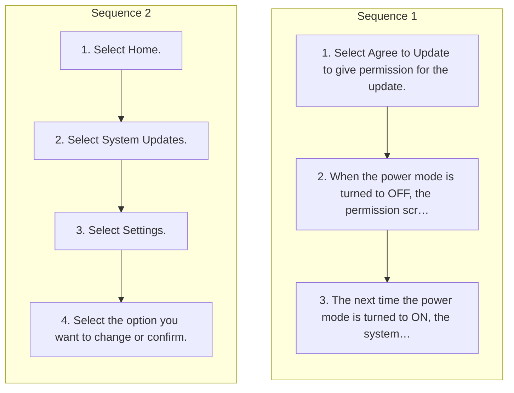

<!-- GENERATED:START function=3ce66144a074 (generated; edits inside this block are overwritten by the next publish — write your own notes outside it) -->
# 7. System Updates

<b>Function path:</b> Audio System Basic Operation / System Updates <b>Source:</b> printed page 282, 283 <b>Test-ready:</b> no — procedure missing or thresholds unfilled

Every "Presumed requirement" row below is machine-derived from the Owner's Manual text by rule-based extraction — not AI-written — and traceable to the printed page in its Source column.

## Procedure (2 sequences; the manual restarts the numbering)

| Seq | Step | Operation (Copied from OM) | Source |
|---|---|---|---|
| 1 | 1 | Select Agree to Update to give permission for the update. | p.282 / step |
| 1 | 2 | When the power mode is turned to OFF, the permission screen is displayed. Once a system update is started, the vehicle will become unable to move. | p.282 / step |
| 1 | 3 | The next time the power mode is turned to ON, the system update results screen 1Performing/Scheduling System Updates will be displayed. | p.283 / step |
| 2 | 1 | Select Home. | p.283 / step |
| 2 | 2 | Select System Updates. | p.283 / step |
| 2 | 3 | Select Settings. | p.283 / step |
| 2 | 4 | Select the option you want to change or confirm. | p.283 / step |

## Numeric thresholds (filled in by a tester)
Filled: 0 / unfilled: 1

| Threshold | Matching text (Copied from OM) | Kind | Unit | Value | Status | Evidence | Filled by |
|---|---|---|---|---|---|---|---|
| 84c549b9e9a2 | a certain number of times | count | times | **unfilled** | unfilled | — | — |

## 7-2-1. Service overview

| # | Presumed requirement | Strength | Source |
|---|---|---|---|
| 1 | System UpdatesSystem Updates. | capability | p.282 / text |
| 2 | System UpdatesSystem Updates uses the telematics control unit (TCU) or Wi-Fi communication capability to operate. When an update for your system becomes available, a screen prompting you to update your system will be displayed on the audio/information screen. | constraint | p.282 / text |
| 3 | System UpdatesPerforming/Scheduling System Updates. | capability | p.282 / text |
| 4 | System UpdatesPerforming System Updates. | capability | p.282 / text |

## 7-2-2. Service requirements

| # | Presumed requirement | Strength | Source |
|---|---|---|---|
| 1 | Step -When you select Proceed Now, the system update begins immediately. | capability | p.282 / bullet |
| 2 | Step -If you select Set Update Time, you can set a time for the update to be performed. | capability | p.282 / bullet |
| 3 | Step -If you select Remind me Later, you can delay the system update. The permission screen will be displayed again the next time the power mode is turned to OFF. | capability | p.282 / bullet |
| 4 | System Updates1System Updates. | capability | p.282 / text |
| 5 | System UpdatesWhen a system update is started, the vehicle will be unable to move. | capability | p.282 / text |
| 6 | System UpdatesIf new software has been released, perform an update as soon as possible. | capability | p.282 / text |
| 7 | System UpdatesIf a system update fails, please consult a dealer. | capability | p.282 / text |
| 8 | System UpdatesSystem updates that change specifications may result in some discrepancies with the information in this owner’s manual. For the most up-to-date information, please refer to the Honda website. | capability | p.282 / text |
| 9 | System Updates1Performing/Scheduling System Updates. | capability | p.282 / text |
| 10 | System UpdatesNOTICE For important updates, Remind me Later will stop displaying after it has been selected a certain number of times. | capability | p.282 / text |
| 11 | System UpdatesMake sure your vehicle is stopped in a safe location before starting a system update. | capability | p.282 / text |
| 12 | System UpdatesSystem Updates Settings. | capability | p.283 / text |
| 13 | System UpdatesYou can change or confirm system update settings. | capability | p.283 / text |
| 14 | System UpdatesThe following settings can be set. | capability | p.283 / text |
| 15 | Step -Automatic Update*. | capability | p.283 / bullet |
| 16 | Step -Automatic Download. | capability | p.283 / bullet |
| 17 | Step -Control Unit Versions. | capability | p.283 / bullet |
| 18 | Step -Connection Setup 2 Wi-Fi Connection P.306. | capability | p.283 / bullet |
| 19 | Step -Update History. | capability | p.283 / bullet |
| 20 | System UpdatesIf you have pressed Agree to Update on the agreement screen when an update is being offered, or Automatic Update* is set to ON, and the permission screen is not displayed even though the power mode is set to OFF, it may be due to one or more of the conditions listed below. For more information, consult a dealer. | constraint | p.283 / text |
| 21 | Step -The hood is open. | capability | p.283 / bullet |
| 22 | Step -The shift position is not in (P. | capability | p.283 / bullet |
| 23 | Step -The vehicle is providing one or more emergency notifications. | capability | p.283 / bullet |
| 24 | Step -The battery is depleted. | capability | p.283 / bullet |
| 25 | System UpdatesIf the system is being updated via Wi-Fi, you will not be able to use this feature in some situations based on Wi-Fi authentication methods. For example:. | capability | p.283 / text |
| 26 | Step -The connection requires you to log in. | capability | p.283 / bullet |
| 27 | Step -Agreement to terms of use is required. If you are disconnected from the network, the download will be stopped. Download is resumed when a new network connection is established. | constraint | p.283 / bullet |
| 28 | System Updates1System Updates Settings To perform a system update via Wi-Fi, change settings for connecting to Wi-Fi. 2 Wi-Fi Connection P.306. | capability | p.283 / text |
<!-- GENERATED:END function=3ce66144a074 -->

