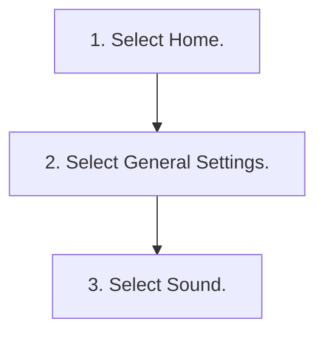

<!-- GENERATED:START function=6ecea6a09b6d (generated; edits inside this block are overwritten by the next publish — write your own notes outside it) -->
# 8. Adjusting the Sound

<b>Function path:</b> Audio System Basic Operation / Adjusting the Sound <b>Source:</b> printed page 284 <b>Test-ready:</b> yes — no unfilled thresholds and a procedure is present

Every "Presumed requirement" row below is machine-derived from the Owner's Manual text by rule-based extraction — not AI-written — and traceable to the printed page in its Source column.

## Procedure

| Seq | Step | Operation (Copied from OM) | Source |
|---|---|---|---|
| 1 | 1 | Select Home. | p.284 / step |
| 2 | 2 | Select General Settings. | p.284 / step |
| 3 | 3 | Select Sound. | p.284 / step |

## 8-2-1. Service overview

| # | Presumed requirement | Strength | Source |
|---|---|---|---|
| 1 | Adjusting the SoundAdjusting the Sound. | capability | p.284 / text |
| 2 | Adjusting the Sound1.Select Home. 2.Select an audio source icon. | capability | p.284 / text |
| 3 | Adjusting the SoundAM/FM Radio mode 3.Select Menu. 4.Select Sound Settings. 5.Select the setting you want. | capability | p.284 / text |
| 4 | Adjusting the SoundUSB Audio, Bluetooth Audio mode 3.Select Sound. 4.Select the setting you want. Select an item from the following choices:. | capability | p.284 / text |

## 8-2-2. Service requirements

| # | Presumed requirement | Strength | Source |
|---|---|---|---|
| 1 | Step -Speed Volume Compensation*2: Sets the amount of volume increase. | capability | p.284 / bullet |
| 2 | Step -Bass / Mid / Treble: Bass, Midrange, Treble. | capability | p.284 / bullet |
| 3 | Step -Balance / Fader*2: Balance, Fader. | capability | p.284 / bullet |
| 4 | Step -Audio Zones &amp; Balance / Fader*1: Driver Only, Front Only, Rear Only, Full Vehicle, Balance, Fader. | capability | p.284 / bullet |
| 5 | Step -Bose Centerpoint*1: Bose Centerpoint. | capability | p.284 / bullet |
| 6 | Step -Bose Dynamic Speed Compensation*1: Sets the amount of volume increase. | capability | p.284 / bullet |
| 7 | Adjusting the Sound*1:Model with BOSE AMP *2:Model with Normal AMP 284. | capability | p.284 / text |
| 8 | Adjusting the Sound1Adjusting the Sound The Speed Volume Compensation*2 and Bose Dynamic Speed Compensation*1 adjusts the volume level based on the vehicle speed. As you go faster, audio volume increases. As you slow down, audio volume decreases. | capability | p.284 / text |
| 9 | Adjusting the SoundYou can also adjust the sound the following procedure. | capability | p.284 / text |
| 10 | Adjusting the SoundTo reset each setting for Bass / Mid / Treble, Balance / Fader*2, Audio Zones &amp; Balance / Fader*1 and Speed Volume Compensation*2 select Reset to Default in each setting item. | capability | p.284 / text |
<!-- GENERATED:END function=6ecea6a09b6d -->

