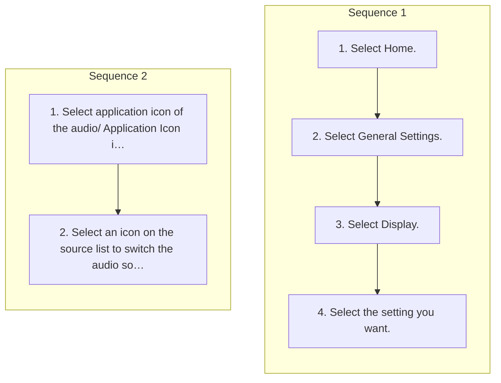

<!-- GENERATED:START function=2ae8194b5a7c (generated; edits inside this block are overwritten by the next publish — write your own notes outside it) -->
# 9. Display Setup

<b>Function path:</b> Audio System Basic Operation / Display Setup <b>Source:</b> printed page 285 <b>Test-ready:</b> yes — no unfilled thresholds and a procedure is present

Every "Presumed requirement" row below is machine-derived from the Owner's Manual text by rule-based extraction — not AI-written — and traceable to the printed page in its Source column.

## Figures (areas of the original PDF; the OM has no figure numbers or captions)

- Figure 9-1 source: p.285
- (Copied from OM) 2.Select an icon on the source list to switch

## Procedure (2 sequences; the manual restarts the numbering)

| Seq | Step | Operation (Copied from OM) | Source |
|---|---|---|---|
| 1 | 1 | Select Home. | p.285 / step |
| 1 | 2 | Select General Settings. | p.285 / step |
| 1 | 3 | Select Display. | p.285 / step |
| 1 | 4 | Select the setting you want. | p.285 / step |
| 2 | 1 | Select application icon of the audio/ Application Icon information screen. | p.285 / step |
| 2 | 2 | Select an icon on the source list to switch the audio source. | p.285 / step |

## 9-2-1. Service overview

| # | Presumed requirement | Strength | Source |
|---|---|---|---|
| 1 | Display SetupDisplay Setup. | capability | p.285 / text |
| 2 | Display SetupYou can change the brightness of the audio/information screen. | capability | p.285 / text |
| 3 | Display SetupChanging the Screen Brightness. | capability | p.285 / text |
| 4 | Display SetupSelecting an Audio Source. | capability | p.285 / text |
| 5 | Display SetupYou can select an audio source on the audio/information screen. | capability | p.285 / text |
| 6 | Display Setup1Changing the Screen Brightness You can change the Contrast and Black Level settings in the same manner. | capability | p.285 / text |
| 7 | Display SetupTo reset the settings, select Reset to Default. | capability | p.285 / text |
<!-- GENERATED:END function=2ae8194b5a7c -->

