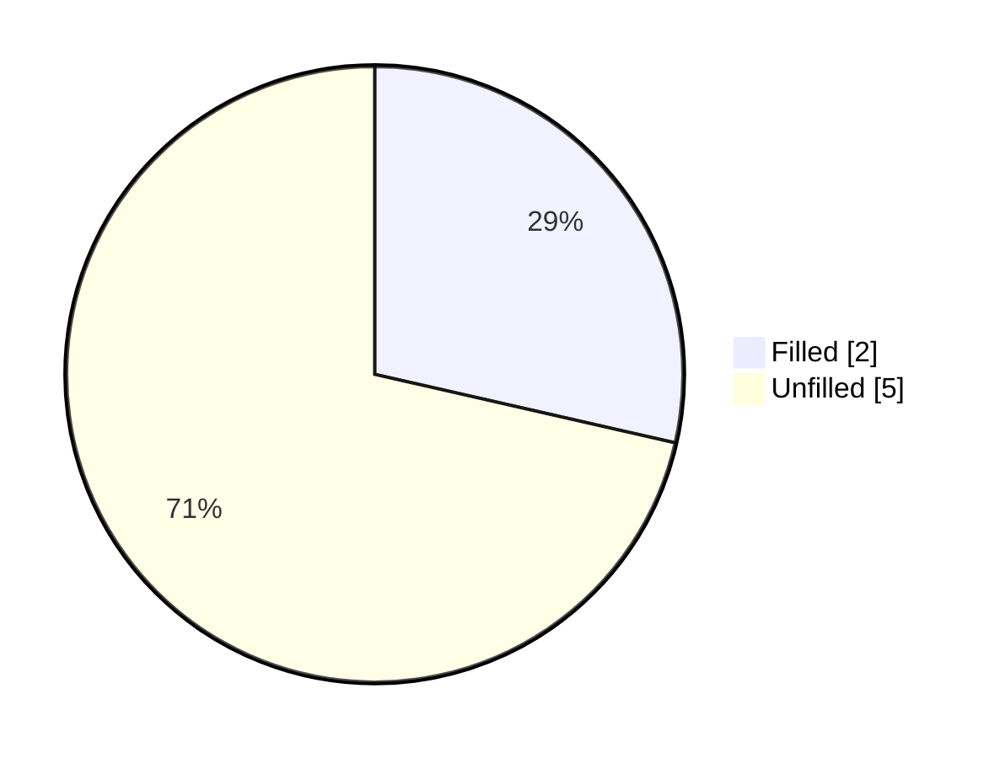
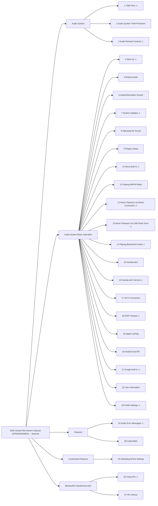

<!-- GENERATED:START index (generated; edits inside this block are overwritten by the next publish — write your own notes outside it) -->
# 2026 Honda Pilot Owner's Manual (AT902626OMEN) — features — Presumed specification

> This is a machine-derived estimate, not an official requirements document. Numeric thresholds left blank could not be found in the manual and must be filled in by a tester with evidence.

| Field | Value |
|---|---|
| Maker / Model | Honda / Pilot 2026 |
| Scope | features |
| Markets | US, CA |
| Profile | honda_v1 |
| Manual ID | honda/pilot-2026/ivi |

## Numeric thresholds

- Thresholds detected: **7**
- Filled: **2** / unfilled: **5**
- Test-ready functions: **14 / 28**

The manual states almost no numbers, so a tester fills the thresholds in. A function that still has an unfilled threshold cannot become a test specification (`is_test_ready=false`). Fill them in `overlay/thresholds.yaml` or on the screen.

## Figures in the manual

- Figures: **33** / images rendered: **33**

Each image is a rendering of the corresponding area of the original PDF. **Images are not kept in the repository** (they are copies of another company's manual); `publish` creates them under `../figures/` on the machine that runs it.

## Glossary (registered by a reviewer)

How wording in the manual maps to the in-house term. **The original text is not rewritten** — the mapping is only annotated here. Register terms on the Glossary screen. Evidence (why the mapping holds) is required.

| In-house term | Category | Wording in the manual | Hits | Evidence |
|---|---|---|---:|---|
| AA | abbreviation | `Android Auto` | 50 | Counted by string match over workspace/subaru/**/published/*.md (2026-09-01): outback-2026 31 / outback-2025 24 / ascent-2026 1. Always printed in full ("Android Auto") — no abbreviated form appears in the manual text; "AA" is an in-house-only abbreviation. |

## Functions

| No. | Function | Area | Requirements | Figures | Unfilled thresholds | Test-ready |
|---|---|---|---|---|---|---|
| 1 | [USB Ports](/specifications/honda/pilot-2026/ivi/file/1-usb-ports.md?chapter=features) | Audio System | 27 | 4 | 0 | - |
| 2 | [Audio System Theft Protection](/specifications/honda/pilot-2026/ivi/file/2-audio-system-theft-protection.md?chapter=features) | Audio System | 3 | 0 | 0 | o |
| 3 | [Audio Remote Controls](/specifications/honda/pilot-2026/ivi/file/3-audio-remote-controls.md?chapter=features) | Audio System | 10 | 1 | 0 | - |
| 4 | [Start Up](/specifications/honda/pilot-2026/ivi/file/4-start-up.md?chapter=features) | Audio System Basic Operation | 15 | 3 | 1 | - |
| 5 | [Reboot Audio](/specifications/honda/pilot-2026/ivi/file/5-reboot-audio.md?chapter=features) | Audio System Basic Operation | 2 | 0 | 0 | o |
| 6 | [Audio/Information Screen](/specifications/honda/pilot-2026/ivi/file/6-audio-information-screen.md?chapter=features) | Audio System Basic Operation | 70 | 6 | 0 | o |
| 7 | [System Updates](/specifications/honda/pilot-2026/ivi/file/7-system-updates.md?chapter=features) | Audio System Basic Operation | 29 | 0 | 1 | - |
| 8 | [Adjusting the Sound](/specifications/honda/pilot-2026/ivi/file/8-adjusting-the-sound.md?chapter=features) | Audio System Basic Operation | 13 | 0 | 0 | o |
| 9 | [Display Setup](/specifications/honda/pilot-2026/ivi/file/9-display-setup.md?chapter=features) | Audio System Basic Operation | 7 | 1 | 0 | o |
| 10 | [Alexa Built-In](/specifications/honda/pilot-2026/ivi/file/10-alexa-built-in.md?chapter=features) | Audio System Basic Operation | 22 | 0 | 0 | - |
| 11 | [Playing AM/FM Radio](/specifications/honda/pilot-2026/ivi/file/11-playing-am-fm-radio.md?chapter=features) | Audio System Basic Operation | 35 | 1 | 0 | o |
| 12 | [Music Playback via Wired Connection](/specifications/honda/pilot-2026/ivi/file/12-music-playback-via-wired-connection.md?chapter=features) | Audio System Basic Operation | 19 | 1 | 1 | - |
| 13 | [Music Playback via USB Flash Drive](/specifications/honda/pilot-2026/ivi/file/13-music-playback-via-usb-flash-drive.md?chapter=features) | Audio System Basic Operation | 18 | 1 | 1 | - |
| 14 | [Playing Bluetooth® Audio](/specifications/honda/pilot-2026/ivi/file/14-playing-bluetooth-audio.md?chapter=features) | Audio System Basic Operation | 31 | 1 | 1 | - |
| 15 | [HondaLink®](/specifications/honda/pilot-2026/ivi/file/15-hondalink.md?chapter=features) | Audio System Basic Operation | 20 | 3 | 0 | o |
| 16 | [HondaLink® Service](/specifications/honda/pilot-2026/ivi/file/16-hondalink-service.md?chapter=features) | Audio System Basic Operation | 36 | 0 | 0 | - |
| 17 | [Wi-Fi Connection](/specifications/honda/pilot-2026/ivi/file/17-wi-fi-connection.md?chapter=features) | Audio System Basic Operation | 17 | 0 | 0 | o |
| 18 | [AT&amp;T Hotspot](/specifications/honda/pilot-2026/ivi/file/18-at-t-hotspot.md?chapter=features) | Audio System Basic Operation | 7 | 1 | 0 | - |
| 19 | [Apple CarPlay](/specifications/honda/pilot-2026/ivi/file/19-apple-carplay.md?chapter=features) | Audio System Basic Operation | 31 | 0 | 0 | o |
| 20 | [Android AutoTM](/specifications/honda/pilot-2026/ivi/file/20-android-autotm.md?chapter=features) | Audio System Basic Operation | 32 | 0 | 0 | o |
| 21 | [Google built-in](/specifications/honda/pilot-2026/ivi/file/21-google-built-in.md?chapter=features) | Audio System Basic Operation | 24 | 1 | 0 | - |
| 22 | [User Information](/specifications/honda/pilot-2026/ivi/file/22-user-information.md?chapter=features) | Audio System Basic Operation | 20 | 2 | 0 | o |
| 23 | [Profile Settings](/specifications/honda/pilot-2026/ivi/file/23-profile-settings.md?chapter=features) | Audio System Basic Operation | 15 | 0 | 0 | - |
| 24 | [Audio Error Messages](/specifications/honda/pilot-2026/ivi/file/24-audio-error-messages.md?chapter=features) | Features | 10 | 0 | 0 | - |
| 25 | [Defaulting All the Settings](/specifications/honda/pilot-2026/ivi/file/25-defaulting-all-the-settings.md?chapter=features) | Customized Features | 8 | 0 | 0 | o |
| 26 | [Using HFL](/specifications/honda/pilot-2026/ivi/file/26-using-hfl.md?chapter=features) | Bluetooth® HandsFreeLink® | 26 | 2 | 0 | - |
| 27 | [HFL Menus](/specifications/honda/pilot-2026/ivi/file/27-hfl-menus.md?chapter=features) | Bluetooth® HandsFreeLink® | 68 | 4 | 0 | o |
| 28 | [CabinTalk®](/specifications/honda/pilot-2026/ivi/file/28-cabintalk.md?chapter=features) | Features | 3 | 1 | 0 | o |
<!-- GENERATED:END index -->

